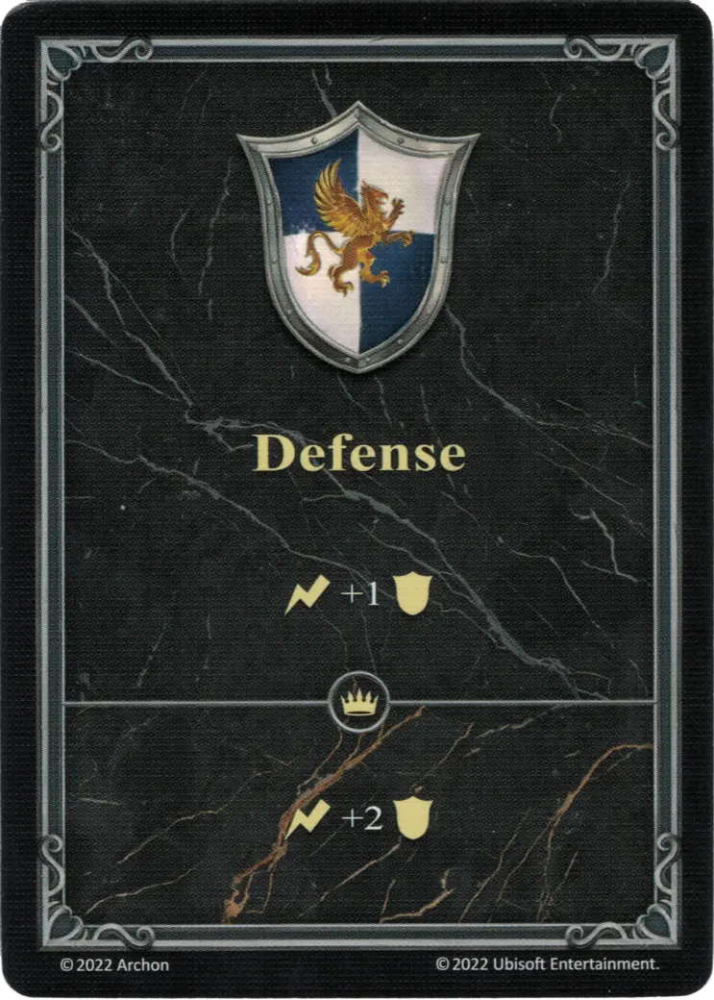
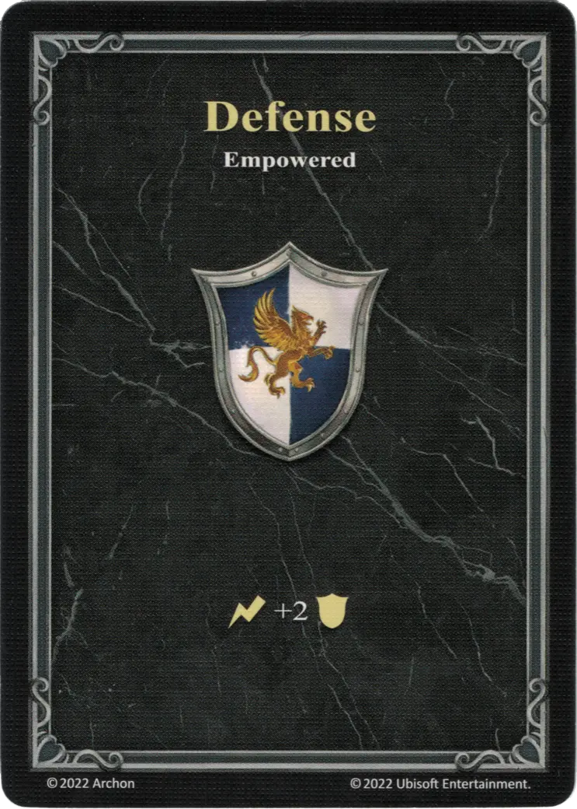

# Defensa

=== "Regular"

    <figure markdown="span">
        { width="340" align=right }
    </figure>

=== "Potenciado"

    <figure markdown="span">
        { width="340" align=right }
    </figure>

| Tipo | Efecto | Efecto :expert: |
| : --- | : --- | : --- |
| Normal | :instant_effect: +1 :defense: | :instant_effect: +2 :defense: |
| Potenciada | :instant_effect: +2 :defense: | - |

## Ver También

- [Lista de Héroes](../heroes/index.md)
- [List of Statistics](index.md)
