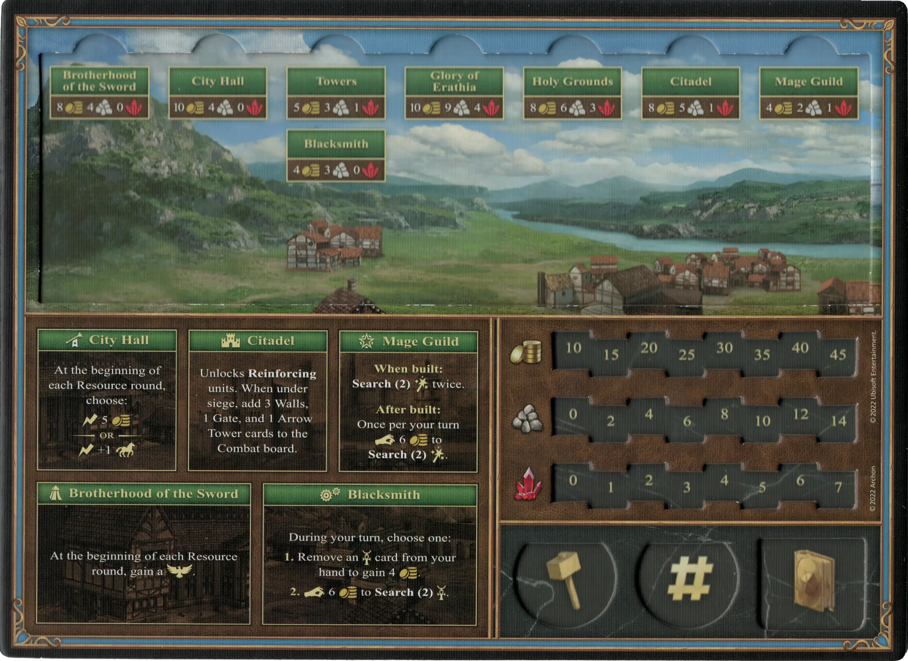
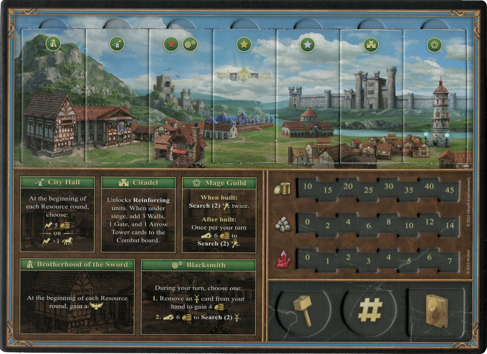
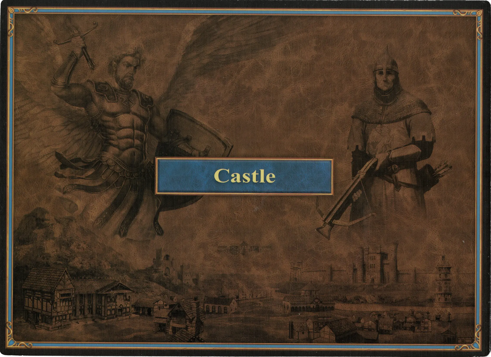

# Castillo

## Edificios

=== "Vacío"

    <figure markdown="span">
        { width="680" align=right }
    </figure>

=== "Fully Built"

    <figure markdown="span">
        { width="680" align=right }
    </figure>

=== "Back Side"

    <figure markdown="span">
        { width="680" align=right }
    </figure>

| Nombre | Coste de Construcción | Efecto |
| :--- | ---: | :---: |
| Alcaldía | 10 :gold: 4 :building_materials: 0 :valuables: | Al inicio de cada ronda de Recursos, elige: :instant: 5 :gold:  — O —  :instant: +1:movement: |
| Ciudadela | 8 :gold: 5 :building_materials: 1 :valuables: | Permite **Refuerzo** de [unidades](#units). Cuando estás bajo asedio, añade 3 cartas Muros, 1 Puerta, y 1 [Torre de Arqueros](../units/arrow_tower.md) al tablero de Combate. |
| Cofradía de Magos | 4 :gold: 2 :building_materials: 1 :valuables: | **Cuando se construye:** **Buscar(2)** [:spellpower:](../spells/index.md) dos veces.  **Después de construirlo:** Una vez por turno :pay: 6 :gold: para **Buscar(2)** [:spellpower:](../spells/index.md). |
| Torres | 5 :gold: 3 :building_materials: 1 :valuables: | Permite **Reclutamiento** de [unidades](#units) de :bronze:. |
| Campos Sagrados | 8 :gold: 6 :building_materials: 3 :valuables: | Permite **Reclutamiento** de [unidades](#units) de :silver:. |
| Gloria de Erathia | 10 :gold: 9 :building_materials: 4 :valuables: | Permite **Reclutamiento** de [unidades](#units) de :golden:. |
| Hermandad de la Espada | 8 :gold: 4 :building_materials: 0 :valuables: | Al inicio de cada ronda de Recursos, gana una :morale_positive:. |
| Herrería | 4 :gold: 3 :building_materials: 0 :valuables: | Durante tu turno, elige:  **1.** Retirar una carta de  [:artifact:](../artifacts/index.md) de tu mano para ganar 4 :gold:.  **2.** :pay: 6 :gold: para **Buscar(2)** [:artifact:](../artifacts/index.md). |

## Héroes

- :magic: [Adelaide](../heroes/adelaide.md)
- :might: [Catherine](../heroes/catherine.md)
- :magic: [Ingham](../heroes/ingham.md)
- :might: [Lord Haart](../heroes/lord_haart_castle.md)
- :might: [Tarnum](../heroes/tarnum_castle.md)
- :magic: [Rion](../heroes/rion.md)
- :might: [Valeska](../heroes/valeska.md)

## Unidades

- :bronze: [Alabarderos](../units/halberdiers.md)
- :bronze: [Tiradores](../units/marksmen.md)
- :bronze: [Grifos](../units/griffins.md)
- :silver: [Cruzados](../units/crusaders.md)
- :silver: [Fanáticos](../units/zealots.md)
- :golden: [Campeones](../units/champions.md)
- :golden: [Arcángeles](../units/archangels.md)

## Viene Con

- [Juego Principal](../content/core_game.md)

## Ver También

- [Lista de Ciudades](../towns/index.md)
