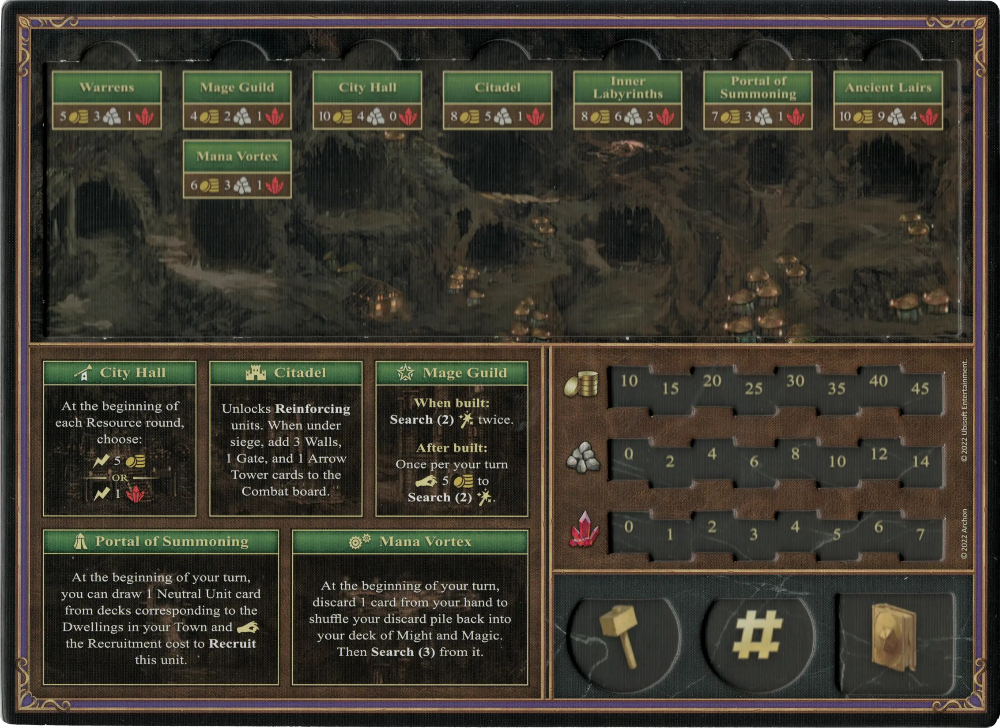
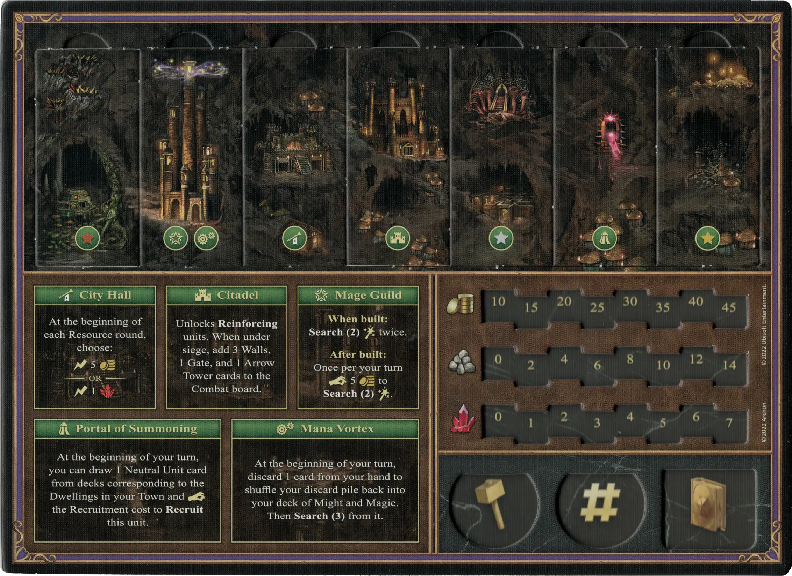
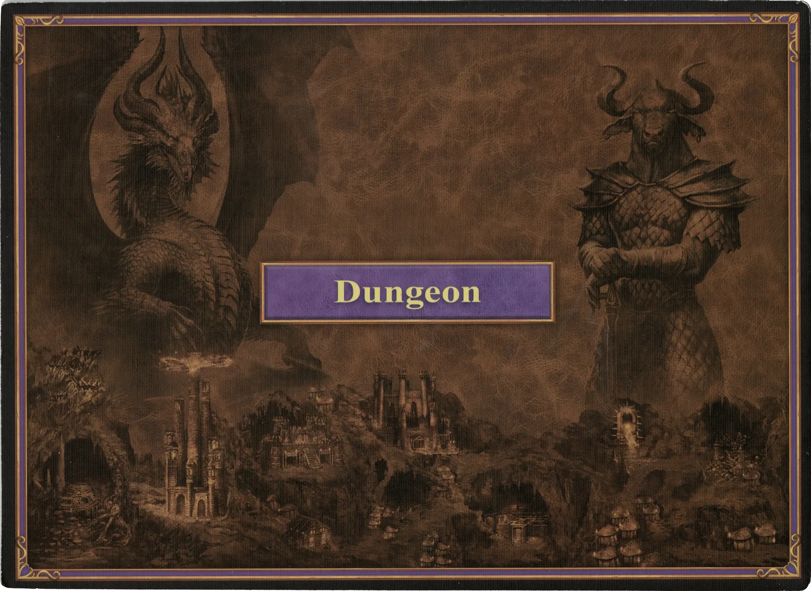

# Mazmorra

## Edificios

=== "Vacío"

    <figure markdown="span">
        { width="680" align=right }
    </figure>

=== "Fully Built"

    <figure markdown="span">
        { width="680" align=right }
    </figure>

=== "Back Side"

    <figure markdown="span">
        { width="680" align=right }
    </figure>

| Nombre | Coste de Construcción | Efecto |
| :--- | ---: | :---: |
| Alcaldía | 10 :gold: 4 :building_materials: 0 :valuables: | Al comienzo de cada ronda de Recursos, elige:: :instant: 5 :gold:  — O —  :instant: 1 :valuables: |
| Ciudadela | 8 :gold: 5 :building_materials: 1 :valuables: | Permite **Reforzar** [unidades](#units). Cuando estés bajo asedio, añade 3 cartas de Muralla, 1 de Puerta y 1 de [Torre Flechas](../units/arrow_tower.md) al tablero de Combate. |
| Cofradía de Magos | 4 :gold: 2 :building_materials: 1 :valuables: | **Cuando se construye:** **Buscar(2)** [:spellpower:](../spells/index.md) dos veces.  **Después de construirse:** Una vez por turno :pay: 5 :gold: para **Buscar(2)** [:spellpower:](../spells/index.md). |
| Madrigueras | 5 :gold: 3 :building_materials: 1 :valuables: | Permite **Reclutar** [unidades](#units) de :bronze:. |
| Laberintos Internos | 8 :gold: 6 :building_materials: 3 :valuables: | Permite **Reclutar** [unidades](#units) de :sylver:. |
| Guaridas Antiguas | 10 :gold: 9 :building_materials: 4 :valuables: | Permite **Reclutar** [unidades](#units) de :golden:. |
| Portal de Invocación | 7 :gold: 3 :building_materials: 1 :valuables: | Al principio de tu turno, puedes robar 1 carta de [Unidad Neutral](../units/index.md) de los mazos correspondientes a las Viviendas de tu Ciudad y :pay: el coste de Reclutamiento para **Reclutar** esta [unidad].(../units/index.md). |
| Vórtice de Maná | 6 :gold: 4 :building_materials: 1 :valuables: | Al principio de tu turno, descarta 1 carta de tu mano para barajar tu pila de descartes de nuevo en tu mazo de Poder y Magia. Luego **Busca(3)** en el. |

## Héroes

- :magic: [Alamar](../heroes/alamar.md)
- :magic: [Deemer](../heroes/deemer.md)
- :magic: [Jeddite](../heroes/jeddite.md)
- :might: [Lorelei](../heroes/lorelei.md)
- :might: [Mutare](../heroes/mutare.md)
- :magic: [Sephinroth](../heroes/sephinroth.md)
- :magic: [Tarnum](../heroes/tarnum_dungeon.md)

## Unidades

- :bronze: [Trogloditas](../units/troglodytes.md)
- :bronze: [Arpías](../units/harpies.md)
- :bronze: [Ojos Maléficos](../units/evil_eyes.md)
- :silver: [Medusas](../units/medusas.md)
- :silver: [Minotauros](../units/minotaurs.md)
- :golden: [Mantícoras](../units/manticores.md)
- :golden: [Dragones Negros](../units/black_dragons.md)

## Viene Con

- [Juego Principal](../content/core_game.md)

## Ver También

- [Lista de Ciudades](../towns/index.md)
