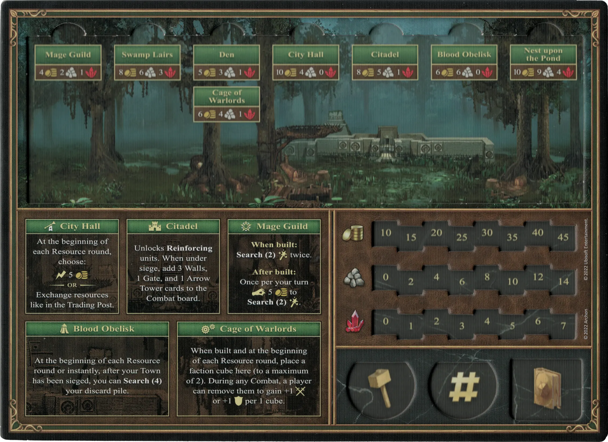
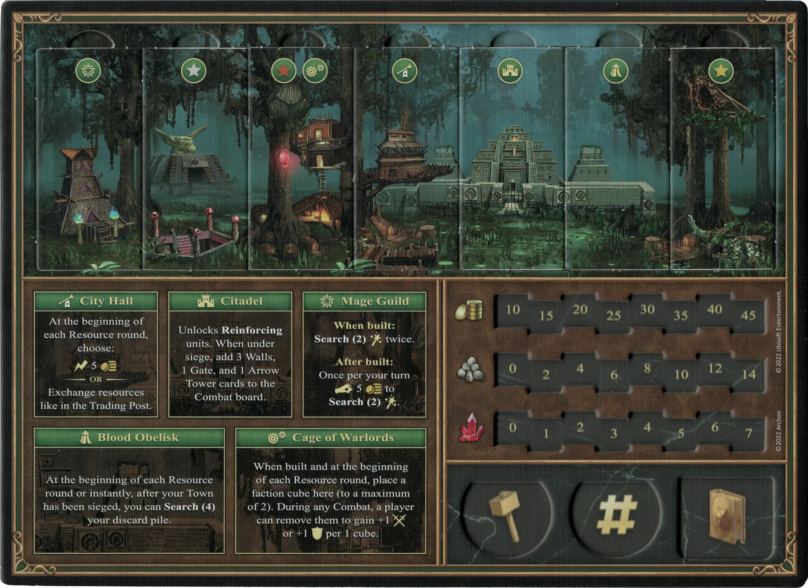
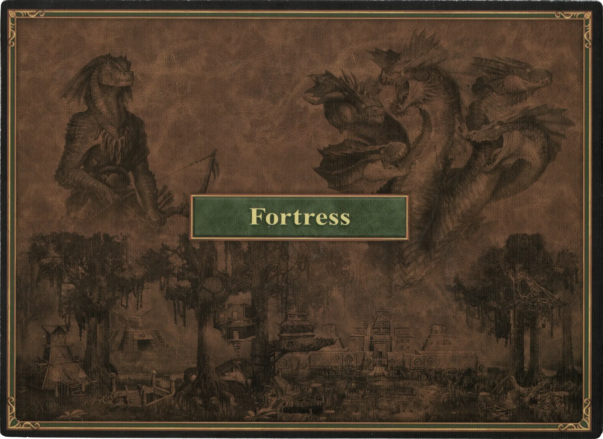

# Fortaleza

## Edificios

=== "Vacío"

    <figure markdown="span">
        { width="680" align=right }
    </figure>

=== "Fully Built"

    <figure markdown="span">
        { width="680" align=right }
    </figure>

=== "Back Side"

    <figure markdown="span">
        { width="680" align=right }
    </figure>

| Nombre | Coste de Construcción | Efecto |
| :--- | ---: | :---: |
| Alcaldía | 10 :gold: 4 :building_materials: 0 :valuables: | Al comienzo de cada ronda de Recursos, elige: :instant: 5 :gold:  — O —  Intercambia recursos como en el Puesto de Comercio. |
| Ciudadela | 8 :gold: 5 :building_materials: 1 :valuables: | Permite **Reforzar** [unidades](#units). Cuando estés bajo asedio, añade 3 cartas de Muralla, 1 de Puerta, y 1 de [Torre de Arqueros](../units/arrow_tower.md) al tablero de Combate. |
| Cofradía de Magos | 4 :gold: 2 :building_materials: 1 :valuables: | **Cuando se construye:** **Buscar(2)** [:spellpower:](../spells/index.md) twice.  **Después de construido:** Una vez por turno :pay: 5 :gold: para **Buscar(2)** [:spellpower:](../spells/index.md). |
| Foso | 5 :gold: 3 :building_materials: 1 :valuables: | Permite **Reclutar** [unidades](#units) de :bronze:. |
| Guaridas Pantanosas | 8 :gold: 6 :building_materials: 3 :valuables: | Permite **Reclutar** [unidades](#units) de :silver:. |
| Nido sobre el Estanque | 10 :gold: 9 :building_materials: 4 :valuables: | Permite **Reclutar** [unidades](#units) de :golden:. |
| Obelisco Sangriento | 6 :gold: 6 :building_materials: 0 :valuables: | Al inicio de cada ronda de Recursos o instantáneamente, si tu Ciudad está siendo asediada, puedes **Buscar(4)** en tu pila de descartes. |
| Jaula de Señores de la Guerra | 6 :gold: 4 :building_materials: 1 :valuables: | Cuando se construye y al principio de cada ronda de Recursos, coloca aquí un cubo de facción (hasta un máximo de 2). Durante cualquier Combate, un jugador puede retirarlos para ganar +1 :attack: o +1 :defense: por 1 cubo. |

## Héroes

- :magic: [Adrienne](../heroes/adrienne.md)
- :might: [Bron](../heroes/bron.md)
- :might: [Gerwulf](../heroes/gerwulf.md)
- :magic: [Merist](../heroes/merist.md)
- :might: [Tarnum](../heroes/tarnum_fortress.md)
- :might: [Tazar](../heroes/tazar.md)
- :might: [Wystan](../heroes/wystan.md)

## Unidades

- :bronze: [Gnolls](../units/gnolls.md)
- :bronze: [Hombres Lagarto](../units/lizardmen.md)
- :bronze: [Libélulas](../units/dragon_flies.md)
- :silver: [Basiliscos](../units/basilisks.md)
- :silver: [Gorgonas](../units/gorgons.md)
- :golden: [Wyverns](../units/wyverns.md)
- :golden: [Hidras](../units/hydras.md)

## Viene Con

- [Expansión de Fortaleza](../content/fortress_expansion.md)

## Ver También

- [Lista de Ciudades](../towns/index.md)
