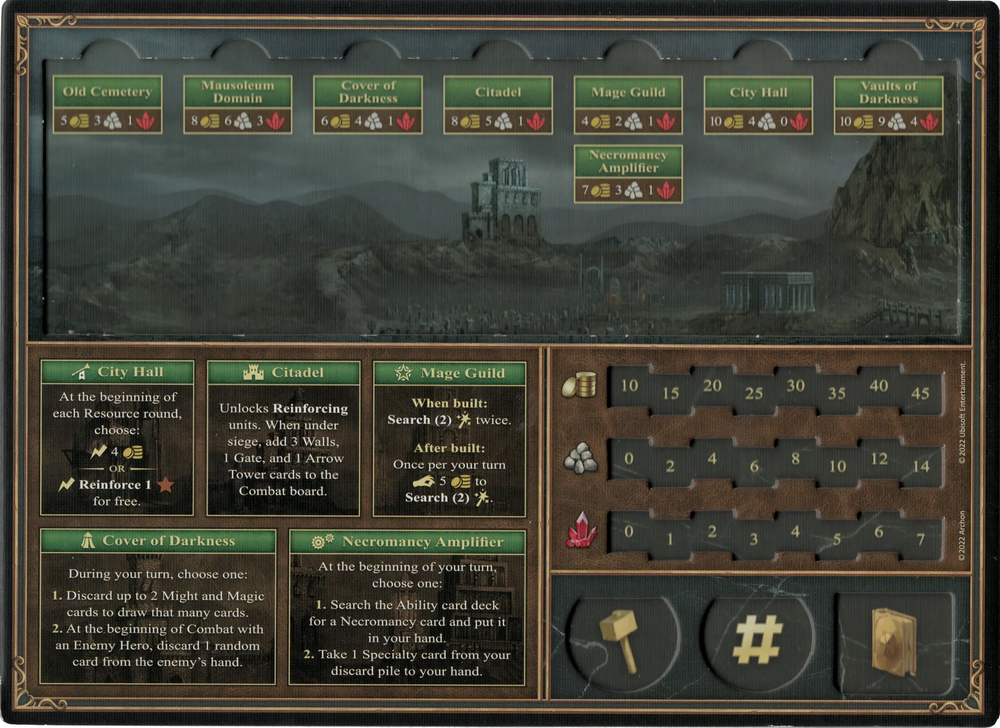
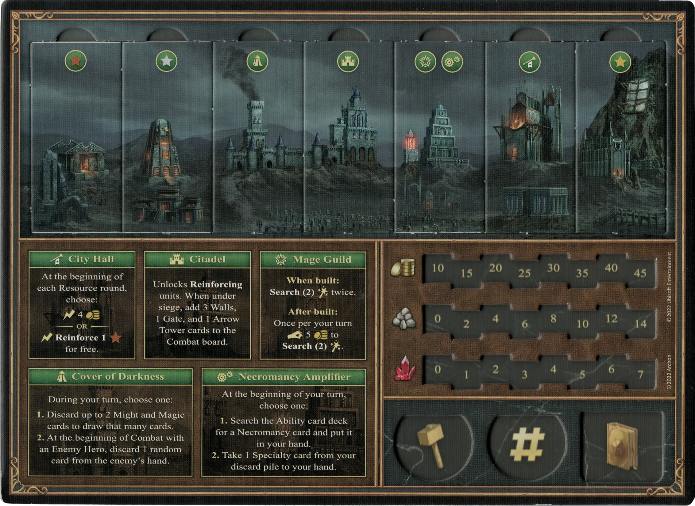
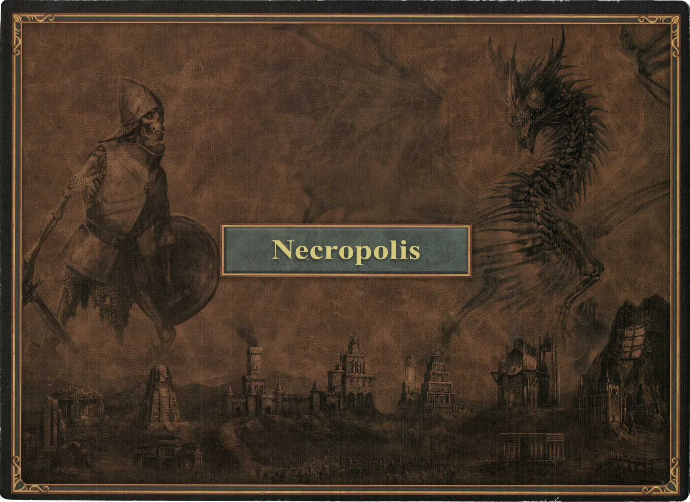

# Necrópolis

## Edificios

=== "Vacío"

    <figure markdown="span">
        { width="680" align=right }
    </figure>

=== "Fully Built"

    <figure markdown="span">
        { width="680" align=right }
    </figure>

=== "Back Side"

    <figure markdown="span">
        { width="680" align=right }
    </figure>

| Name | Building Cost | Effect |
| :--- | ---: | :---: |
| City Hall | 10 :gold: 4 :building_materials: 0 :valuables: | At the beginning of each Resource round, choose: :instant: 4 :gold:  — OR —  :instant:**Reinforce 1** :bronze: for free. |
| Citadel | 8 :gold: 5 :building_materials: 1 :valuables: | Unlocks **Reinforcing** [units](#units). When under siege, add 3 Walls, 1 Gate, and 1 [Arrow Tower](../units/arrow_tower.md) cards to the Combat board. |
| Mage Guild | 4 :gold: 2 :building_materials: 1 :valuables: | **When built:** **Search(2)** [:spellpower:](../spells/index.md) twice.  **After built:** Once per your turn :pay: 5 :gold: to **Search(2)** [:spellpower:](../spells/index.md). |
| Old Cemetery | 5 :gold: 3 :building_materials: 1 :valuables: | Unlocks **Recruiting** of :bronze: [units](#units). |
| Mausoleum Domain | 8 :gold: 6 :building_materials: 3 :valuables: | Unlocks **Recruiting** of :silver: [units](#units). |
| Vaults of Darkness | 10 :gold: 9 :building_materials: 4 :valuables: | Unlocks **Recruiting** of :golden: [units](#units). |
| Necromancy Amplifier | 7 :gold: 3 :building_materials: 1 :valuables: | At the beginning of your turn, choose one:  **1.** Search the [Habilidad](../abilities/index.md) card deck for a [Nigromancia](../abilities/index.md) card and put it in your hand.  **2.** Take 1 [Specialty](#heroes) card from your discard pile to your hand. |
| Cover of Darkness | 6 :gold: 4 :building_materials: 1 :valuables: | During your turn, choose one:  **1.** Discard up to 2 Might and Magic cards to draw that many cards.  **2.** At the beginning of Combat with an Enemy [Héroe](../heroes/index.md), discard 1 random card from the enemy's hand. |

## Héroes

- :might: [Lord Haart](../heroes/lord_haart_necropolis.md)
- :might: [Moandor](../heroes/moandor.md)
- :magic: [Sandro](../heroes/sandro.md)
- :magic: [Septienna](../heroes/septienna.md)
- :might: [Tamika](../heroes/tamika.md)
- :magic: [Vidomina](../heroes/vidomina.md)

## Unidades

- :bronze: [Esqueletos](../units/skeletons.md)
- :bronze: [Zombis](../units/zombies.md)
- :bronze: [Espectros](../units/wraiths.md)
- :silver: [Vampiros](../units/vampires.md)
- :silver: [Liches](../units/liches.md)
- :golden: [Caballeros del Terror](../units/dread_knights.md)
- :golden: [Dragones Fantasma](../units/ghost_dragons.md)

## Talento

- :necro: [Nigromancia](../abilities/necromancy.md)

## Viene Con

- [Juego Principal](../content/core_game.md)

## Ver También

- [Lista de Ciudades](../towns/index.md)
