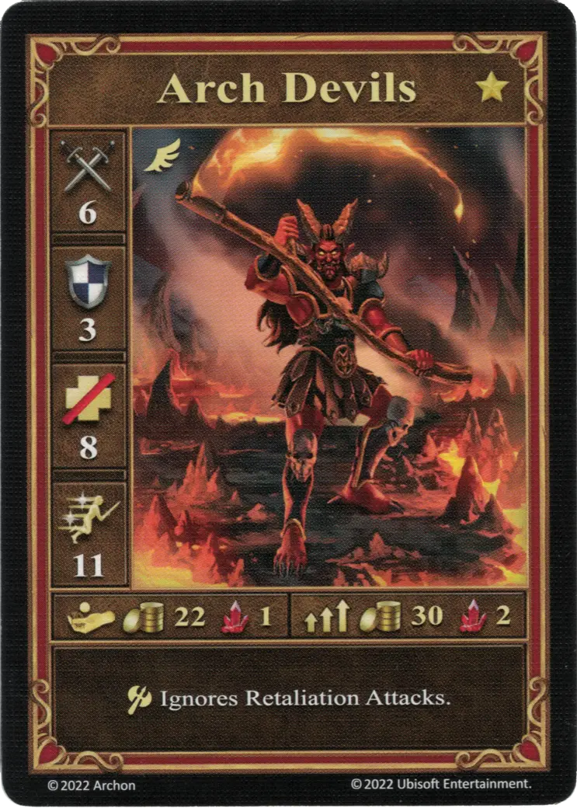
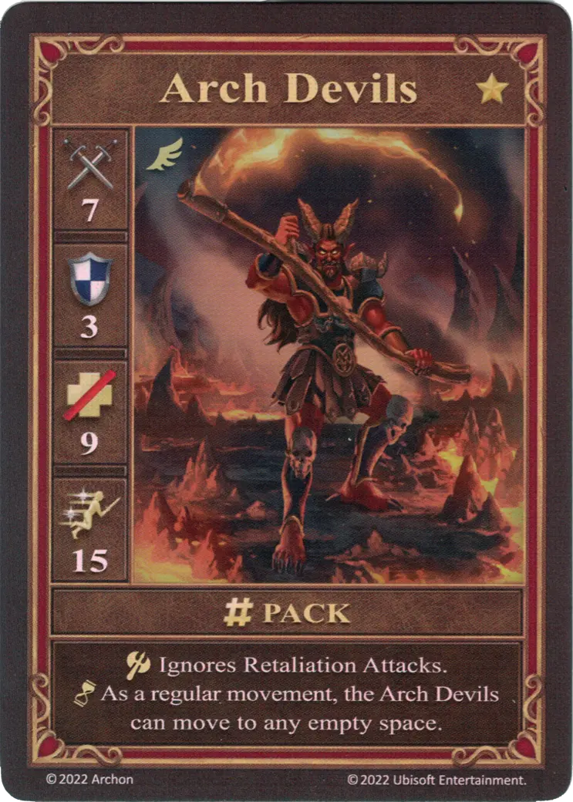
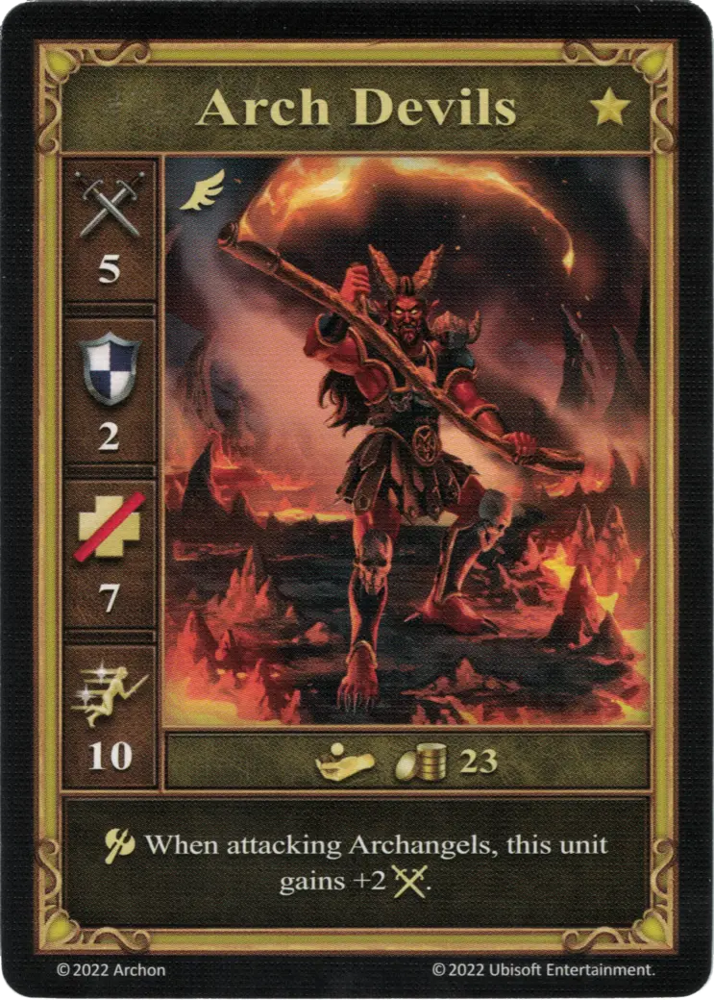

# Archidiablos

=== "Pocos"

    <figure markdown="span">
        { width="340" align=right }
    </figure>

=== "Manada"

    <figure markdown="span">
        { width="340" align=right }
    </figure>

=== "Neutral"

    <figure markdown="span">
        { width="340" align=right }
    </figure>

| Características | Pocos | Manada | Neutral |
| :--- | :---: | :---: | :---: |
| Ciudad | [Infierno](../towns/inferno.md) | [Infierno](../towns/inferno.md) | [Neutral](../towns/neutral.md) |
| Nivel | :golden: | :golden: | :golden: |
| Tipo | [:unit_flying:](../keywords/flying_unit.md) | [:unit_flying:](../keywords/flying_unit.md) | [:unit_flying:](../keywords/flying_unit.md) |
| :attack: | 6 | **7** | 5 |
| :defense: | 3 | 3 | 2 |
| :health_points: | 8 | **9** | 7 |
| :initiative: | 11 | **15** | 10 |
| Coste | 22 :gold: 1 :valuables: | 30 :gold: 2 :valuables: | 23 :gold: |
| Habilidades | :unit_attack: Ignora los Contraataques. | :unit_attack: Ignora los Contraataques. :unit_passive: Como su movimiento normal, el Archidiablo puede moverse a cualquier casilla vacía. | :unit_attack: Cuando ataca a [Arcángeles](archangels.md), esta unidad gana +2 :attack:. |

## Viene Con

- [Expansión de Infierno](../content/inferno_expansion.md)

## Ver También

- [Lista de Unidades](index.md)
- [Lista de Ciudades](../towns/index.md)
