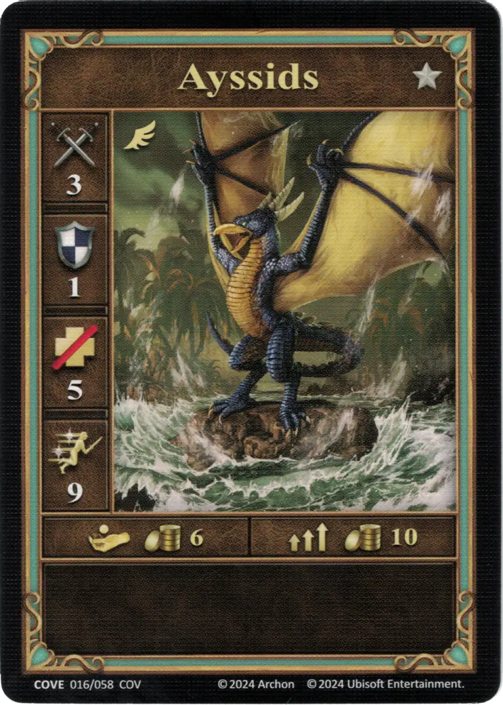
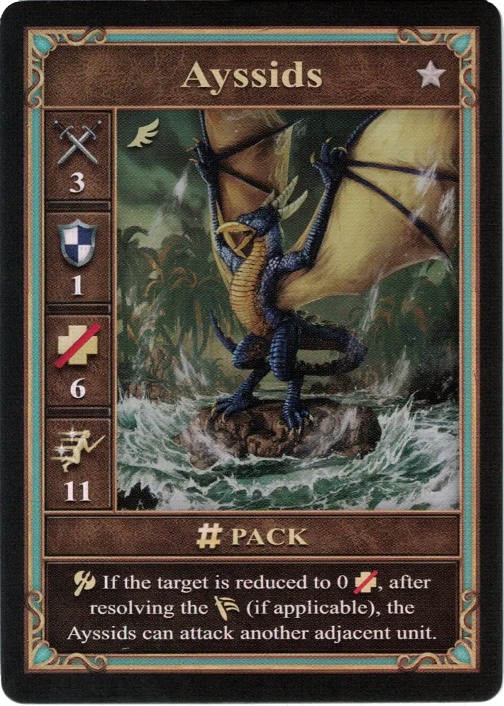
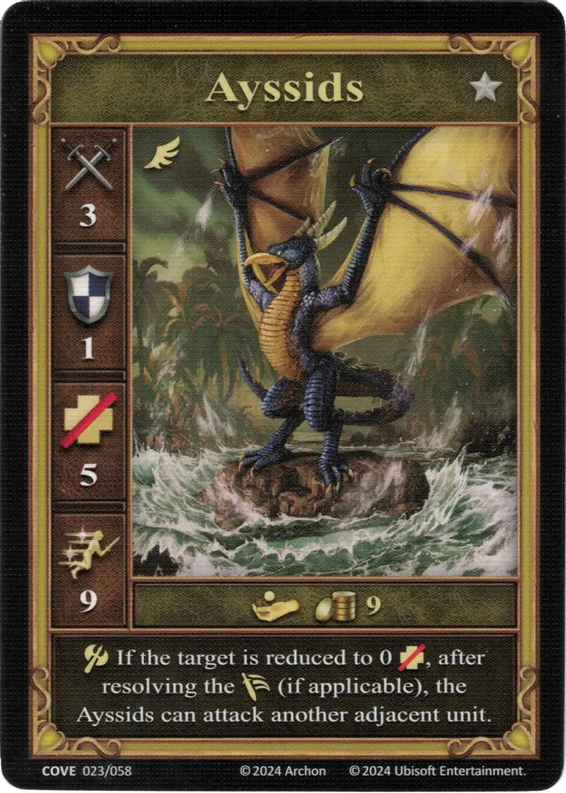

# Aysides

=== "Pocos"

    <figure markdown="span">
        { width="340" align=right }
    </figure>

=== "Manada"

    <figure markdown="span">
        { width="340" align=right }
    </figure>

=== "Neutral"

    <figure markdown="span">
        { width="340" align=right }
    </figure>

| Statistics | Few | Pack | Neutral |
| :--- | :---: | :---: | :---: |
| Town | [Cove](../towns/cove.md) | [Cove](../towns/cove.md) | [Neutral](../towns/neutral.md) |
| Tier | :silver_tier: | :silver_tier: | :silver_tier: |
| Type | [:flying_unit:](index.md#flying-units) | [:flying_unit:](index.md#flying-units) | [:flying_unit:](index.md#flying-units) |
| :attack: | 3 | 3 | 3 |
| :defense: | 1 | 1 | 1 |
| :health_points: | 5 | **6** | 5 |
| :initiative: | 9 | **11** | 9 |
| Cost | 6 :gold: | 10 :gold: | 9 :gold: |
| Abilities | - | :unit_attack: If the target is reduced to 0 :health_points:, after resolving the :unit_retaliation: (if applicable), the Ayssids can attack another adjacent unit. | :unit_attack: If the target is reduced to 0 :health_points:, after resolving the :unit_retaliation: (if applicable), the Ayssids can attack another adjacent unit. |

## Viene Con

- [Expansión de Ensenada](../content/cove_expansion.md)

## Ver También

- [Lista de Unidades](index.md)
- [Lista de Ciudades](../towns/index.md)
