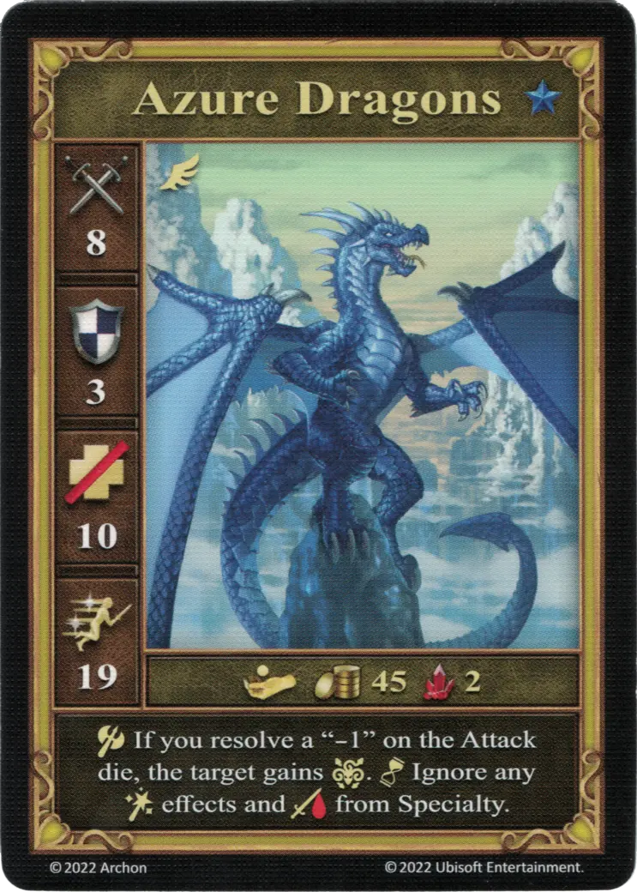

# Dragones Celestes

<figure markdown="span">
    { width="340" align=right }
</figure>

| Características | Neutral |
| :--- | :---: |
| Ciudad | [Neutral](../towns/neutral.md) |
| Nivel | :azure: |
| Tipo | [:unit_flying:](../keywords/flying_unit.md) |
| :attack: | 8 |
| :defense: | 3 |
| :health_points: | 10 |
| :initiative: | 19 |
| Coste | 45 :gold: 2 :valuables: |
| Habilidades | :unit_attack: Si sacas un "-1" como resultado en el [Dado de Ataque](../dice.md#attack-die), el objetivo obtiene :paralysis:. :unit_passive: Ignora cualquier efecto de [:spellpower:](../spells/index.md) y :damage: de [Especialidad](../heroes/index.md). |

## Héroes Con Especialidad

- [:might: Mutare](../heroes/mutare.md#specialty)

## Notas

- Los efectos de los hechizos y especialidades del jugador también se ignoran.
- Las Especialidades son las cartas específicas del héroe (Ⅰ, Ⅳ, y Ⅵ).

## Viene Con

- [Juego Principal](../content/core_game.md)

## Ver También

- [Lista de Unidades](index.md)
- [Lista de Ciudades](../towns/index.md)
