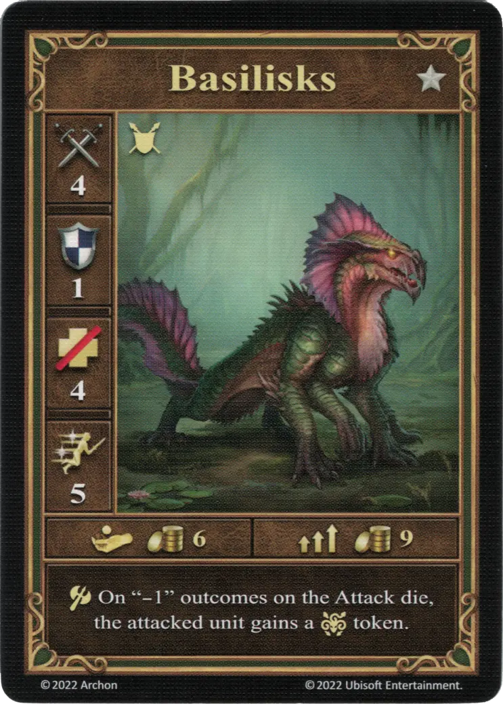
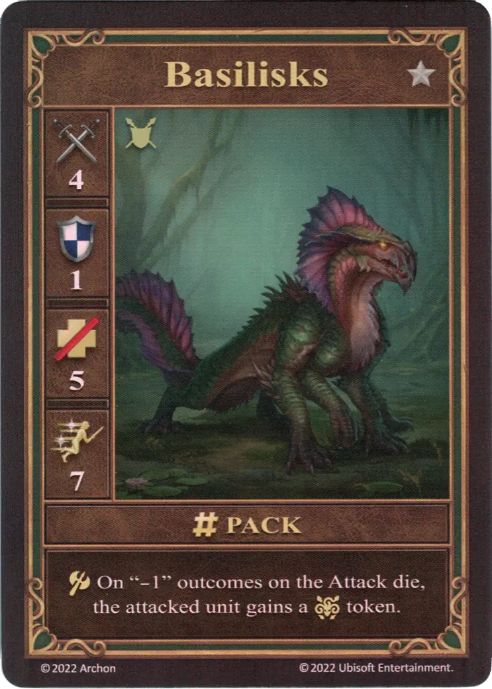
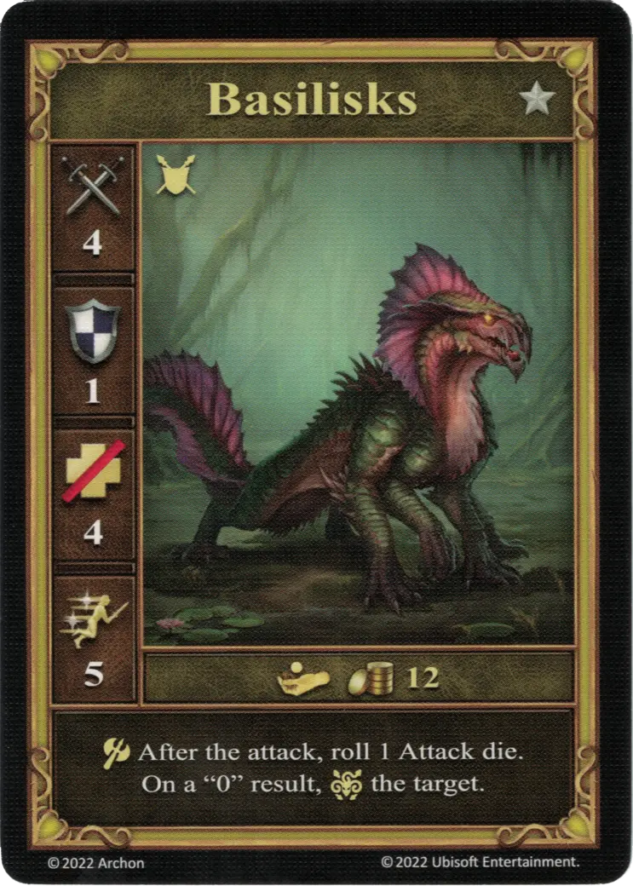

# Basiliscos

=== "Pocos"

    <figure markdown="span">
        { width="340" align=right }
    </figure>

=== "Manada"

    <figure markdown="span">
        { width="340" align=right }
    </figure>

=== "Neutral"

    <figure markdown="span">
        { width="340" align=right }
    </figure>

| Características | Pocos | Manada | Neutral |
| :--- | :---: | :---: | :---: |
| Ciudad | [Fortaleza](../towns/fortress.md) | [Fortaleza](../towns/fortress.md) | [Neutral](../towns/neutral.md) |
| Nivel | :silver: | :silver: | :silver: |
| Tipo | [:unit_ground:](../keywords/ground_unit.md) | [:unit_ground:](../keywords/ground_unit.md) | [:unit_ground:](../keywords/ground_unit.md) |
| :attack: | 4 | 4 | 4 |
| :defense: | 1 | 1 | 1 |
| :health_points: | 4 | **5** | 4 |
| :initiative: | 5 | **7** | 5 |
| Coste | 6 :gold: | 9 :gold: | 12 :gold: |
| Habilidades | :unit_attack: Con resultado "-1" en el [dado de Ataque](../dice.md#attack-die), la unidad atacada recibe una ficha de :paralysis:. | :unit_attack: Con resultado "-1" en el [dado de Ataque](../dice.md#attack-die), la unidad atacada recibe una ficha de :paralysis:. | :unit_attack: Después del ataque, tira 1 [dado de Ataque](../dice.md#attack-die). Con un resultado "0", :paralysis: al objetivo. |

## Héroes Con Especialidad

- [:might: Bron](../heroes/bron.md#specialty)

## Notas

- Ver [Parálisis](../keywords/paralysis.md)

## Viene Con

- [Expansión de Fortaleza](../content/fortress_expansion.md)
- [Expansión de Torre](../content/tower_expansion.md) (Neutral)

## Ver También

- [Lista de Unidades](index.md)
- [Lista de Ciudades](../towns/index.md)
