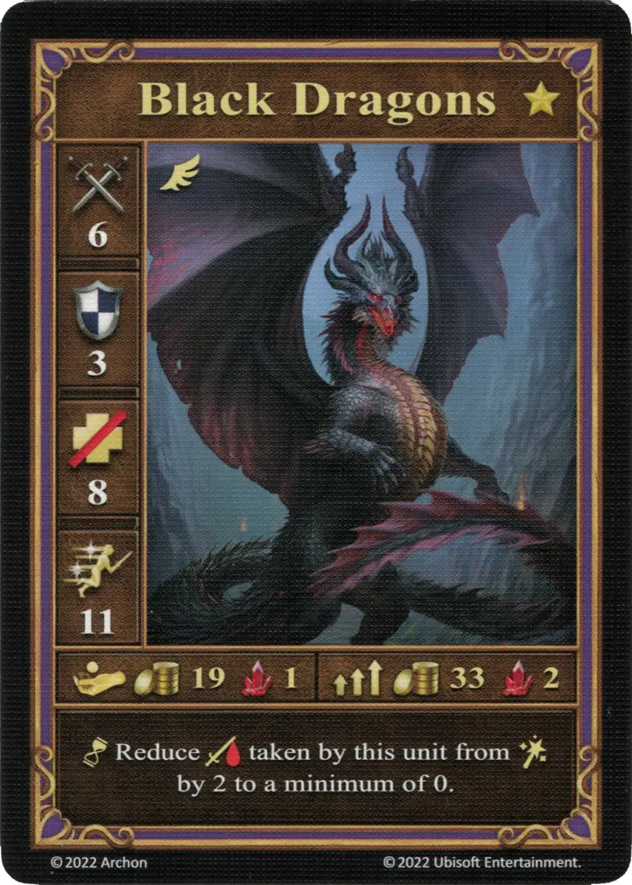
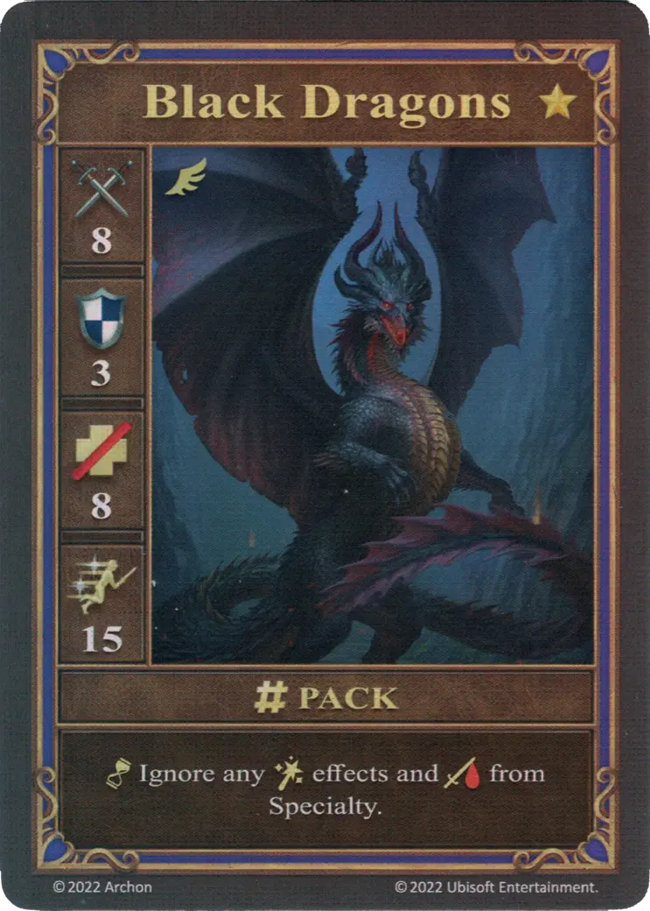
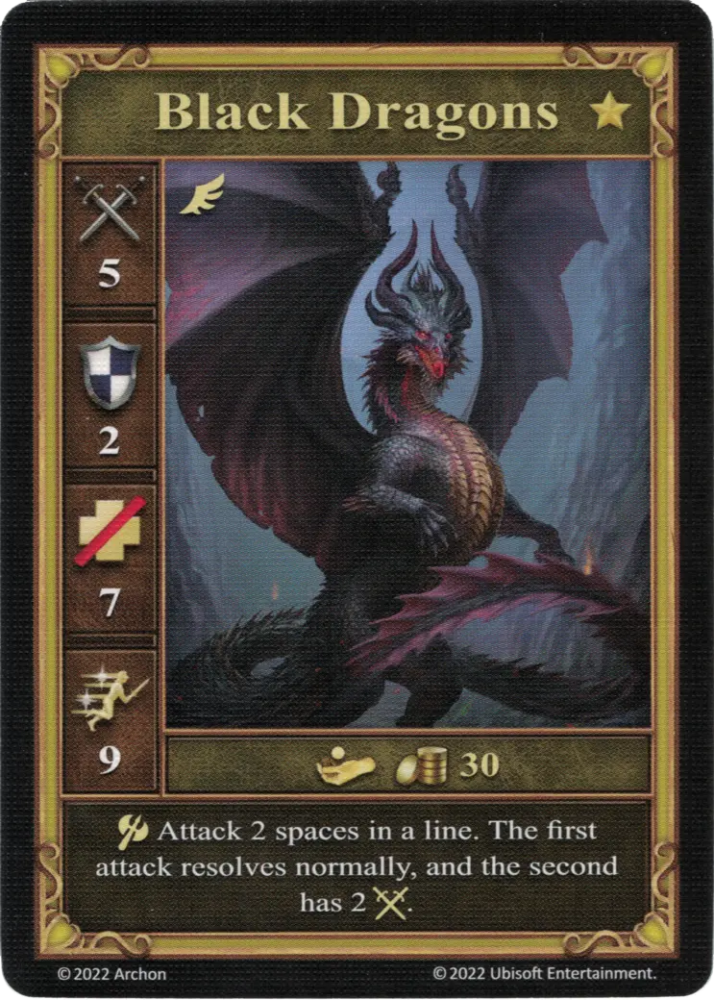

# Dragones Negros

=== "Pocos"

    <figure markdown="span">
        { width="340" align=right }
    </figure>

=== "Manada"

    <figure markdown="span">
        { width="340" align=right }
    </figure>

=== "Neutral"

    <figure markdown="span">
        { width="340" align=right }
    </figure>

| Características | Pocos | Manada | Neutral |
| :--- | :---: | :---: | :---: |
| Ciudad | [Mazmorra](../towns/dungeon.md) | [Mazmorra](../towns/dungeon.md) | [Neutral](../towns/neutral.md) |
| Nivel | :golden: | :golden: | :golden: |
| Tipo | [:unit_flying:](../keywords/flying_unit.md) | [:unit_flying:](../keywords/flying_unit.md) | [:unit_flying:](../keywords/flying_unit.md) |
| :attack: | 6 | **8** | 5 |
| :defense: | 3 | 3 | 2 |
| :health_points: | 8 | 8 | 7 |
| :initiative: | 11 | **15** | 9 |
| Coste | 19 :gold: 1 :valuables: | 33 :gold: 2 :valuables: | 30 :gold: |
| Habilidades | :unit_passive: Reduce el :damage: recibido de esta unidad por [:spellpower:](../spells/index.md) en 2 hasta un mínimo de 0. | :unit_passive: Ignora cualquier efecto de [:spellpower:](../spells/index.md) y :damage: de [Especialidad](../heroes/index.md). | :unit_attack: Ataca 2 casillas en una línea. El primer ataque se resuelve normalmente, y el segundo tiene 2 :attack:. |

## Héroes Con Especialidad

- [:might: Mutare](../heroes/mutare.md#specialty)

## Notas

- **Manada** - Los efectos de los hechizos y especialidades propios del jugador son ignorados.
- **Manada** - Las Especialidades son cartas (Ⅰ, Ⅳ, y Ⅵ) específicas del héroe.
- ** Neutral ** - El primer ataque se dirige a una unidad directamente frente a los Dragones Negros. El segundo ataque se dirige a la unidad directamente detrás del objetivo primario en línea recta. No hay otra opción aquí.
- ** Neutral ** - El objetivo del segundo ataque no lleva a cabo un ataque de represalia contra los Dragones Negro, ya que no está adyacente a él.
- ** Neutral ** - Si los Dragones Negros atacan a dos unidades en una línea, ambos ataques se resuelven primero. El ataque de represalia solo se llevará a cabo después de que se haya resuelto el ataque secundario de los Dragones Negros.
- ** Neutral ** - Si los Dragones Negros atacan una unidad, y la unidad directamente detrás del objetivo principal en línea recta es una unidad aliada, entonces la unidad aliada será el objetivo de su ataque secundario.
- ** Neutral ** - Si los Dragones Negros atacan un Muro, no se producirá un ataque secundario. Las unidades detrás de la pared están protegidas. Si atacan una unidad directamente frente a una pared, la pared no recibirá ningún daño.

## Viene Con

- [Juego Principal](../content/core_game.md)

## Ver También

- [Lista de Unidades](index.md)
- [Lista de Ciudades](../towns/index.md)
