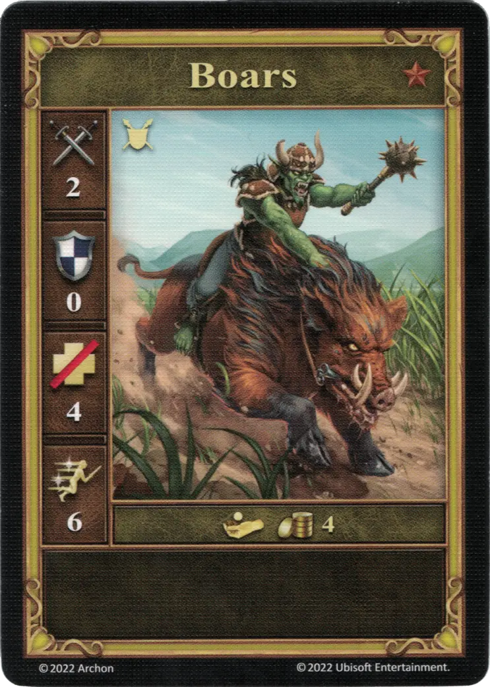

# Jabalíes

<figure markdown="span">
    { width="340" align=right }
</figure>

| Características | Neutral |
| :--- | :---: |
| Ciudad | [Neutral](../towns/neutral.md) |
| Nivel | :bronze: |
| Tipo | [:unit_ground:](../keywords/ground_unit.md) |
| :attack: | 2 |
| :defense: | 0 |
| :health_points: | 4 |
| :initiative: | 6 |
| Coste | 4 :gold: |
| Habilidades | - |

## Viene Con

- [Juego Principal](../content/core_game.md)

## Ver También

- [Lista de Unidades](index.md)
- [Lista de Ciudades](../towns/index.md)
