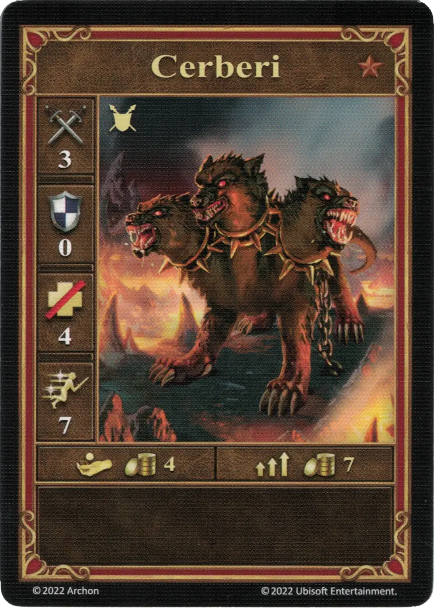
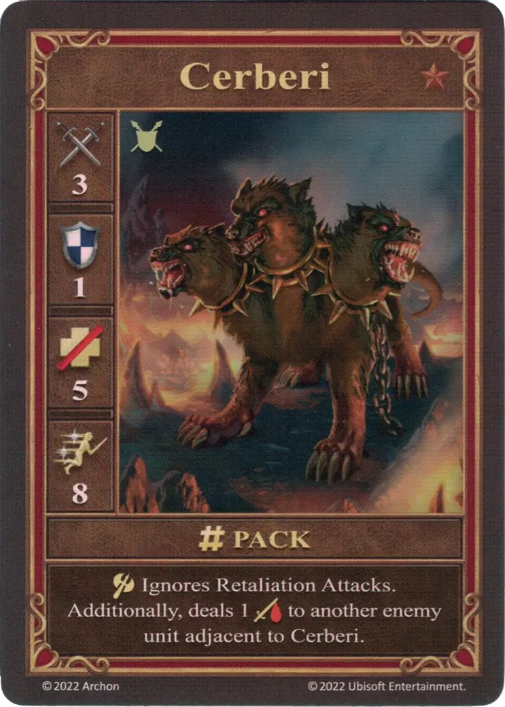
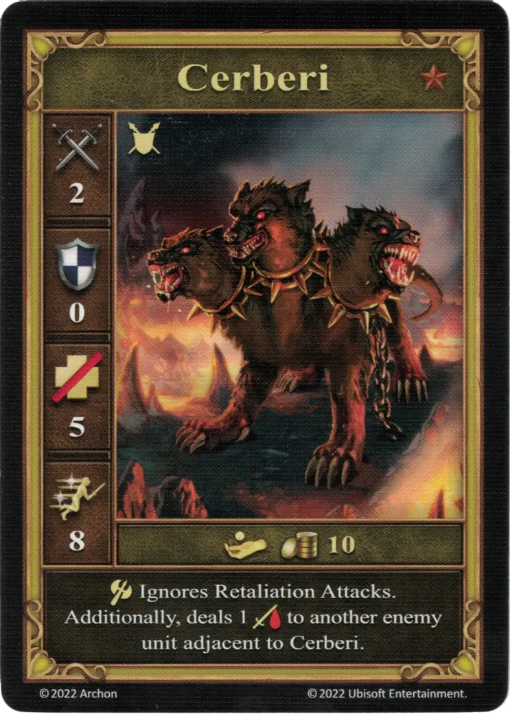

# Cerberos

=== "Pocos"

    <figure markdown="span">
        { width="340" align=right }
    </figure>

=== "Manada"

    <figure markdown="span">
        { width="340" align=right }
    </figure>

=== "Neutral"

    <figure markdown="span">
        { width="340" align=right }
    </figure>

| Características | Pocos | Manada | Neutral |
| :--- | :---: | :---: | :---: |
| Ciudad | [Infierno](../towns/inferno.md) | [Infierno](../towns/inferno.md) | [Neutral](../towns/neutral.md) |
| Nivel | :bronze: | :bronze: | :bronze: |
| Tipo | [:unit_ground:](../keywords/ground_unit.md) | [:unit_ground:](../keywords/ground_unit.md) | [:unit_ground:](../keywords/ground_unit.md) |
| :attack: | 3 | 3 | 2 |
| :defense: | 0 | **1** | 0 |
| :health_points: | 4 | **5** | 5 |
| :initiative: | 7 | **8** | 8 |
| Coste | 4 :gold: | 7 :gold: | 10 :gold: |
| Habilidades | - | :unit_attack: Ignora Ataques de Represalia. Adicionalmente, inflige 1 :damage: a otra unidad enemiga adyacente a Cerberos. | :unit_attack: Ignora Ataques de Represalia. Adicionalmente, inflige 1 :damage: a otra unidad enemiga adyacente a Cerberos. |

## Héroes Con Especialidad

- [:might: Fiona](../heroes/fiona.md#specialty)

## Notas

- **Manada y Neutral** - Si los Cerberos atacan a una unidad y sólo hay una unidad alidada adyacente a su objetivo, entonces la unidad aliada recibirá el daño.

## Viene Con

- [Expansión de Infierno](../content/inferno_expansion.md)

## Ver También

- [Lista de Unidades](index.md)
- [Lista de Ciudades](../towns/index.md)
