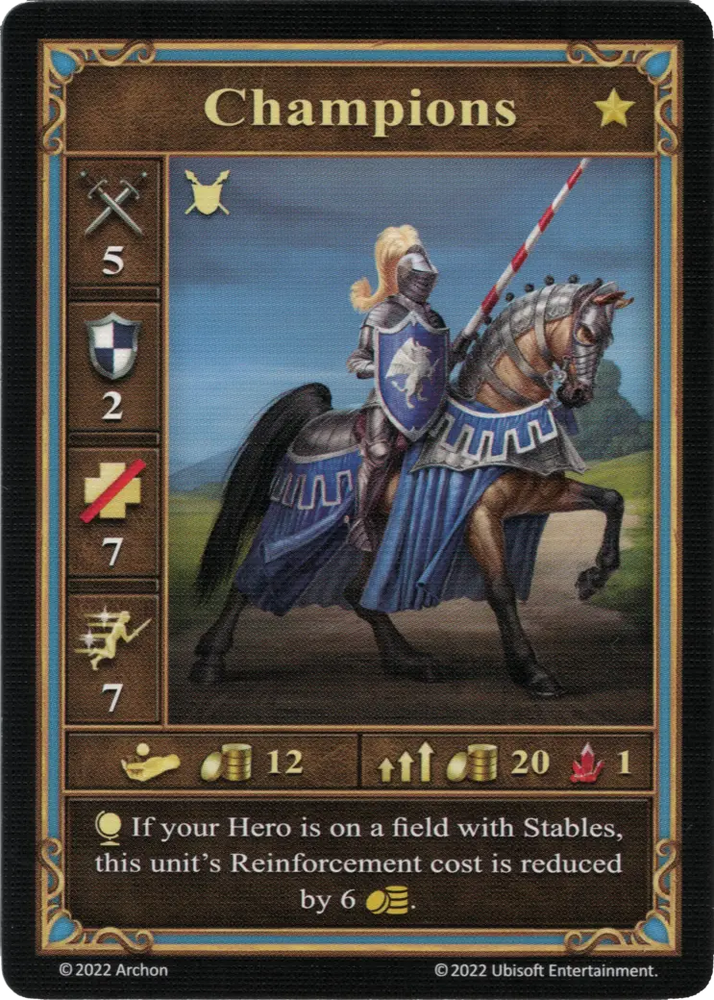
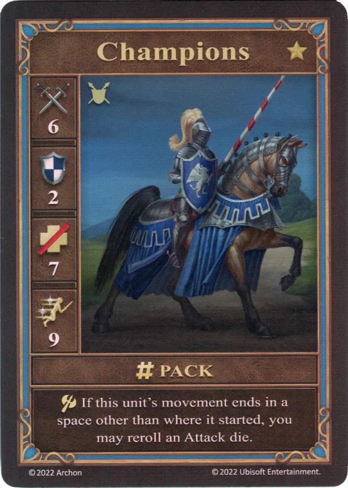
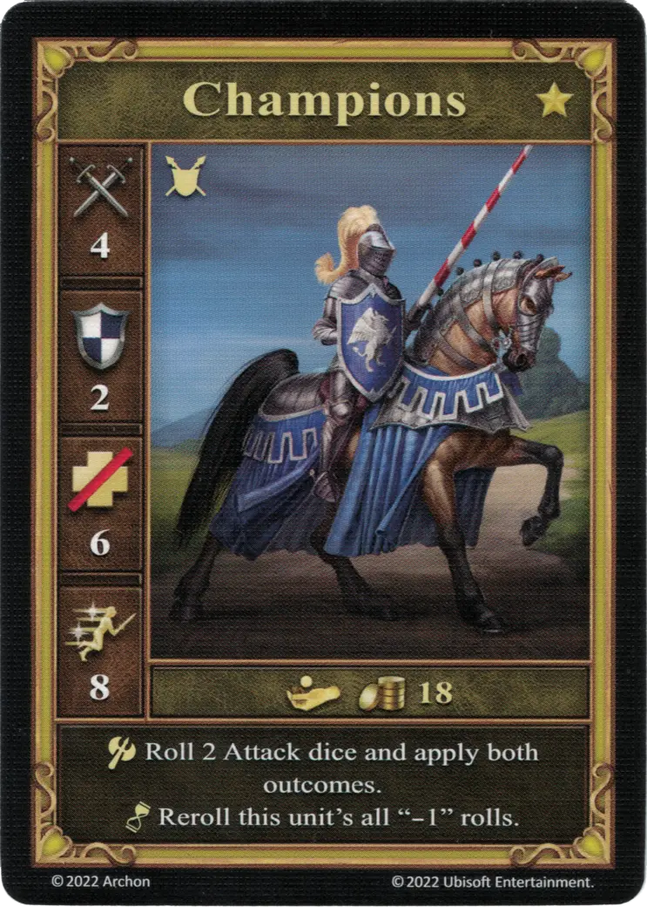

# Campeones

=== "Pocos"

    <figure markdown="span">
        { width="340" align=right }
    </figure>

=== "Manada"

    <figure markdown="span">
        { width="340" align=right }
    </figure>

=== "Neutral"

    <figure markdown="span">
        { width="340" align=right }
    </figure>

| Características | Pocos | Manada | Neutral |
| :--- | :---: | :---: | :---: |
| Ciudad | [Castle](../towns/castle.md) | [Castle](../towns/castle.md) | [Neutral](../towns/neutral.md) |
| Nivel | :golden: | :golden: | :golden: |
| Tipo | [:unit_ground:](../keywords/ground_unit.md) | [:unit_ground:](../keywords/ground_unit.md) | [:unit_ground:](../keywords/ground_unit.md) |
| :attack: | 5 | **6** | 4 |
| :defense: | 2 | 2 | 2 |
| :health_points: | 7 | 7 | 6 |
| :initiative: | 7 | **9** | 8 |
| Coste | 12 :gold: | 20 :gold: 1 :valuables: | 18 :gold: |
| Habilidades | :effect_map: Si tu héroe está en una casilla con Establos, el refuerzo de esta unidad se reduce en 6 :gold:. | :unit_attack: Si el movimiento de esta unidad finaliza en una casilla distinta a la inicial, puedes repetir un [dado de Ataque](../dice.md#attack-die). | :unit_attack: Lanza 2 [dados de Ataque](../dice.md#attack-die) y aplica ambos resultados. :unit_passive: Esta unidad Repite todos los "-1" de la tirada. |

## Notas

- ** Neutral ** - Un -1 en el dado de Ataque siempre se vuelve a lanzar, incluso varias veces.
- ** Neutral ** - Al atacar a [Mantícoras](manticores.md) neutrales, las [Mantícoras](manticores.md) reciben +2 :defense:, ya que ambos dados de Ataque siempre acabarán en 0 o 1.

## Viene Con

- [Juego Principal](../content/core_game.md)

## Ver También

- [Lista de Unidades](index.md)
- [Lista de Ciudades](../towns/index.md)
