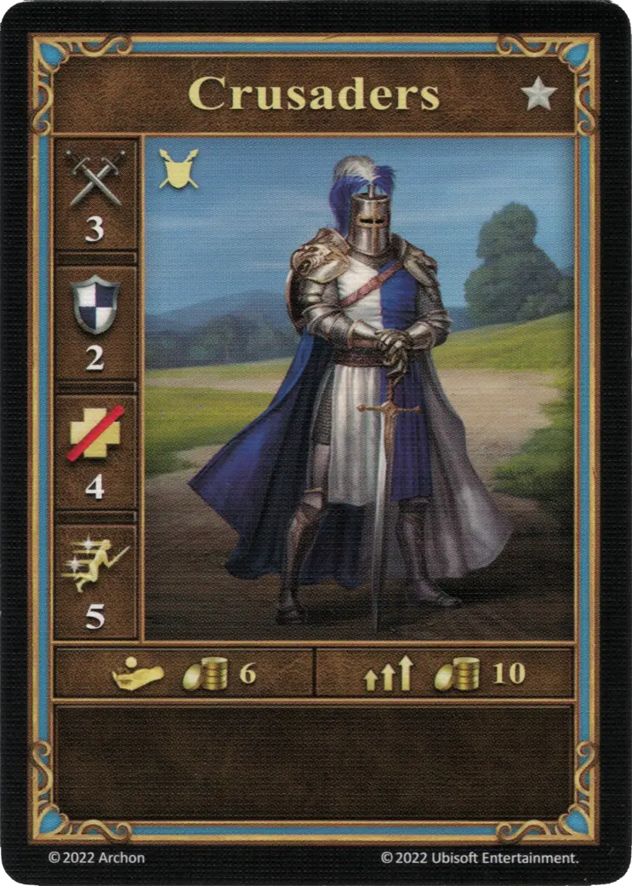
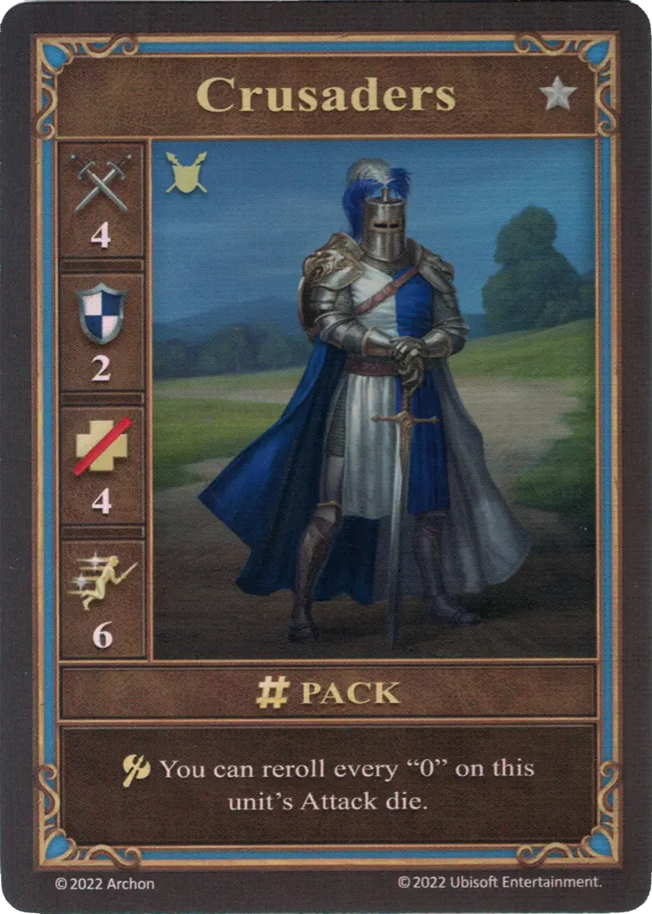
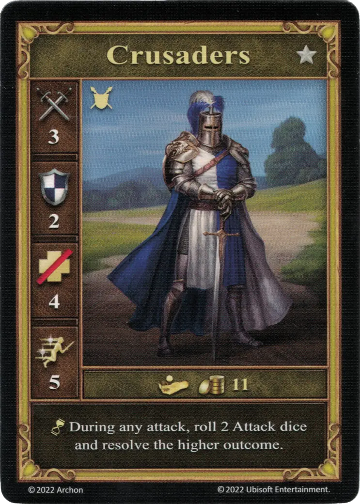

# Cruzados

=== "Pocos"

    <figure markdown="span">
        { width="340" align=right }
    </figure>

=== "Manada"

    <figure markdown="span">
        { width="340" align=right }
    </figure>

=== "Neutral"

    <figure markdown="span">
        { width="340" align=right }
    </figure>

| Características | Pocos | Manada | Neutral |
| :--- | :---: | :---: | :---: |
| Ciudad | [Castillo](../towns/castle.md) | [Castillo](../towns/castle.md) | [Neutral](../towns/neutral.md) |
| Nivel | :silver: | :silver: | :silver: |
| Tipo | [:unit_ground:](../keywords/ground_unit.md) | [:unit_ground:](../keywords/ground_unit.md) | [:unit_ground:](../keywords/ground_unit.md) |
| :attack: | 3 | **4** | 3 |
| :defense: | 2 | 2 | 2 |
| :health_points: | 4 | 4 | 4 |
| :initiative: | 5 | **6** | 5 |
| Coste | 6 :gold: | 10 :gold: | 11 :gold: |
| Habilidades | - | :unit_attack: Puedes Puedes repetir cada "0" en el [Dado de ataque](../dice.md#attack-die) de esta unidad. | :unit_passive: Durante cualquier ataque, lanza 2 [dados de Ataque](../dice.md#attack-die) y resuelve el valor superior. |

## Héroes Con Especialidad

- [:might: Catherine](../heroes/catherine.md#specialty)

## Notas

- **Manada y Neutral** - El [dado de Ataque](../dice.md#attack-die) debe ser repetido hasta que el número del dado no sea igual a "0".
- [^1] **Neutral** - Si los Cruzados toman represalias contra unos pocos [Caballeros del Terror](dread_knights.md), sus habilidades se anulan y se tira un único [Dado de ataque](../dice.md#attack-die) como si fuera un ataque normal.

## Notas

## Viene Con

- [Juego Principal](../content/core_game.md)

## Ver También

- [Lista de Unidades](index.md)
- [Lista de Ciudades](../towns/index.md)

[^1]: Not officially confirmed by game designers, and is therefore considered a Community rule.
