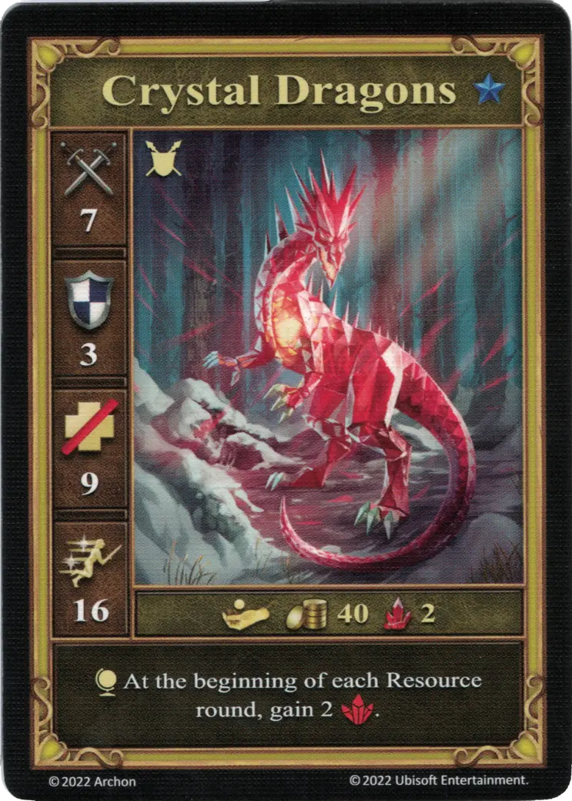

# Dragones de Cristal

<figure markdown="span">
    { width="340" align=right }
</figure>

| Características | Neutral |
| :--- | :---: |
| Ciudad | [Neutral](../towns/neutral.md) |
| Nivel | :azure: |
| Tipo | [:unit_ground:](../keywords/ground_unit.md) |
| :attack: | 7 |
| :defense: | 3 |
| :health_points: | 9 |
| :initiative: | 16 |
| Coste | 40 :gold: 2 :valuables: |
| Habilidades | :effect_map: Al inicio de cada ronda de Recursos, gana 2 :valuables:. |

## Héroes Con Especialidad

- [:might: Mutare](../heroes/mutare.md#specialty)

## Notas

- El efecto sólo se activa si los Dragones de Cristal están en el mazo de unidades del jugador, por lo que tenían que ser reclutados de antemano (ej. mediante [Diplomacia](../abilities/diplomacy.md)).

## Viene Con

- [Juego Principal](../content/core_game.md)

## Ver También

- [Lista de Unidades](index.md)
- [Lista de Ciudades](../towns/index.md)
