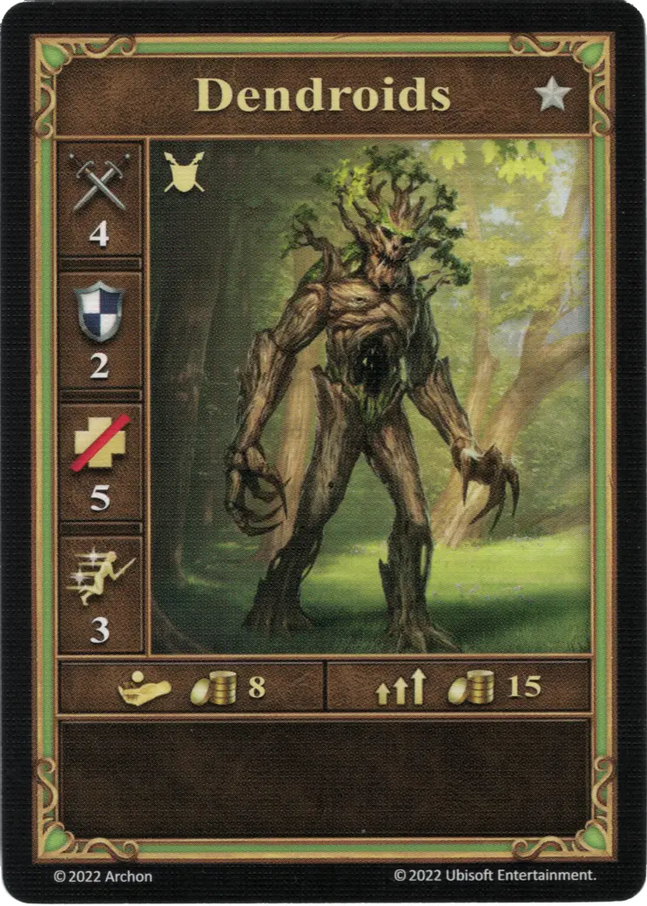
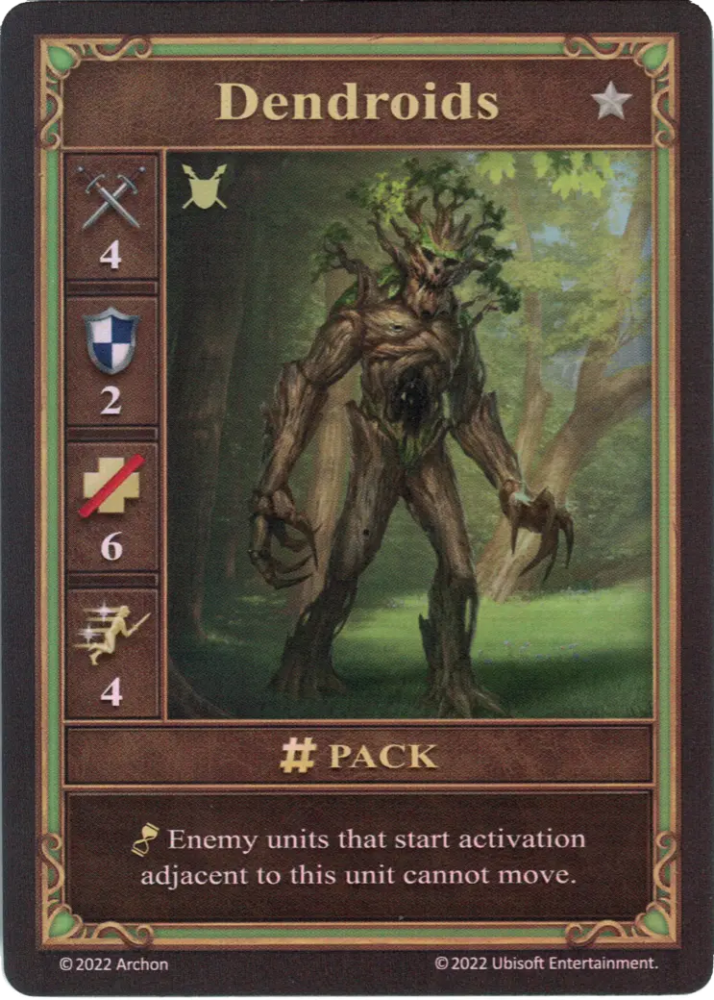
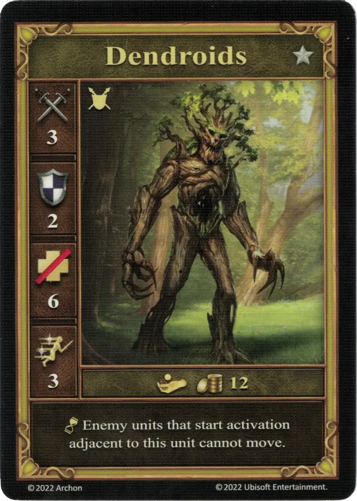

# Dendroides

=== "Pocos"

    <figure markdown="span">
        { width="340" align=right }
    </figure>

=== "Manada"

    <figure markdown="span">
        { width="340" align=right }
    </figure>

=== "Neutral"

    <figure markdown="span">
        { width="340" align=right }
    </figure>

| Características | Pocos | Manada | Neutral |
| :--- | :---: | :---: | :---: |
| Ciudad | [Murallas](../towns/rampart.md) | [Murallas](../towns/rampart.md) | [Neutral](../towns/neutral.md) |
| Nivel | :silver: | :silver: | :silver: |
| Tipo | [:unit_ground:](../keywords/ground_unit.md) | [:unit_ground:](../keywords/ground_unit.md) | [:unit_ground:](../keywords/ground_unit.md) |
| :attack: | 4 | 4 | 3 |
| :defense: | 2 | 2 | 2 |
| :health_points: | 5 | **6** | 6 |
| :initiative: | 3 | **4** | 3 |
| Coste | 8 :gold: | 15 :gold: | 12 :gold: |
| Habilidades | - | :unit_passive: Las unidades enemigas que comienzan la activación adyacentes a esta unidad no pueden moverse. | :unit_passive: Las unidades enemigas que comienzan la activación adyacentes a esta unidad no pueden moverse. |

## Viene Con

- [Expansión de Muralla](../content/rampart_expansion.md)
- [Expansión de Torre](../content/tower_expansion.md) (Neutral)

## Ver También

- [Lista de Unidades](index.md)
- [Lista de Ciudades](../towns/index.md)
