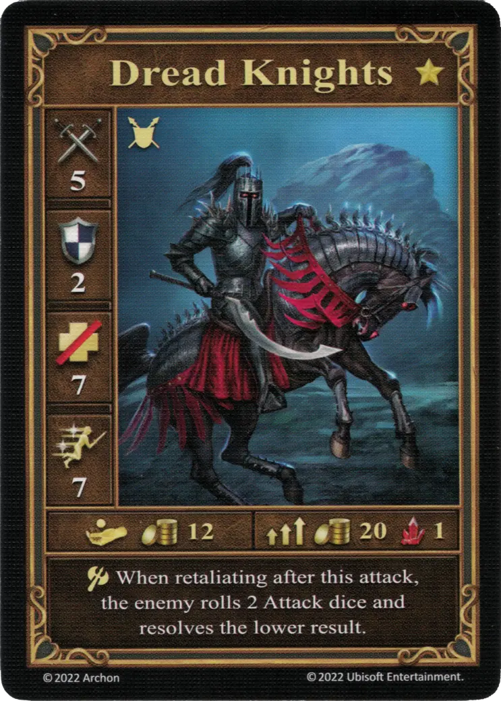
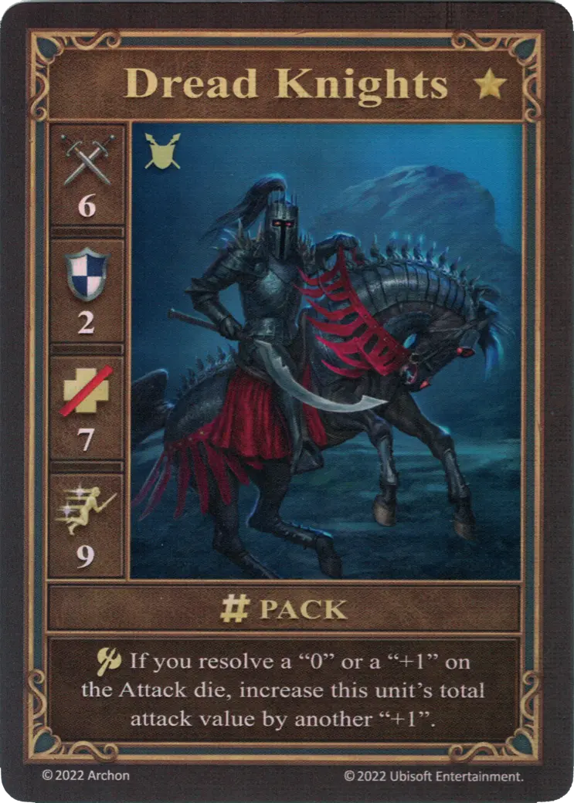
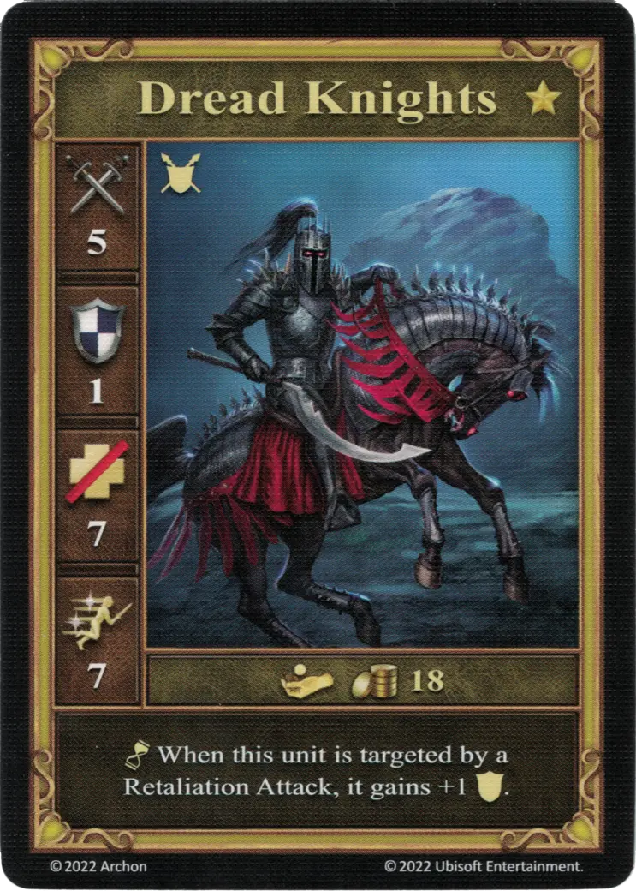

# Caballeros del Terror

=== "Pocos"

    <figure markdown="span">
        { width="340" align=right }
    </figure>

=== "Manada"

    <figure markdown="span">
        { width="340" align=right }
    </figure>

=== "Neutral"

    <figure markdown="span">
        { width="340" align=right }
    </figure>

| Características | Pocos | Manada | Neutral |
| :--- | :---: | :---: | :---: |
| Ciudad | [Necrópolis](../towns/necropolis.md) | [Necrópolis](../towns/necropolis.md) | [Neutral](../towns/neutral.md) |
| Nivel | :golden: | :golden: | :golden: |
| Tipo | [:unit_ground:](../keywords/ground_unit.md) | [:unit_ground:](../keywords/ground_unit.md) | [:unit_ground:](../keywords/ground_unit.md) |
| :attack: | 5 | **6** | 5 |
| :defense: | 2 | 2 | 1 |
| :health_points: | 7 | 7 | 7 |
| :initiative: | 7 | **9** | 7 |
| Coste | 12 :gold: | 20 :gold: 1 :valuables: | 18 :gold: |
| Habilidades | :unit_attack: Al contraatacar después de este ataque, el enemigo tira 2 [dados de Ataque](../dice.md#attack-die) y resuelve el resultado más bajo. | :unit_attack: Si obtienes un «0» o un «+1» en el [dado de Ataque](../dice.md#attack-die), aumenta el valor de ataque total de esta unidad en otro "+1". | :unit_passive: Cuando esta unidad sea objetivo de un Contraataque, gana +1 :defense:. |

## Héroes Con Especialidad

- [:might: Lord Haart (Necrópolis)](../heroes/lord_haart_necropolis.md#specialty)
- [:might: Tamika](../heroes/tamika.md#specialty)

## Notas

- [^1] **Pocos** - Si los Caballeros del Terror atacan a [Cruzados] (crusaders.md) neutrales, cuando los [Cruzados](crusaders.md) contraatacan contra unos pocos Caballeros del Terror, sus habilidades se anulan y se lanza un único [Dado de ataque](../dice.md#attack-die) como si fuera un ataque normal.

## Viene Con

- [Juego Principal](../content/core_game.md)

## Ver También

- [Lista de Unidades](index.md)
- [Lista de Ciudades](../towns/index.md)

[^1]: Not officially confirmed by game designers, and is therefore considered a Community rule.
