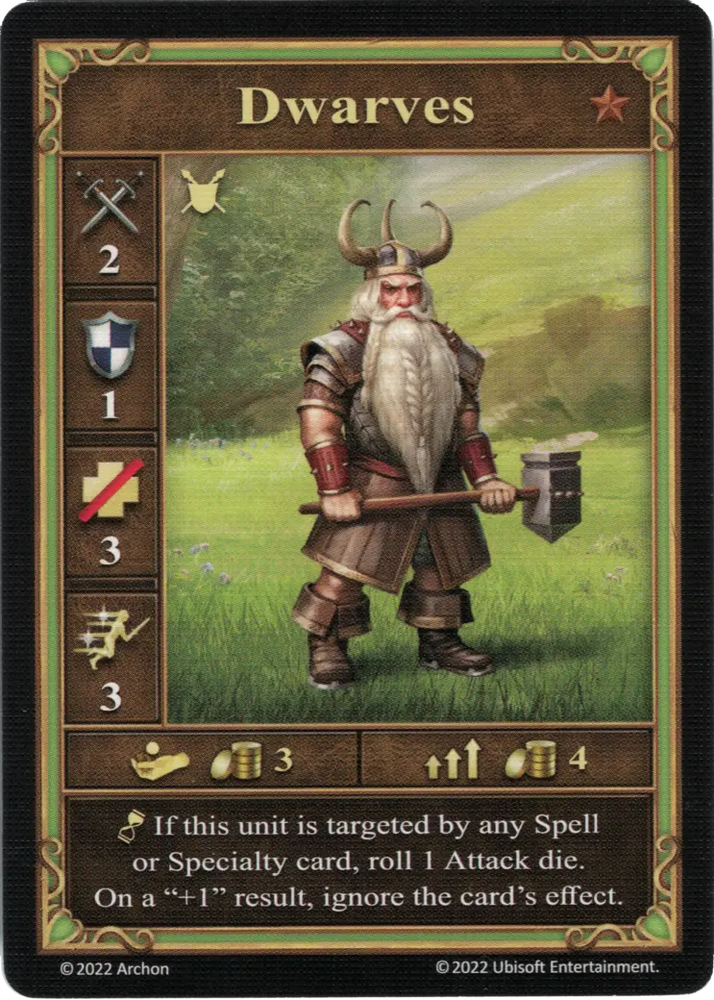
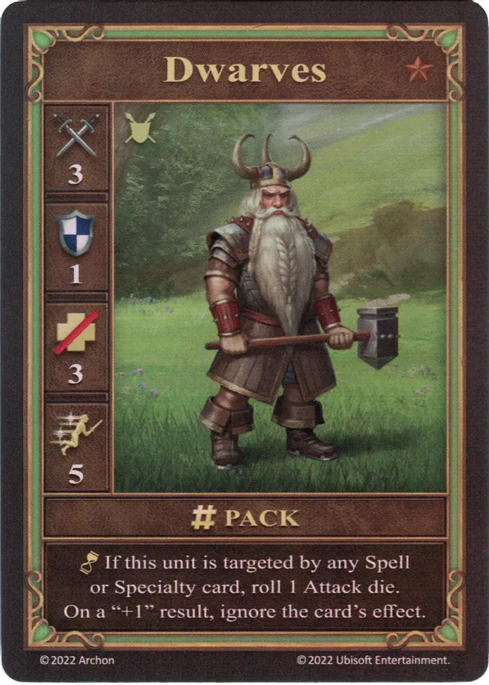
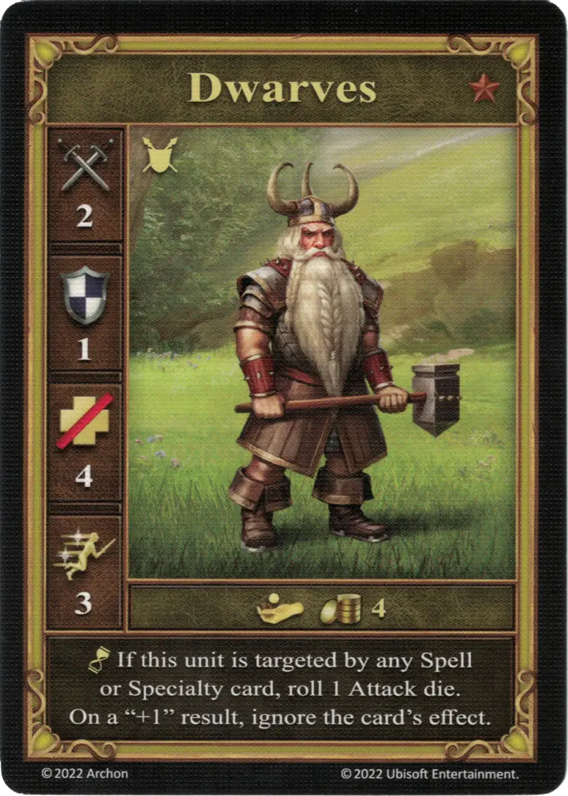

# Enanos

=== "Pocos"

    <figure markdown="span">
        { width="340" align=right }
    </figure>

=== "Manada"

    <figure markdown="span">
        { width="340" align=right }
    </figure>

=== "Neutral"

    <figure markdown="span">
        { width="340" align=right }
    </figure>

| Características | Pocos | Manada | Neutral |
| :--- | :---: | :---: | :---: |
| Ciudad | [Murallas](../towns/rampart.md) | [Murallas](../towns/rampart.md) | [Neutral](../towns/neutral.md) |
| Nivel | :bronze: | :bronze: | :bronze: |
| Tipo | [:unit_ground:](../keywords/ground_unit.md) | [:unit_ground:](../keywords/ground_unit.md) | [:unit_ground:](../keywords/ground_unit.md) |
| :attack: | 2 | **3** | 2 |
| :defense: | 1 | 1 | 1 |
| :health_points: | 3 | 3 | 4 |
| :initiative: | 3 | **5** | 3 |
| Coste | 3 :gold: | 4 :gold: | 4 :gold: |
| Habilidades | :unit_passive: Si esta unidad es objetivo de alguna carta de  [Hechizo](../spells/index.md) o [Especialidad](../heroes/index.md), lanza 1 [dado de Ataque](../dice.md#attack-die). Con un resultado "+1", ignora el efecto de la carta. | :unit_passive: Si esta unidad es objetivo de alguna carta de  [Hechizo](../spells/index.md) o [Especialidad](../heroes/index.md), lanza 1 [dado de Ataque](../dice.md#attack-die). Con un resultado "+1", ignora el efecto de la carta. | :unit_passive: Si esta unidad es objetivo de alguna carta de  [Hechizo](../spells/index.md) o [Especialidad](../heroes/index.md), lanza 1 [dado de Ataque](../dice.md#attack-die). Con un resultado "+1", ignora el efecto de la carta. |

## Notas

- El dado de Ataque necesita ser lanzado incluso si el hechizo o especialidad que fue usado era beneficioso.
- [^1] Los Enanos ignoran el efecto de la carta si son el único objetivo. Si el efecto también afecta a otras unidades, los Enanos no lo ignoran.

## Viene Con

- [Expansión de Muralla](../content/rampart_expansion.md)
- [Expansión de Torre](../content/tower_expansion.md) (Neutral)

## Ver También

- [Lista de Unidades](index.md)
- [Lista de Ciudades](../towns/index.md)

[^1]: Not officially confirmed by game designers, and is therefore considered a Community rule.
