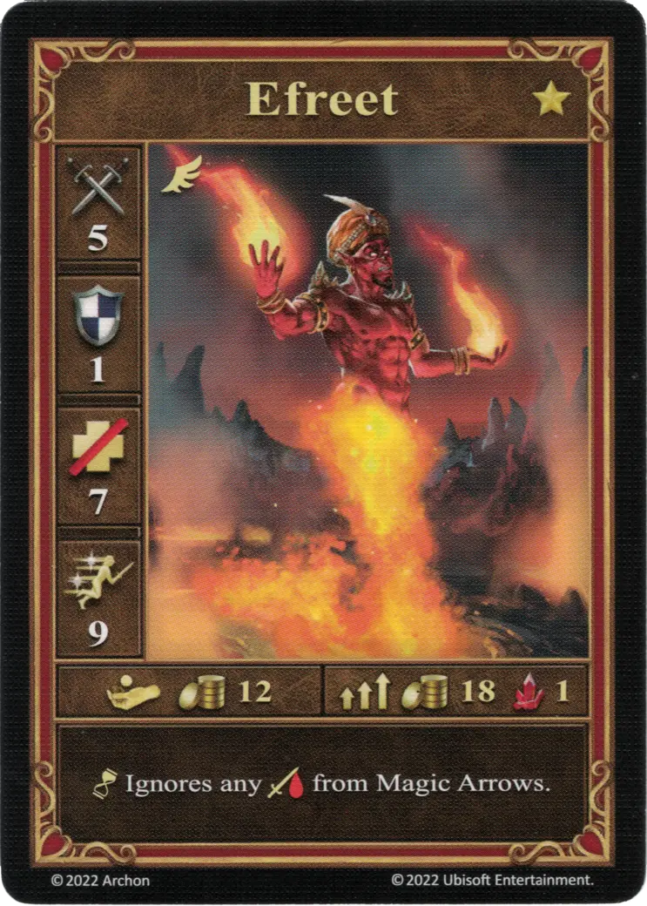
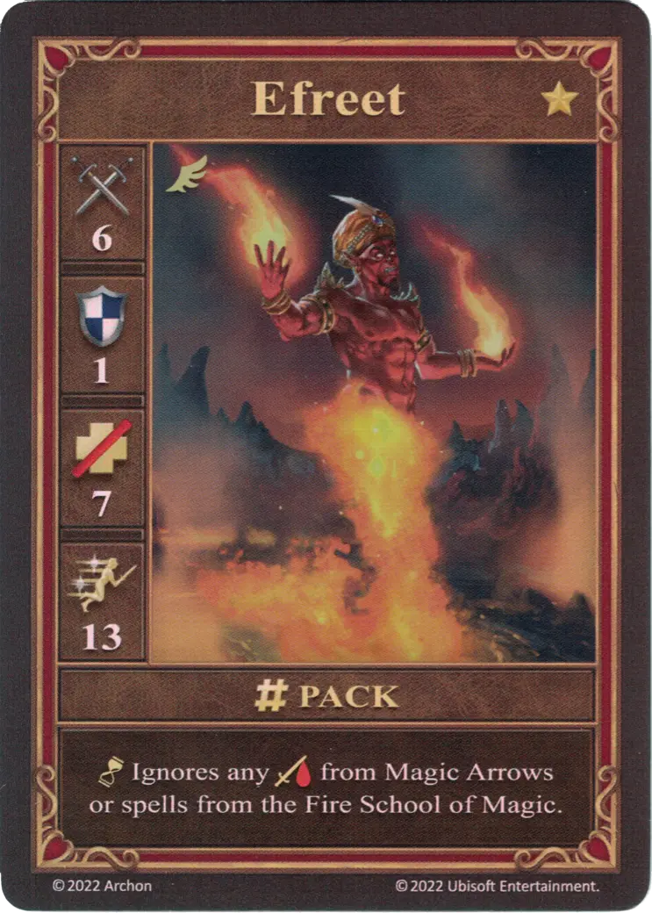
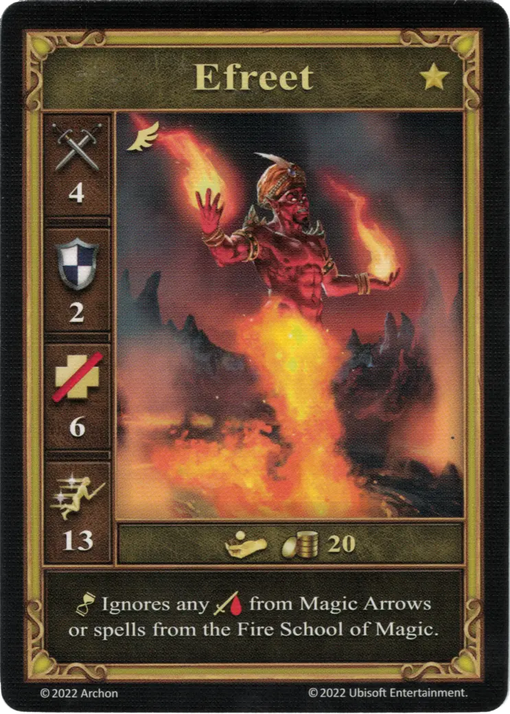

# Ifrits

=== "Pocos"

    <figure markdown="span">
        { width="340" align=right }
    </figure>

=== "Manada"

    <figure markdown="span">
        { width="340" align=right }
    </figure>

=== "Neutral"

    <figure markdown="span">
        { width="340" align=right }
    </figure>

| Características | Pocos | Manada | Neutral |
| :--- | :---: | :---: | :---: |
| Ciudad | [Infierno](../towns/inferno.md) | [Infierno](../towns/inferno.md) | [Neutral](../towns/neutral.md) |
| Nivel | :golden: | :golden: | :golden: |
| Tipo | [:unit_flying:](../keywords/flying_unit.md) | [:unit_flying:](../keywords/flying_unit.md) | [:unit_flying:](../keywords/flying_unit.md) |
| :attack: | 5 | **6** | 4 |
| :defense: | 1 | 1 | 2 |
| :health_points: | 7 | 7 | 6 |
| :initiative: | 9 | **13** | 13 |
| Coste | 12 :gold: | 18 :gold: 1 :valuables: | 20 :gold: |
| Habilidades | :unit_passive: Ignora cualquier :damage: de [Flechas Mágicas](../spells/magic_arrow.md). | :unit_passive: Ignora cualquier :damage: de [Flechas Mágicas](../spells/magic_arrow.md) o [hechizos](../spells/index.md) de la [Escuela de Magia Ígnea](../spells/school_of_fire_magic.md). | :unit_passive: Ignora cualquier :damage: de [Flechas Mágicas](../spells/magic_arrow.md) o [hechizos](../spells/index.md) de la [Escuela de Magia Ígnea](../spells/school_of_fire_magic.md). |

## Héroes Con Especialidad

- [:might: Rashka](../heroes/rashka.md#specialty)

## Viene Con

- [Expansión de Infierno](../content/inferno_expansion.md)

## Ver También

- [Lista de Unidades](index.md)
- [Lista de Ciudades](../towns/index.md)
