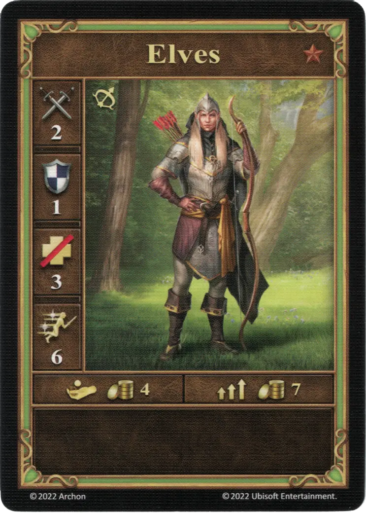
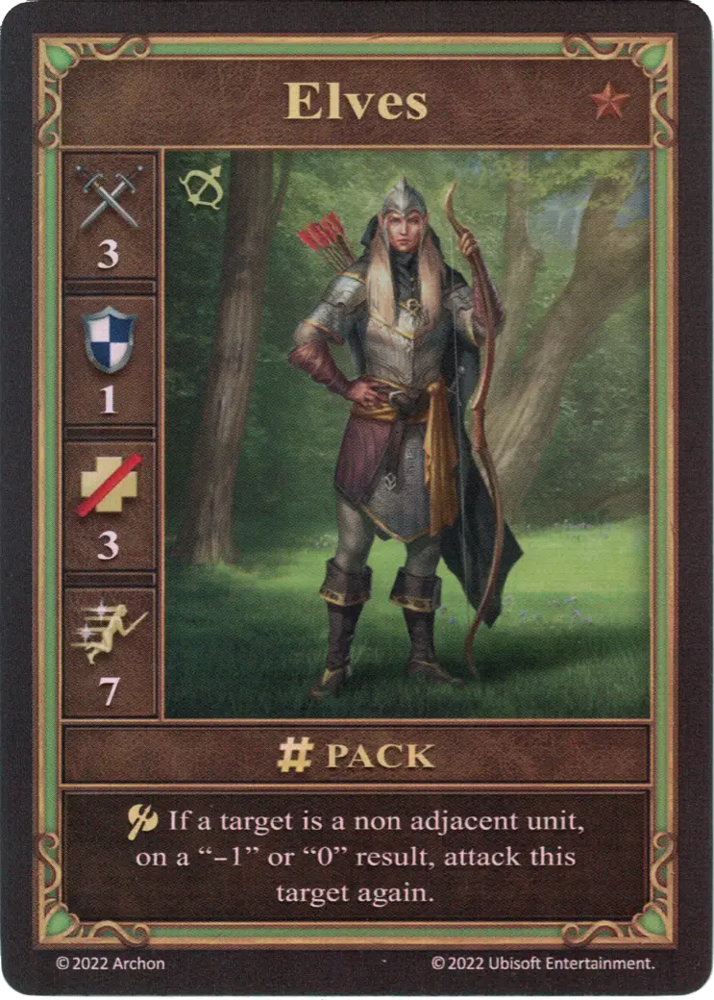
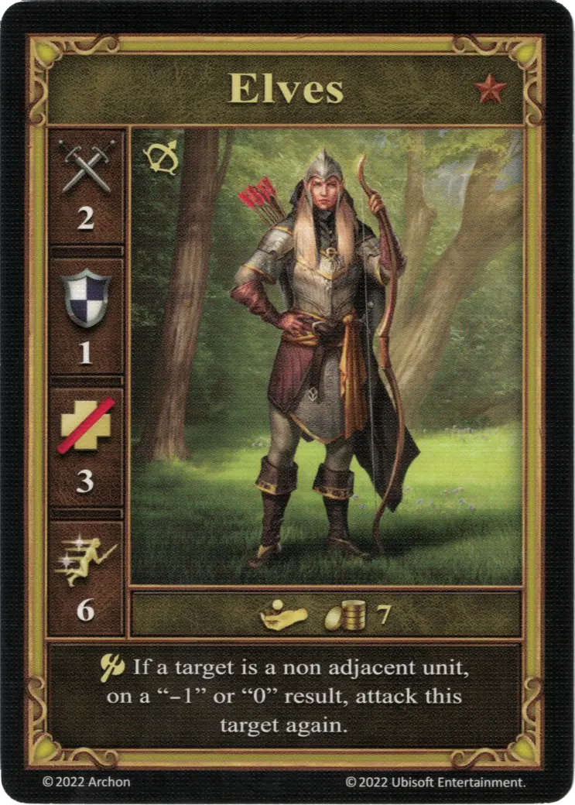

# Elfos

=== "Pocos"

    <figure markdown="span">
        { width="340" align=right }
    </figure>

=== "Manada"

    <figure markdown="span">
        { width="340" align=right }
    </figure>

=== "Neutral"

    <figure markdown="span">
        { width="340" align=right }
    </figure>

| Características | Pocos | Manada | Neutral |
| :--- | :---: | :---: | :---: |
| Ciudad | [Murallas](../towns/rampart.md) | [Murallas](../towns/rampart.md) | [Neutral](../towns/neutral.md) |
| Nivel | :bronze: | :bronze: | :bronze: |
| Tipo | [:unit_ranged:](../keywords/ranged_unit.md) | [:unit_ranged:](../keywords/ranged_unit.md) | [:unit_ranged:](../keywords/ranged_unit.md) |
| :attack: | 2 | **3** | 2 |
| :defense: | 1 | 1 | 1 |
| :health_points: | 3 | 3 | 3 |
| :initiative: | 6 | **7** | 6 |
| Coste | 4 :gold: | 7 :gold: | 7 :gold: |
| Habilidades | - | :unit_attack: Si un objetivo es una unidad no adyacente, con un resultado de "-1" o "0", ataca de nuevo a este objetivo. | :unit_attack: Si un objetivo es una unidad no adyacente, con un resultado de "-1" o "0", ataca de nuevo a este objetivo. |

## Héroes Con Especialidad

- [:might: Gelu](../heroes/gelu.md#specialty)

## Notas

- **Manada y Neutral** - Los Elfos pueden atacar como máximo una vez adicional, no más.

## Viene Con

- [Expansión de Muralla](../content/rampart_expansion.md)
- [Expansión de Torre](../content/tower_expansion.md) (Neutral)

## Ver También

- [Lista de Unidades](index.md)
- [Lista de Ciudades](../towns/index.md)
