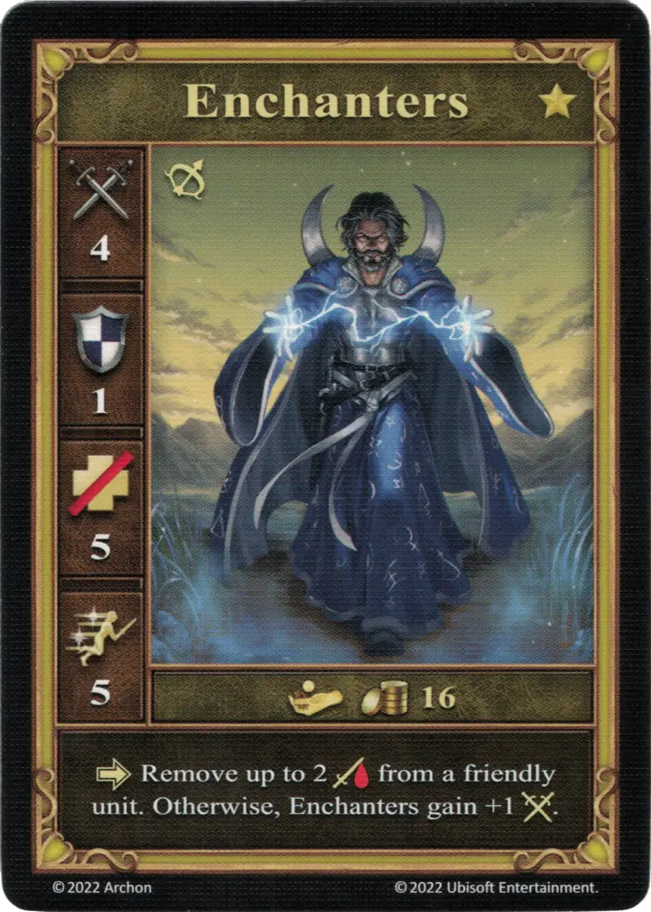

# Conjuradores

<figure markdown="span">
    { width="340" align=right }
</figure>

| Características | Neutral |
| :--- | :---: |
| Ciudad | [Neutral](../towns/neutral.md) |
| Nivel | :golden: |
| Tipo | [:unit_ranged:](../keywords/ranged_unit.md) |
| :attack: | 4 |
| :defense: | 1 |
| :health_points: | 5 |
| :initiative: | 5 |
| Coste | 16 :gold: |
| Habilidades | :activation: Elimina hasta 2 :damage: de una unidad aliada. De lo contrario, los Conjuradores ganan +1 :attack:. |

## Héroes Con Especialidad

- [:magic: Dracon](../heroes/dracon.md#specialty)

## Notas

- Si es posible, hay que elegir el efecto curativo. El efecto curativo no se puede omitir en favor del +1 :attack:.
- La curación se aplica justo después de la activación.
- Los Conjuradores no pueden sanarse a sí mismos.

## Viene Con

- [Juego Principal](../content/core_game.md)
- [Expansión de Conflujo](../content/conflux_expansion.md)

## Ver También

- [Lista de Unidades](index.md)
- [Lista de Ciudades](../towns/index.md)
