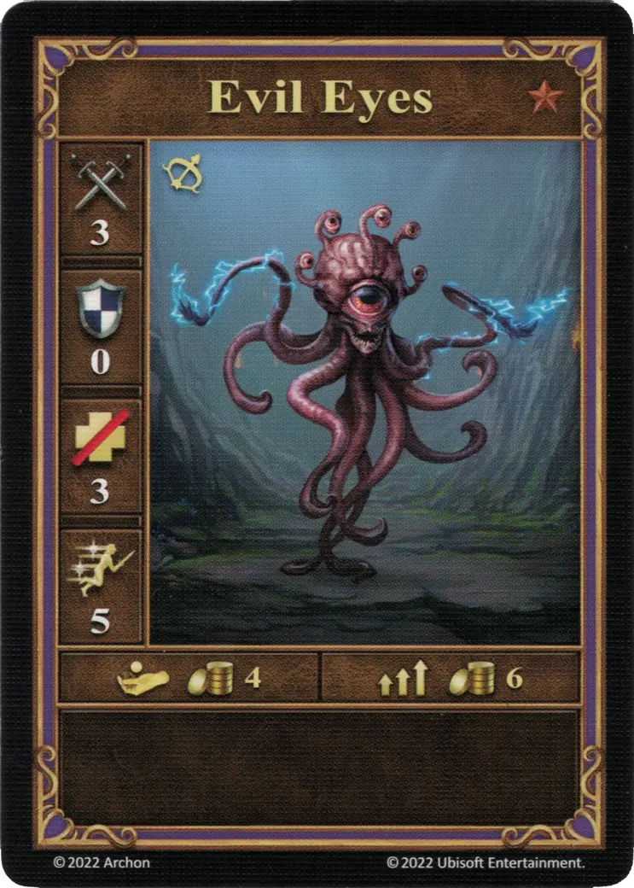
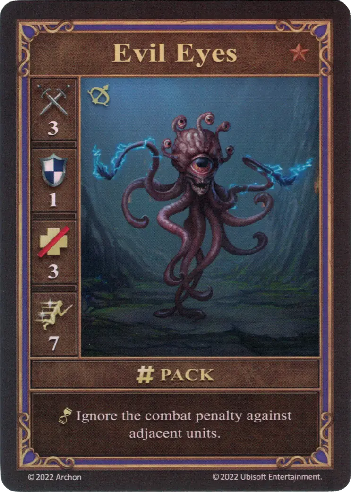

# Ojos Maléficos

=== "Pocos"

    <figure markdown="span">
        { width="340" align=right }
    </figure>

=== "Manada"

    <figure markdown="span">
        { width="340" align=right }
    </figure>

=== "Neutral"

    <figure markdown="span">
        { width="340" align=right }
    </figure>

| Características | Pocos | Manada | Neutral |
| :--- | :---: | :---: | :---: |
| Ciudad | [Mazmorra](../towns/dungeon.md) | [Mazmorra](../towns/dungeon.md) | [Neutral](../towns/neutral.md) |
| Nivel | :bronze: | :bronze: | :bronze: |
| Tipo | [:unit_ranged:](../keywords/ranged_unit.md) | [:unit_ranged:](../keywords/ranged_unit.md) | [:unit_ranged:](../keywords/ranged_unit.md) |
| :attack: | 3 | 3 | 2 |
| :defense: | 0 | **1** | 1 |
| :health_points: | 3 | 3 | 3 |
| :initiative: | 5 | **7** | 6 |
| Coste | 4 :gold: | 6 :gold: | 6 :gold: |
| Habilidades | - | :unit_passive: Ignora la penalización de combate contra unidades adyacentes. | :unit_passive: Ignora la penalización de combate contra unidades adyacentes. |

## Viene Con

- [Juego Principal](../content/core_game.md)

## Ver También

- [Lista de Unidades](index.md)
- [Lista de Ciudades](../towns/index.md)
