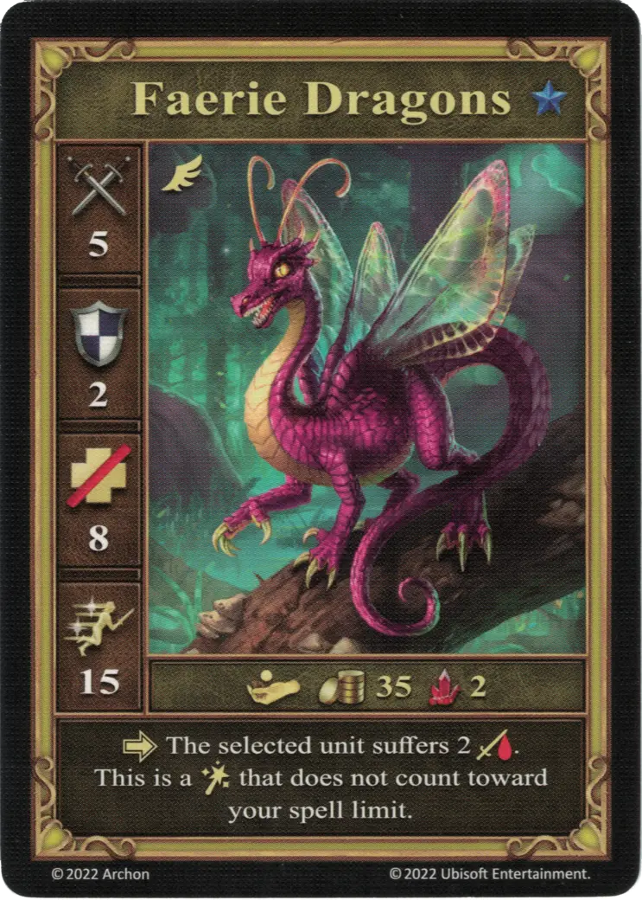

# Dragones Feéricos

<figure markdown="span">
    { width="340" align=right }
</figure>

| Características | Neutral |
| :--- | :---: |
| Ciudad | [Neutral](../towns/neutral.md) |
| Nivel | :azure: |
| Tipo | [:unit_flying:](../keywords/flying_unit.md) |
| :attack: | 5 |
| :defense: | 2 |
| :health_points: | 8 |
| :initiative: | 15 |
| Coste | 35 :gold: 2 :valuables: |
| Habilidades | :activation: La unidad seleccionada sufre 2 :damage:. Esto es un [:spellpower:](../spells/index.md) que no cuenta para tu límite de [hechizo](../spells/index.md). |

## Héroes Con Especialidad

- [:might: Mutare](../heroes/mutare.md#specialty)

## Notas

- Los 2 :damage: se pueden infligir a cualquier unidad del tablero de Combate.
- La habilidad que cuenta como un [:spellpower:](../spells/index.md) sólo es relevante cuando los Dragones Feéricos están en el mazo de unidades del jugador (ej. después de ser reclutados por [Diplomacia](../abilities/diplomacy.md)).

## Viene Con

- [Expansión de Muralla](../content/rampart_expansion.md)

## Ver También

- [Lista de Unidades](index.md)
- [Lista de Ciudades](../towns/index.md)
