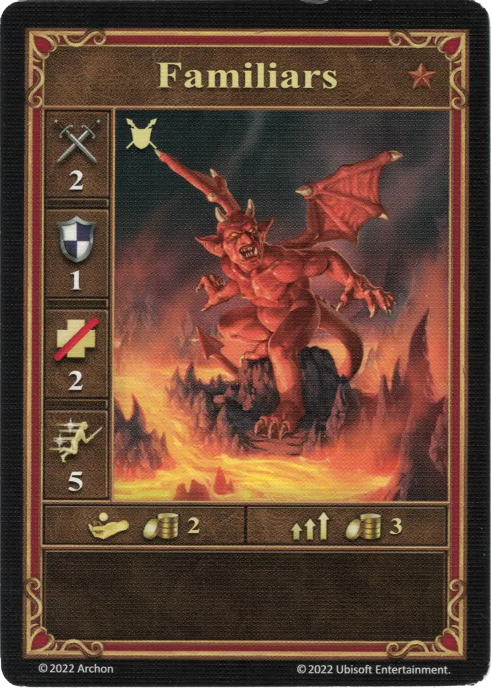
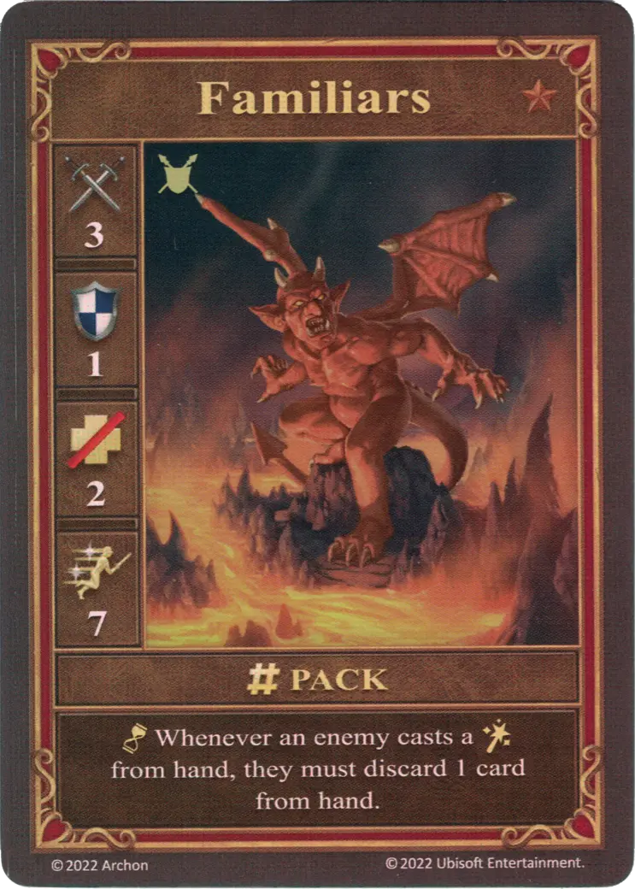
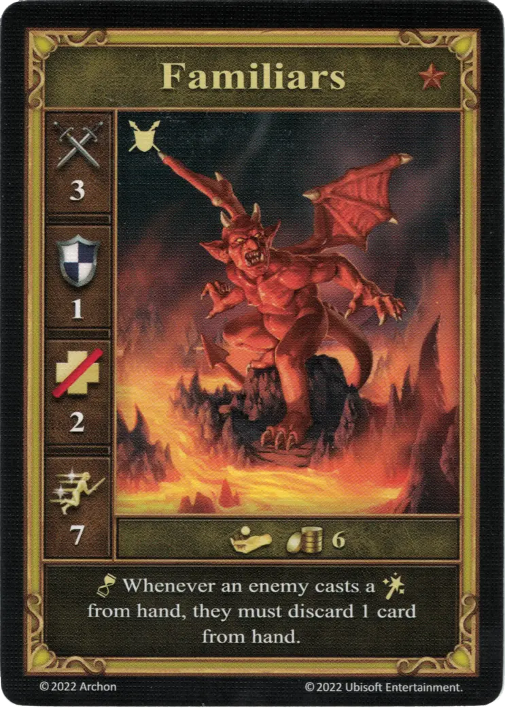

# Familiares

=== "Pocos"

    <figure markdown="span">
        { width="340" align=right }
    </figure>

=== "Manada"

    <figure markdown="span">
        { width="340" align=right }
    </figure>

=== "Neutral"

    <figure markdown="span">
        { width="340" align=right }
    </figure>

| Características | Pocos | Manada | Neutral |
| :--- | :---: | :---: | :---: |
| Ciudad | [Infierno](../towns/inferno.md) | [Infierno](../towns/inferno.md) | [Neutral](../towns/neutral.md) |
| Nivel | :bronze: | :bronze: | :bronze: |
| Tipo | [:unit_ground:](../keywords/ground_unit.md) | [:unit_ground:](../keywords/ground_unit.md) | [:unit_ground:](../keywords/ground_unit.md) |
| :attack: | 2 | **3** | 3 |
| :defense: | 1 | 1 | 1 |
| :health_points: | 2 | 2 | 2 |
| :initiative: | 5 | **7** | 7 |
| Coste | 2 :gold: | 3 :gold: | 6 :gold: |
| Habilidades | - | :unit_passive: Siempre que un enemigo lance un [:spellpower:](../spells/index.md) desde la mano, debe descartar 1 carta de la mano. | :unit_passive: Siempre que un enemigo lance un [:spellpower:](../spells/index.md) desde la mano, debe descartar 1 carta de la mano. |

## Notas

- **Manada y Neutral** - Mientras haya Familiares en juego, el jugador enemigo sólo puede lanzar un [hechizo](../spells/index.md) si puede descartarse de una carta (el descarte se trata como un coste de jugar el hechizo). Si no tiene ninguna carta para descartar, no puede jugar ningún [hechizo](../spells/index.md).

## Viene Con

- [Expansión de Infierno](../content/inferno_expansion.md)

## Ver También

- [Lista de Unidades](index.md)
- [Lista de Ciudades](../towns/index.md)
