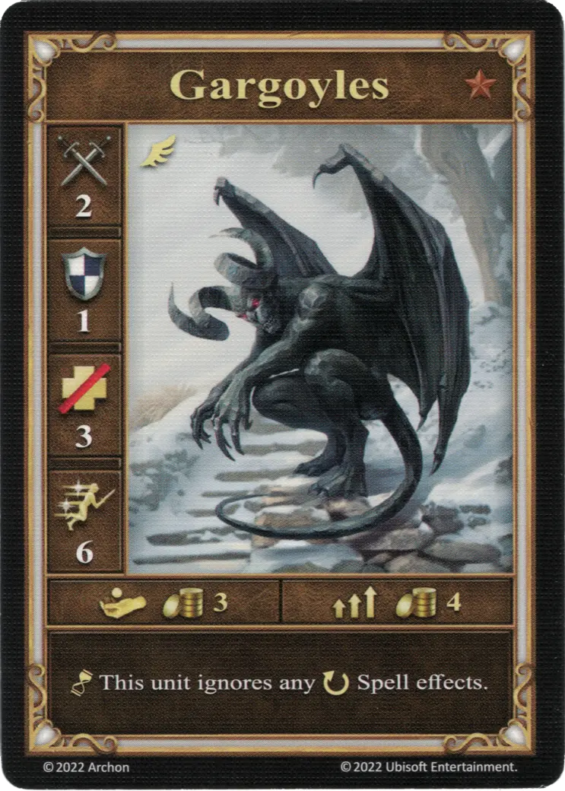
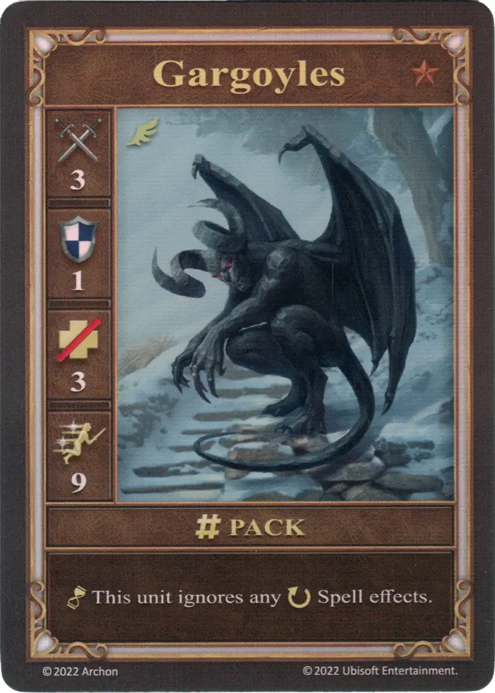
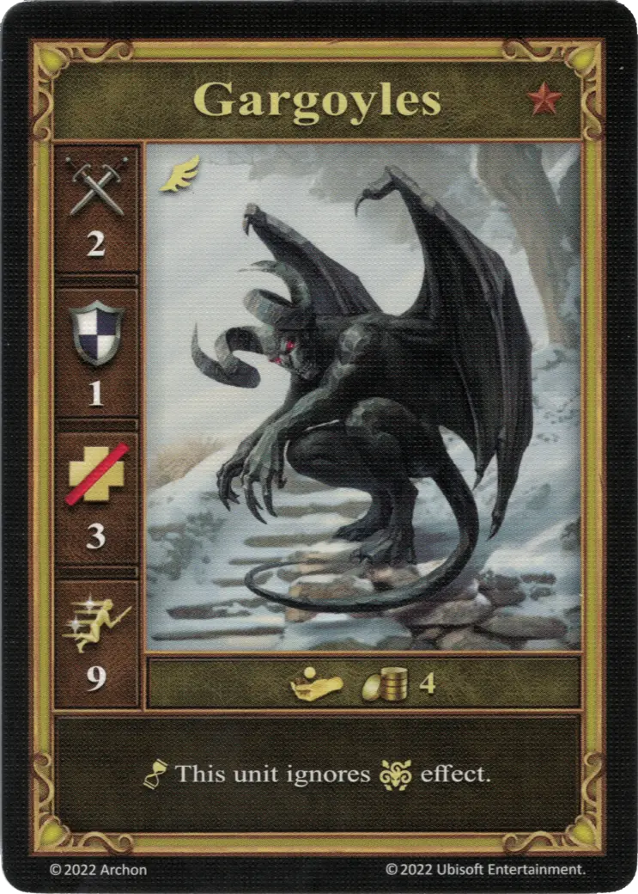

# Gárgolas

=== "Pocos"

    <figure markdown="span">
        { width="340" align=right }
    </figure>

=== "Manada"

    <figure markdown="span">
        { width="340" align=right }
    </figure>

=== "Neutral"

    <figure markdown="span">
        { width="340" align=right }
    </figure>

| Características | Pocos | Manada | Neutral |
| :--- | :---: | :---: | :---: |
| Ciudad | [Torre](../towns/tower.md) | [Torre](../towns/tower.md) | [Neutral](../towns/neutral.md) |
| Nivel | :bronze: | :bronze: | :bronze: |
| Tipo | [:unit_flying:](../keywords/flying_unit.md) | [:unit_flying:](../keywords/flying_unit.md) | [:unit_flying:](../keywords/flying_unit.md) |
| :attack: | 2 | **3** | 2 |
| :defense: | 1 | 1 | 1 |
| :health_points: | 3 | 3 | 3 |
| :initiative: | 6 | **9** | 9 |
| Coste | 3 :gold: | 4 :gold: | 4 :gold: |
| Habilidades | :unit_passive: Esta unidad ignora cualquier efecto :ongoing: de [Hechizo](../spells/index.md). | :unit_passive: Esta unidad ignora cualquier efecto :ongoing: de [Hechizo](../spells/index.md). | :unit_passive: Esta unidad ignora efecto de :paralysis:. |

## Notas

- **Pocos y Manada** - Sólo los efectos de [hechizo](../spells/index.md) :ogoing: son ignorados. Otras fuentes de efectos :ongoing: seguirán funcionando (ej. [artefactos](../artifacts/index.md)).
- **Pocos y Manada** - Los efectos positivos de [hechizo](../spells/index.md) :ongoing: también se ignoran.

## Viene Con

- [Expansión de Torre](../content/tower_expansion.md)

## Ver También

- [Lista de Unidades](index.md)
- [Lista de Ciudades](../towns/index.md)
