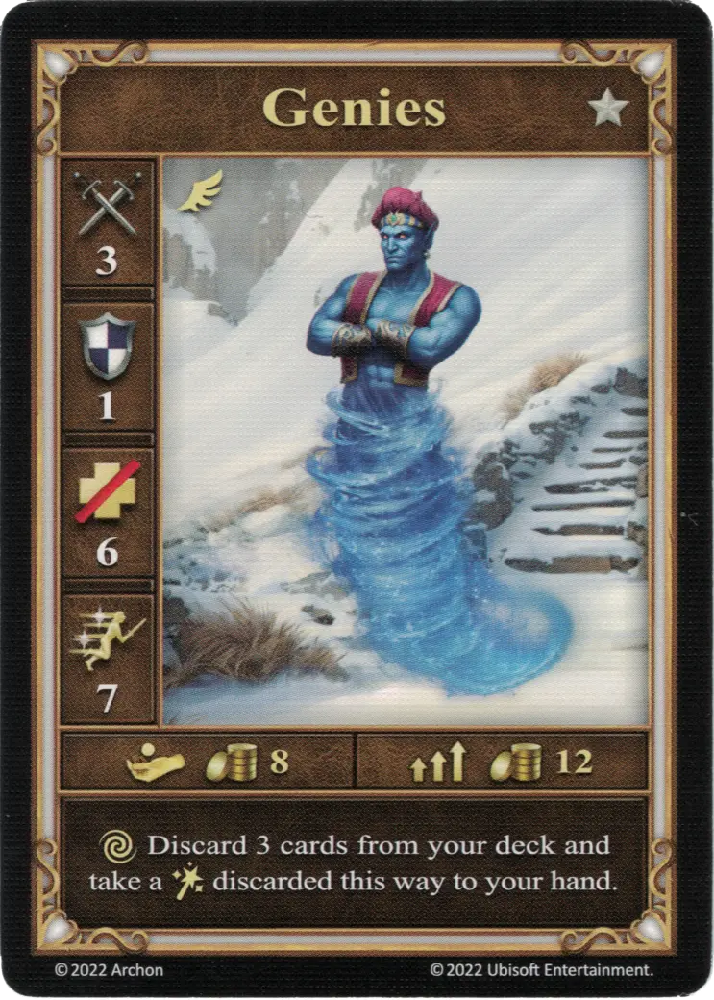
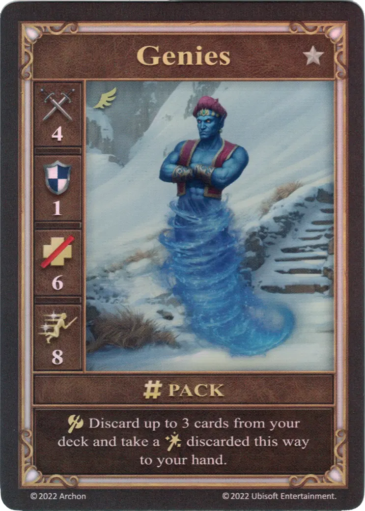
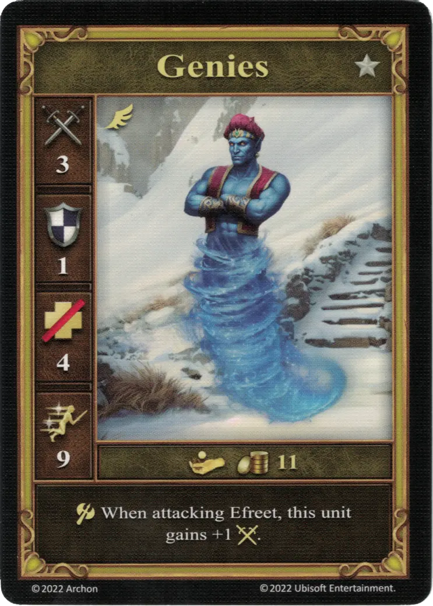

# Genios

=== "Pocos"

    <figure markdown="span">
        { width="340" align=right }
    </figure>

=== "Manada"

    <figure markdown="span">
        { width="340" align=right }
    </figure>

=== "Neutral"

    <figure markdown="span">
        { width="340" align=right }
    </figure>

| Características | Pocos | Manada | Neutral |
| :--- | :---: | :---: | :---: |
| Ciudad | [Torre](../towns/tower.md) | [Torre](../towns/tower.md) | [Neutral](../towns/neutral.md) |
| Nivel | :silver: | :silver: | :silver: |
| Tipo | [:unit_flying:](../keywords/flying_unit.md) | [:unit_flying:](../keywords/flying_unit.md) | [:unit_flying:](../keywords/flying_unit.md) |
| :attack: | 3 | **4** | 3 |
| :defense: | 1 | 1 | 1 |
| :health_points: | 6 | 6 | 4 |
| :initiative: | 7 | **8** | 9 |
| Coste | 8 :gold: | 12 :gold: | 11 :gold: |
| Habilidades | :unit_other: Descarta 3 cartas de tu mazo y toma un [:spellpower:](../spells/index.md) descartado de esta manera a tu mano. | :unit_attack: Descarta hasta 3 cartas de tu mazo y toma un [:spellpower:](../spells/index.md) descartado de esta manera a tu mano. | :unit_attack: Al atacar a [Efrits](efreet.md), esta unidad gana +1 :attack:. |

## Héroes Con Especialidad

- [:might: Iona](../heroes/iona.md#specialty)

## Notas

- **Pocos** - Si los Genios usan su [acción alternativa](../keywords/alternative_action.md), no pueden moverse, atacar o defenderse.
- ** Pocos ** - Se descartan exactamente 3 cartas del mazo.
- **Manada** - Se descartan hasta 3 cartas del mazo. Las cartas se descartan una tras otra. El jugador puede decidir dejar de descartar cartas en cualquier momento antes de llegar a 3 cartas y tomar un [hechizo](../spells/index.md) descartado de esta forma para su mano.
- **Pocos y Manada** - Si no hay suficientes cartas para descartar del mazo, las cartas ya descartadas por la habilidad que se está resolviendo en ese momento se utilizan para formar la nueva pila de descarte. La antigua pila de descarte se baraja de nuevo en el mazo, y las cartas restantes se descartan. El [hechizo](../spells/index.md) se toma de las cartas descartadas.

## Viene Con

- [Expansión de Torre](../content/tower_expansion.md)

## Ver También

- [Lista de Unidades](index.md)
- [Lista de Ciudades](../towns/index.md)
