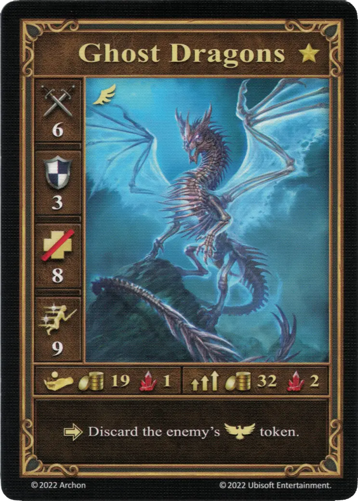
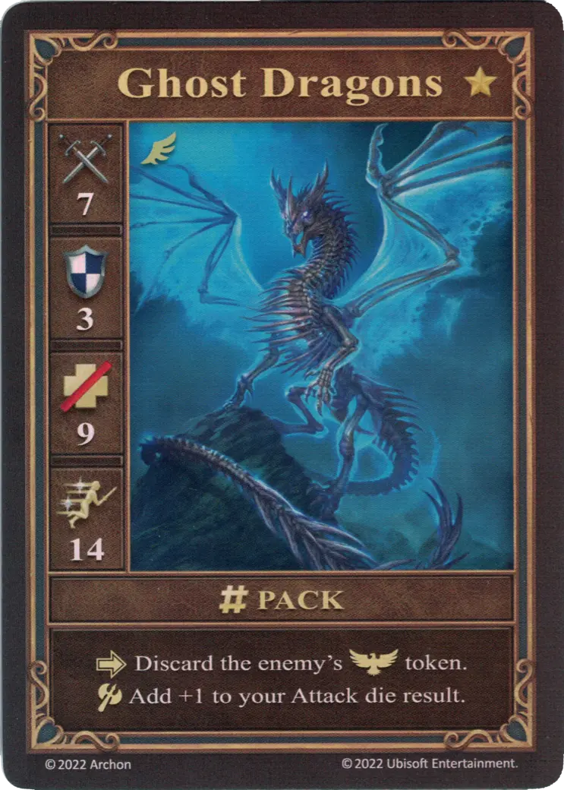
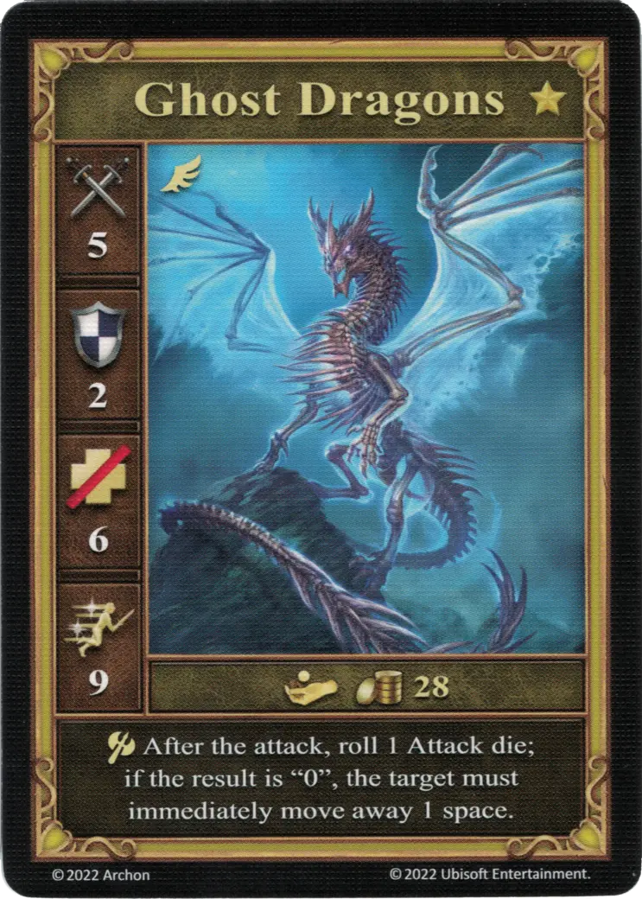

# Dragones Fantasma

=== "Pocos"

    <figure markdown="span">
        { width="340" align=right }
    </figure>

=== "Manada"

    <figure markdown="span">
        { width="340" align=right }
    </figure>

=== "Neutral"

    <figure markdown="span">
        { width="340" align=right }
    </figure>

| Características | Pocos | Manada | Neutral |
| :--- | :---: | :---: | :---: |
| Ciudad | [Necrópolis](../towns/necropolis.md) | [Necrópolis](../towns/necropolis.md) | [Neutral](../towns/neutral.md) |
| Nivel | :golden: | :golden: | :golden: |
| Tipo | [:unit_flying:](../keywords/flying_unit.md) | [:unit_flying:](../keywords/flying_unit.md) | [:unit_flying:](../keywords/flying_unit.md) |
| :attack: | 6 | **7** | 5 |
| :defense: | 3 | 3 | 2 |
| :health_points: | 8 | **9** | 6 |
| :initiative: | 9 | **14** | 9 |
| Coste | 19 :gold: 1 :valuables: | 32 :gold: 2 :valuables: | 28 :gold: |
| Habilidades | :activation: Descarta la ficha :morale_positive: del enemigo. | :activation: Descarta la ficha :morale_positive: del enemigo. :unit_attack: Suma +1 al resultado de tu [dado de Ataque](../dice.md#attack_die). | :unit_attack: Después del ataque, tira 1 [dado de Ataque](../dice.md#attack_die); si el resultado es "0", el objetivo debe alejarse inmediatamente 1 casilla. |

## Héroes Con Especialidad

- [:might: Mutare](../heroes/mutare.md#specialty)

## Notas

- **Manada** - Primero se añade el +1 al resultado del dado de Ataque, antes de aplicar otros efectos, como el efecto del [Hacha del Centauro](../artifacts/centaurs_axe.md).
- **Neutral** - El jugador de la unidad atacada decide dónde mueve la unidad. La nueva casilla debe estar vacía y no debe estar adyacente a los Dragones Fantasma. Si no hay tal casilla, la unidad atacada permanece en su lugar.
- **Neutral** - Si la unidad atacada no ha podido alejarse, se producirá el contraataque. En caso contrario, no tendría lugar, ya que la unidad dejaría de estar adyacente a los Dragones Fantasma.

## Viene Con

- [Juego Principal](../content/core_game.md)

## Ver También

- [Lista de Unidades](index.md)
- [Lista de Ciudades](../towns/index.md)
