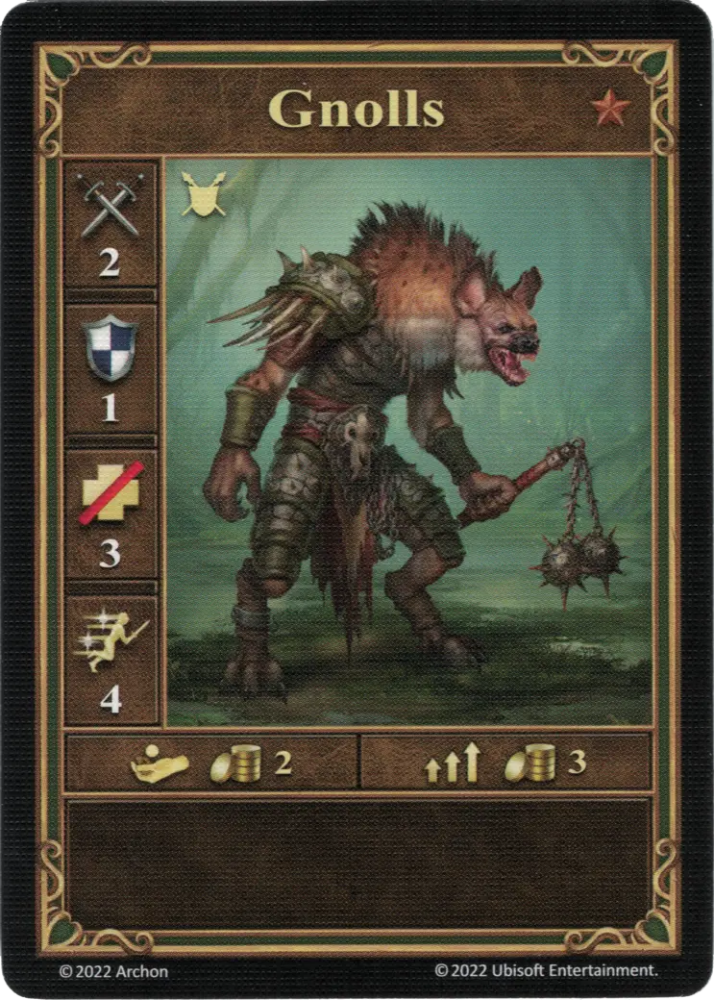
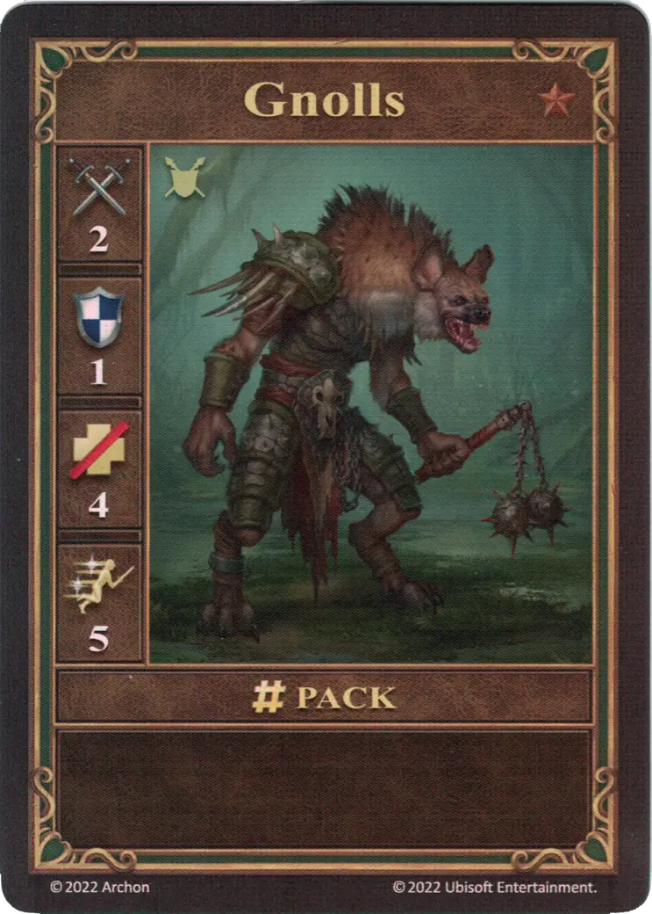
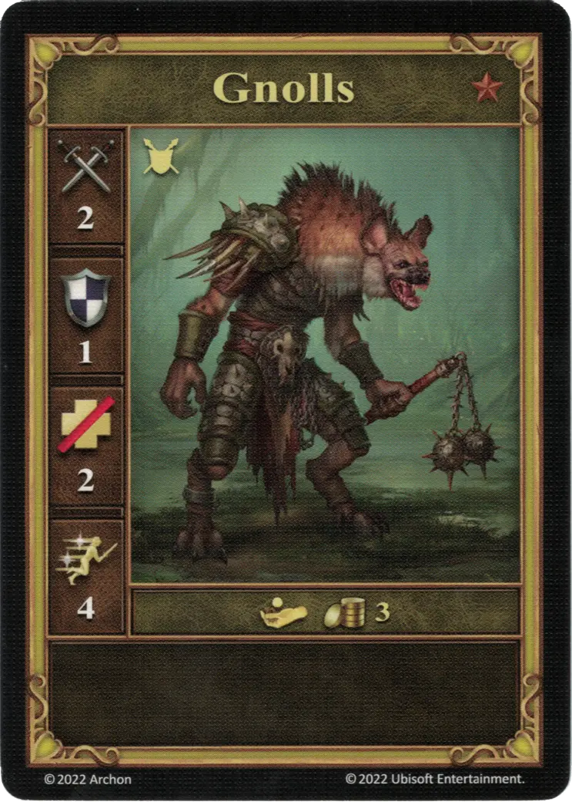

# Gnolls

=== "Pocos"

    <figure markdown="span">
        { width="340" align=right }
    </figure>

=== "Manada"

    <figure markdown="span">
        { width="340" align=right }
    </figure>

=== "Neutral"

    <figure markdown="span">
        { width="340" align=right }
    </figure>

| Características | Pocos | Manada | Neutral |
| :--- | :---: | :---: | :---: |
| Ciudad | [Fortaleza](../towns/fortress.md) | [Fortaleza](../towns/fortress.md) | [Neutral](../towns/neutral.md) |
| Nivel | :bronze: | :bronze: | :bronze: |
| Tipo | [:unit_ground:](../keywords/ground_unit.md) | [:unit_ground:](../keywords/ground_unit.md) | [:unit_ground:](../keywords/ground_unit.md) |
| :attack: | 2 | 2 | 2 |
| :defense: | 1 | 1 | 1 |
| :health_points: | 3 | **4** | 2 |
| :initiative: | 4 | **5** | 4 |
| Coste | 2 :gold: | 3 :gold: | 3 :gold: |
| Habilidades | - | - | - |

## Viene Con

- [Expansión de Fortaleza](../content/fortress_expansion.md)
- [Expansión de Torre](../content/tower_expansion.md) (Neutral)

## Ver También

- [Lista de Unidades](index.md)
- [Lista de Ciudades](../towns/index.md)
