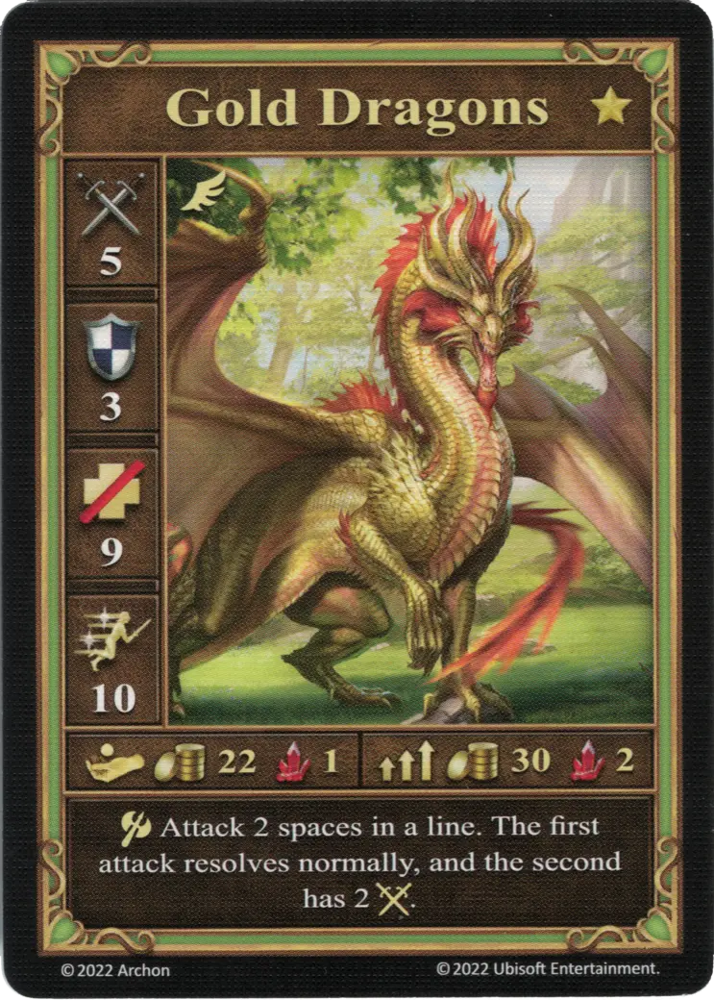
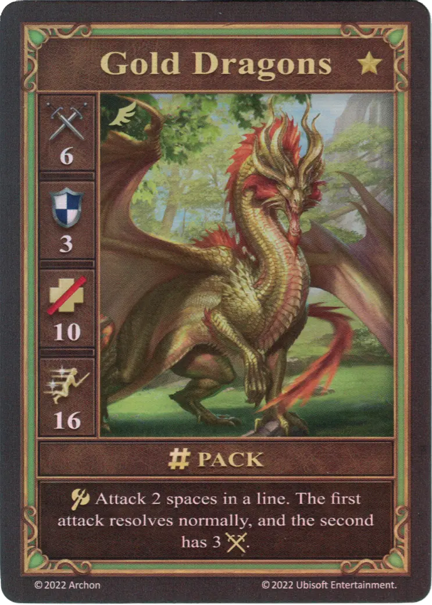
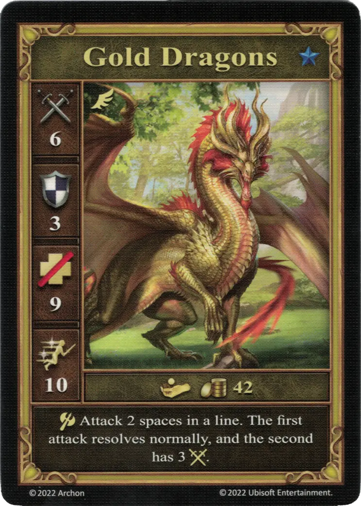

# Dragones Dorados

=== "Pocos"

    <figure markdown="span">
        { width="340" align=right }
    </figure>

=== "Manada"

    <figure markdown="span">
        { width="340" align=right }
    </figure>

=== "Neutral"

    <figure markdown="span">
        { width="340" align=right }
    </figure>

| Características | Pocos | Manada | Neutral |
| :--- | :---: | :---: | :---: |
| Ciudad | [Murallas](../towns/rampart.md) | [Murallas](../towns/rampart.md) | [Neutral](../towns/neutral.md) |
| Nivel | :golden: | :golden: | :golden: |
| Tipo | [:unit_flying:](../keywords/flying_unit.md) | [:unit_flying:](../keywords/flying_unit.md) | :azure: |
| :attack: | 5 | **6** | 6 |
| :defense: | 3 | 3 | 3 |
| :health_points: | 9 | **10** | 9 |
| :initiative: | 10 | **16** | 10 |
| Coste | 22 :gold: 1 :valuables: | 30 :gold: 2 :valuables: | 42 :gold: |
| Habilidades | :unit_attack: Ataca 2 espacios en una línea. El primer ataque se resuelve normalmente, y el segundo tiene 2 :attack:, | :unit_attack: Ataca 2 espacios en una línea. El primer ataque se resuelve normalmente, y el segundo tiene 3 :attack:. | :unit_attack: Ataca 2 espacios en una línea. El primer ataque se resuelve normalmente, y el segundo tiene 3 :attack:. |

## Héroes Con Especialidad

- [:might: Mutare](../heroes/mutare.md#specialty)

## Notas

- El primer ataque tiene como objetivo una unidad directamente delante de los Dragones Dorados. El segundo ataque apunta a la unidad directamente detrás del objetivo principal en línea recta. Aquí no hay elección.
- El objetivo del segundo ataque no realiza un contraataque contra los Dragones Dorados, ya que no está adyacente a él.
- Si los Dragones Dorados atacan a dos unidades en línea, ambos ataques se resuelven primero. El contraataque solo se llevará a cabo después de que se haya resuelto el ataque secundario de los Dragones Dorados.
- Si los Dragones Dorados atacan a una unidad, y la unidad directamente detrás del objetivo primario en línea recta resulta ser una unidad aliada, entonces la unidad aliada será el objetivo de su ataque secundario.
- Si los Dragones Dorados atacan una Muralla, no se producirá ningún ataque secundario. Las unidades detrás de la Muralla están protegidas. Si atacan a una unidad directamente delante de una Muralla, ésta no sufrirá ningún daño.

## Viene Con

- [Expansión de Torre](../content/tower_expansion.md)

## Ver También

- [Lista de Unidades](index.md)
- [Lista de Ciudades](../towns/index.md)
