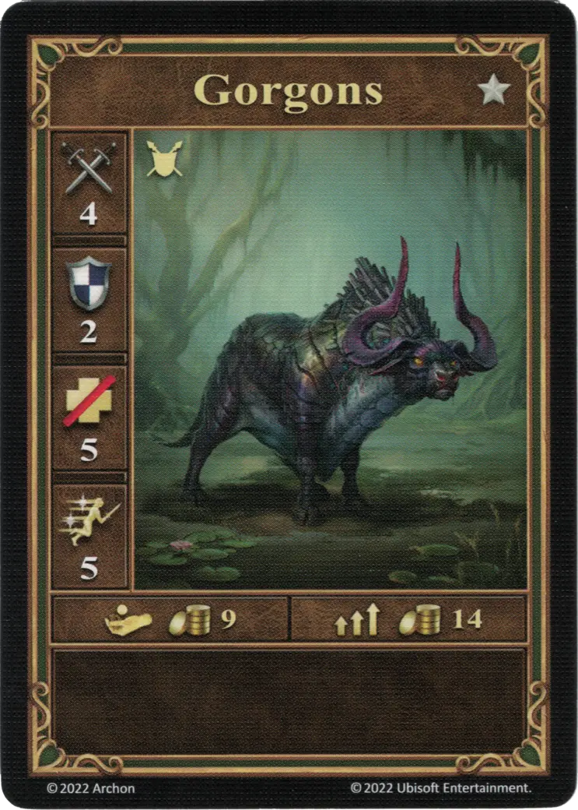
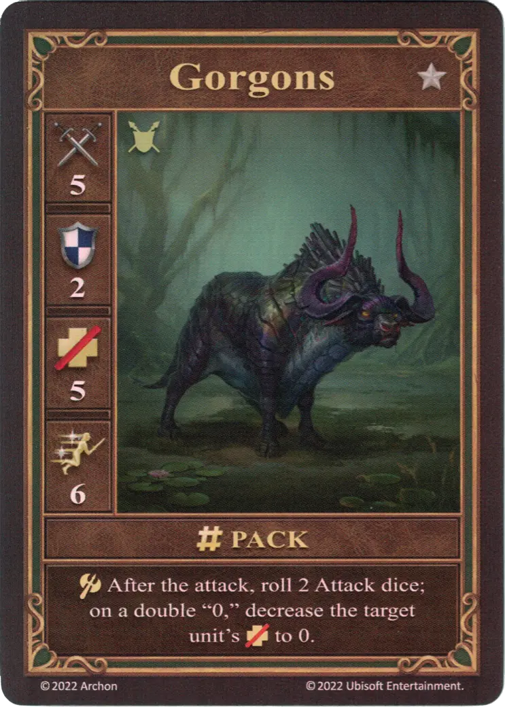
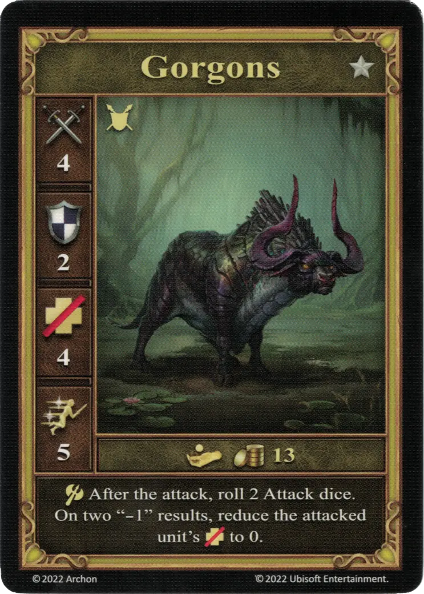

# Gorgonas

=== "Pocos"

    <figure markdown="span">
        { width="340" align=right }
    </figure>

=== "Manada"

    <figure markdown="span">
        { width="340" align=right }
    </figure>

=== "Neutral"

    <figure markdown="span">
        { width="340" align=right }
    </figure>

| Características | Pocos | Manada | Neutral |
| :--- | :---: | :---: | :---: |
| Ciudad | [Fortaleza](../towns/fortress.md) | [Fortaleza](../towns/fortress.md) | [Neutral](../towns/neutral.md) |
| Nivel | :silver: | :silver: | :silver: |
| Tipo | [:unit_ground:](../keywords/ground_unit.md) | [:unit_ground:](../keywords/ground_unit.md) | [:unit_ground:](../keywords/ground_unit.md) |
| :attack: | 4 | **5** | 4 |
| :defense: | 2 | 2 | 2 |
| :health_points: | 5 | 5 | 4 |
| :initiative: | 5 | **6** | 5 |
| Coste | 9 :gold: | 14 :gold: | 13 :gold: |
| Habilidades | - | :unit_attack: Después del ataque, tira 2 [dados de Ataque](../dice.md#attack-die); con un doble "0", reduce los :health_points: de la unidad objetivo a 0. | :unit_attack: Después del ataque, tira 2 [dados de Ataque](../dice.md#attack-die); con un doble "-1", reduce los :health_points: de la unidad objetivo a 0. |

## Viene Con

- [Expansión de Fortaleza](../content/fortress_expansion.md)
- [Expansión de Torre](../content/tower_expansion.md) (Neutral)

## Ver También

- [Lista de Unidades](index.md)
- [Lista de Ciudades](../towns/index.md)
