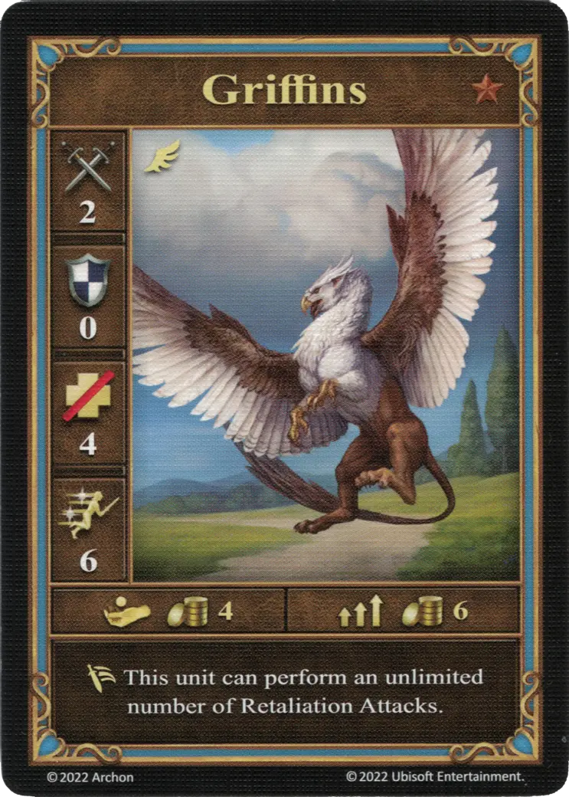
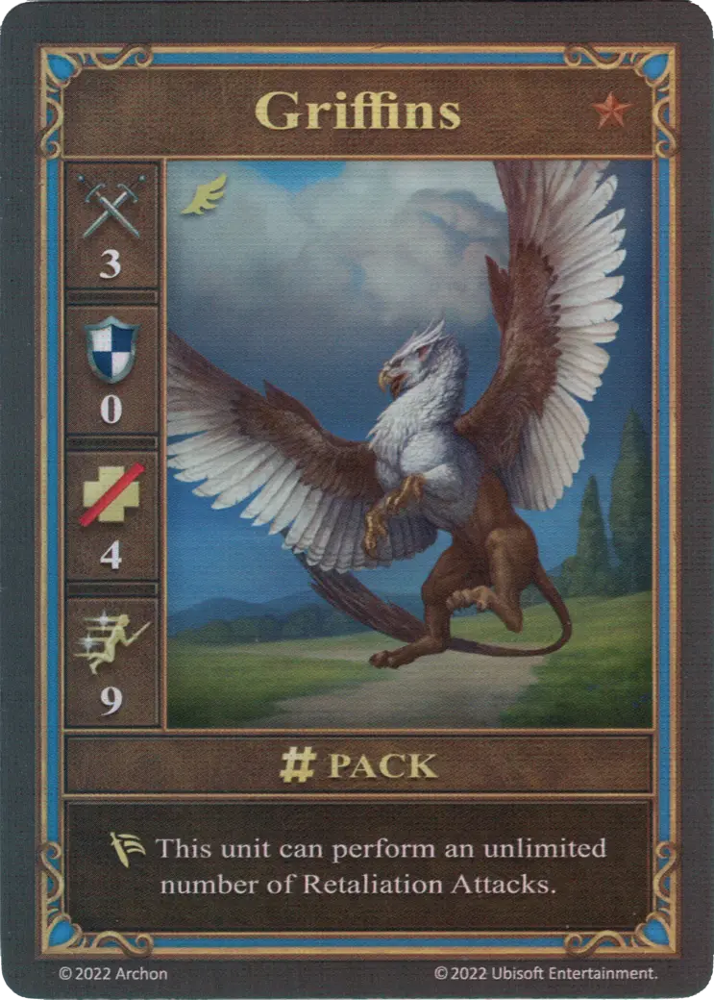
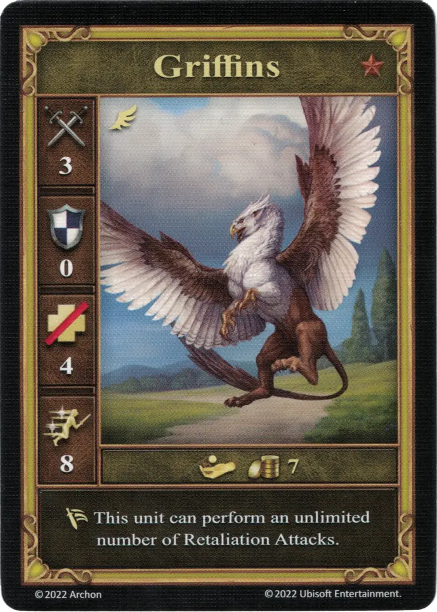

# Grifos

=== "Pocos"

    <figure markdown="span">
        { width="340" align=right }
    </figure>

=== "Manada"

    <figure markdown="span">
        { width="340" align=right }
    </figure>

=== "Neutral"

    <figure markdown="span">
        { width="340" align=right }
    </figure>

| Características | Pocos | Manada | Neutral |
| :--- | :---: | :---: | :---: |
| Ciudad | [Castillo](../towns/castle.md) | [Castillo](../towns/castle.md) | [Neutral](../towns/neutral.md) |
| Nivel | :bronze: | :bronze: | :bronze: |
| Tipo | [:unit_flying:](../keywords/flying_unit.md) | [:unit_flying:](../keywords/flying_unit.md) | [:unit_flying:](../keywords/flying_unit.md) |
| :attack: | 2 | **3** | 3 |
| :defense: | 0 | 0 | 0 |
| :health_points: | 4 | 4 | 4 |
| :initiative: | 6 | **9** | 8 |
| Coste | 4 :gold: | 6 :gold: | 7 :gold: |
| Habilidades | :unit_retaliate:Esta unidad puede realizar un número ilimitado de Contraataques.. | :unit_retaliate: Esta unidad puede realizar un número ilimitado de Contraataques. | :unit_retaliate: Esta unidad puede realizar un número ilimitado de Contraataques. |

## Viene Con

- [Juego Principal](../content/core_game.md)

## Ver También

- [Lista de Unidades](index.md)
- [Lista de Ciudades](../towns/index.md)
