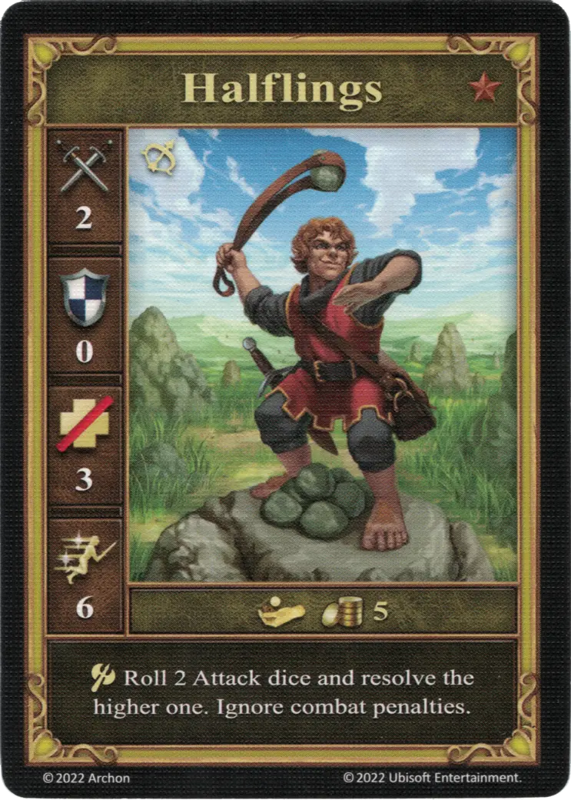

# Medianos

<figure markdown="span">
    { width="340" align=right }
</figure>

| Características | Neutral |
| :--- | :---: |
| Ciudad | [Neutral](../towns/neutral.md) |
| Nivel | :bronze: |
| Tipo | [:unit_ranged:](../keywords/ranged_unit.md) |
| :attack: | 2 |
| :defense: | 0 |
| :health_points: | 3 |
| :initiative: | 6 |
| Coste | 5 :gold: |
| Habilidades: | :unit_attack: Tira 2 [dados de Ataque](../dice.md#attack-die) y resuelve el más alto. Ignora las penalizaciones de combate. |

## Viene Con

- [Juego Principal](../content/core_game.md)

## Ver También

- [Lista de Unidades](index.md)
- [Lista de Ciudades](../towns/index.md)
