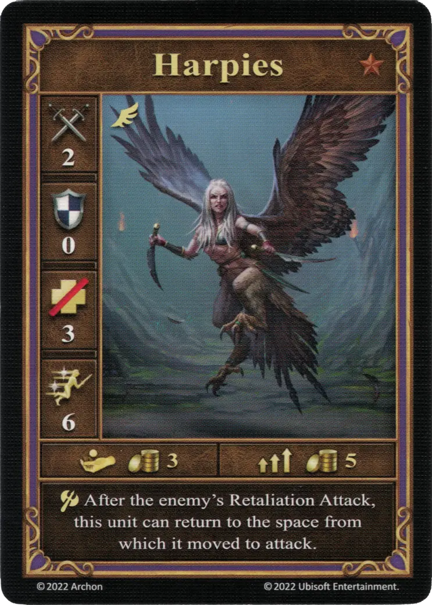
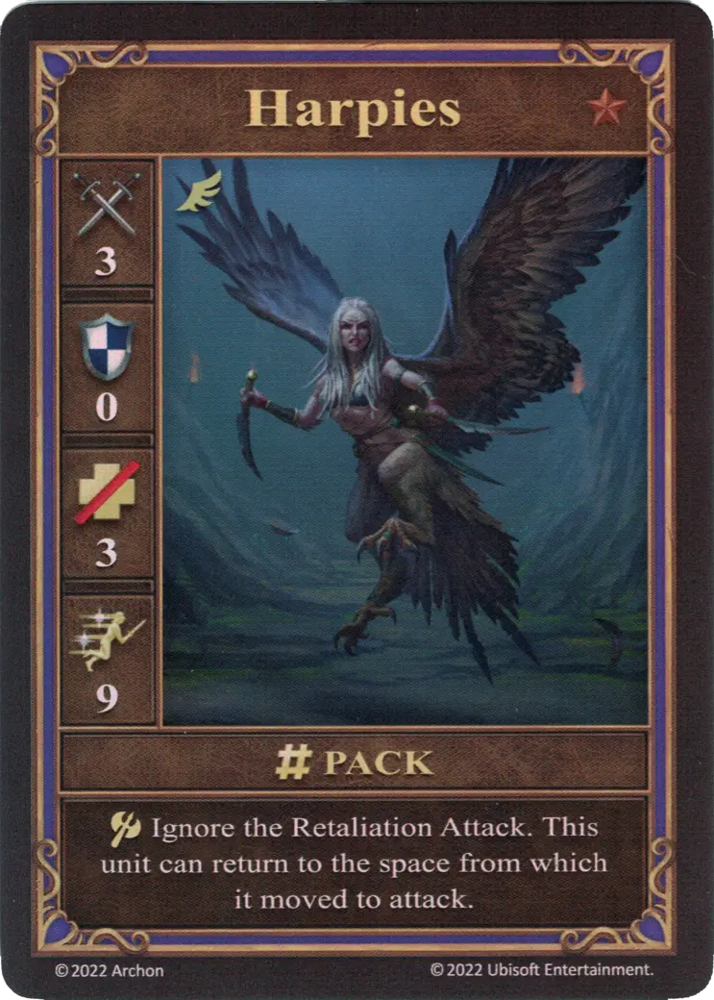
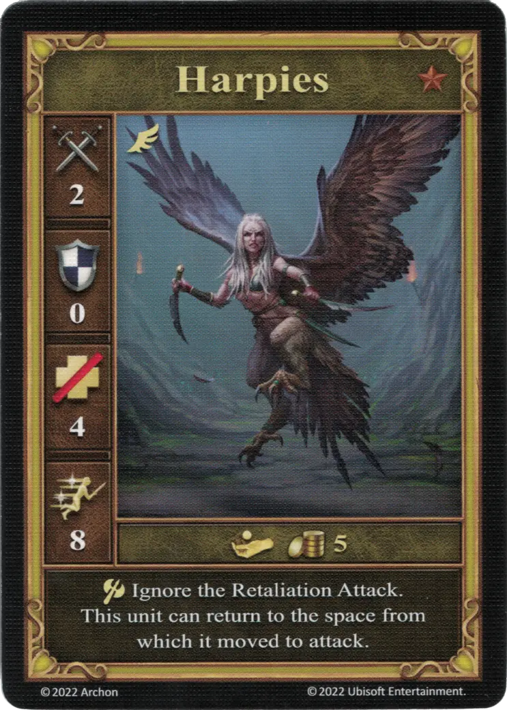

# Arpías

=== "Pocos"

    <figure markdown="span">
        { width="340" align=right }
    </figure>

=== "Manada"

    <figure markdown="span">
        { width="340" align=right }
    </figure>

=== "Neutral"

    <figure markdown="span">
        { width="340" align=right }
    </figure>

| Características | Pocos | Manada | Neutral |
| :--- | :---: | :---: | :---: |
| Ciudad | [Mazmorra](../towns/dungeon.md) | [Mazmorra](../towns/dungeon.md) | [Neutral](../towns/neutral.md) |
| Nivel | :bronze: | :bronze: | :bronze: |
| Tipo | [:unit_flying:](../keywords/flying_unit.md) | [:unit_flying:](../keywords/flying_unit.md) | [:unit_flying:](../keywords/flying_unit.md) |
| :attack: | 2 | **3** | 2 |
| :defense: | 0 | 0 | 0 |
| :health_points: | 3 | 3 | 4 |
| :initiative: | 6 | **9** | 8 |
| Coste | 3 :gold: | 5 :gold: | 5 :gold: |
| Habilidades | :unit_attack: Tras el Contraataque del enemigo, esta unidad puede volver a la casilla desde la que se movió para atacar. | :unit_attack: Ignora los Contraataques. Esta unidad puede volver a la casilla desde la que se movió para atacar. | :unit_attack: Ignora los Contraataques. Esta unidad puede volver a la casilla desde la que se movió para atacar. |

## Héroes Con Especialidad

- [:might: Lorelei](../heroes/lorelei.md#specialty)

## Notas

- El jugador puede decidir libremente si las Arpías vuelven a su posición inicial después de su ataque.

## Viene Con

- [Juego Principal](../content/core_game.md)

## Ver También

- [Lista de Unidades](index.md)
- [Lista de Ciudades](../towns/index.md)
