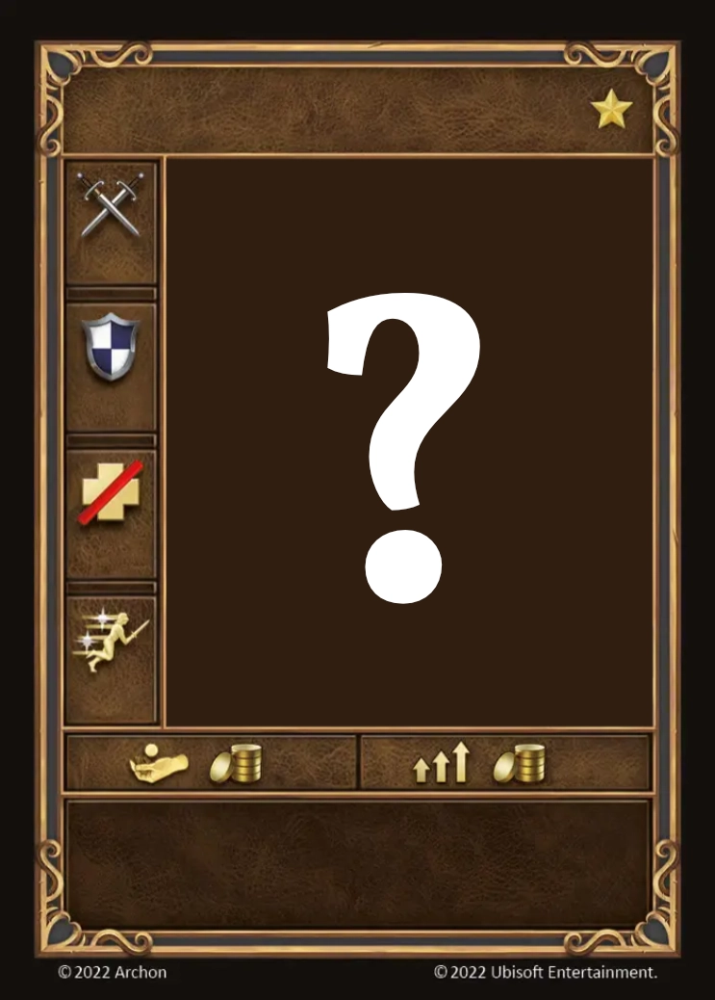

# Áspides

=== "Pocos"

    <figure markdown="span">
        { width="340" align=right }
    </figure>

=== "Manada"

    <figure markdown="span">
        { width="340" align=right }
    </figure>

=== "Neutral"

    <figure markdown="span">
        { width="340" align=right }
    </figure>

| Características | Pocos | Manada | Neutral |
| :--- | :---: | :---: | :---: |
| Ciudad | [Ensenada](../towns/cove.md) | [Ensenada](../towns/cove.md) | [Neutral](../towns/neutral.md) |
| Nivel | :golden: | :golden: | :golden: |
| Tipo | [:unit_ground:](../keywords/ground_unit.md) | [:unit_ground:](../keywords/ground_unit.md) | 🚧 |
| :attack: | 5 | **6** | 🚧 |
| :defense: | 3 | 3 | 🚧 |
| :health_points: | 7 | **9** | 🚧 |
| :initiative: | 9 | **12** | 🚧 |
| Coste | 18 :gold: 1 :valuables: | 32 :gold: 2 :valuables: | 🚧 |
| Habilidades | :unit_attack: Si esta unidad gira desde el lado de Manada en este combate, gana +2 :attack: | :unit_attack: Coloca 2 cubos de facción sobre el objetivo. Al inicio de cada activación, retira 1 de ellos para infligir 1 :damage:. | 🚧 |

## Viene Con

- [Expansión de Ensenada](../content/cove_expansion.md)

## Ver También

- [Lista de Unidades](index.md)
- [Lista de Ciudades](../towns/index.md)
