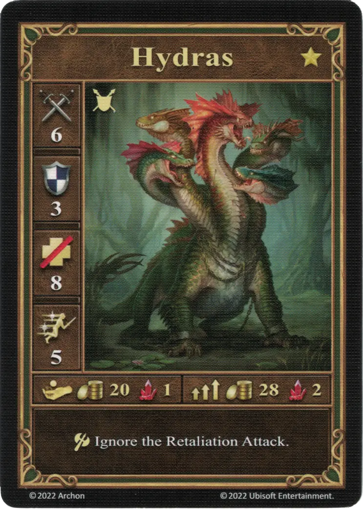
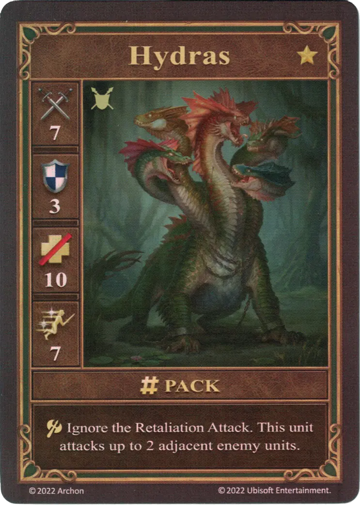
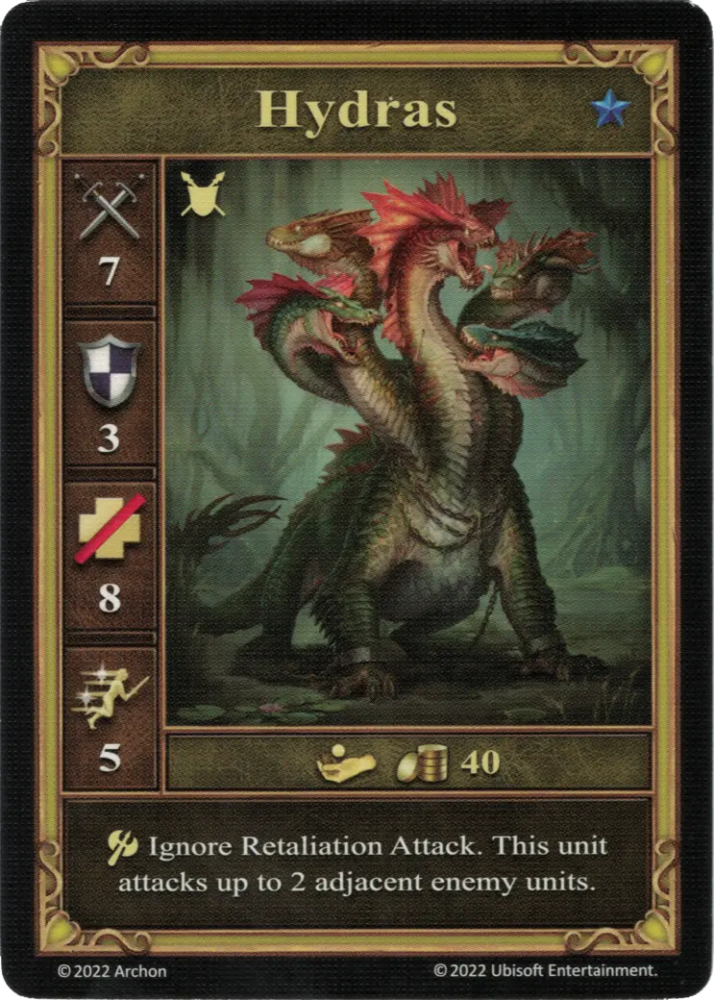

# Hidras

=== "Pocos"

    <figure markdown="span">
        { width="340" align=right }
    </figure>

=== "Manada"

    <figure markdown="span">
        { width="340" align=right }
    </figure>

=== "Neutral"

    <figure markdown="span">
        { width="340" align=right }
    </figure>

| Características | Pocos | Manada | Neutral |
| :--- | :---: | :---: | :---: |
| Ciudad | [Fortaleza](../towns/fortress.md) | [Fortaleza](../towns/fortress.md) | [Neutral](../towns/neutral.md) |
| Nivel | :golden: | :golden: | :azure: |
| Tipo | [:unit_ground:](../keywords/ground_unit.md) | [:unit_ground:](../keywords/ground_unit.md) | [:unit_ground:](../keywords/ground_unit.md) |
| :attack: | 6 | **7** | 7 |
| :defense: | 3 | 3 | 3 |
| :health_points: | 8 | **10** | 8 |
| :initiative: | 5 | **7** | 5 |
| Coste | 20 :gold: 1 :valuables: | 28 :gold: 2 :valuables: | 40 :gold: |
| Habilidades | :unit_attack: Ignora los Contraataques. | :unit_attack: Ignora los Contraataques. Esta unidad ataca hasta 2 unidades enemigas adyacentes. | :unit_attack: Ignora los Contraataques. Esta unidad ataca hasta 2 unidades enemigas adyacentes. |

## Notas

- **Manada y Neutral** - Los ataques tienen lugar uno detrás de otro y cada uno de esos ataques tiene una tirada de Dado de Ataque independiente. El jugador decide el orden de los ataques.
- **Manada y Neutral** - Ninguno de los ataques desencadena un Contraataque. El símbolo :unit_attack: afecta a ambos objetivos de las Hidras.
- [^1] **Manada y Neutral** - Las Hidras no pueden atacar a una unidad y a una Muralla al mismo tiempo, sólo a una u otra.

## Viene Con

- [Expansión de Fortaleza](../content/fortress_expansion.md)
- [Expansión de Torre](../content/tower_expansion.md) (Neutral)

## Ver También

- [Lista de Unidades](index.md)
- [Lista de Ciudades](../towns/index.md)

[^1]: Not officially confirmed by game designers, and is therefore considered a Community rule.
