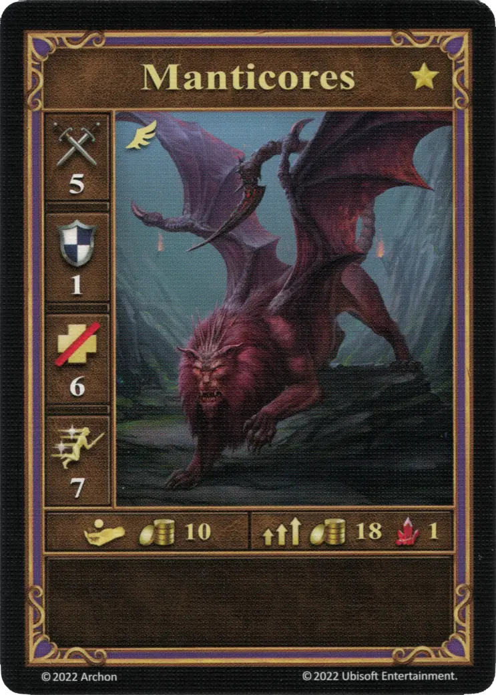
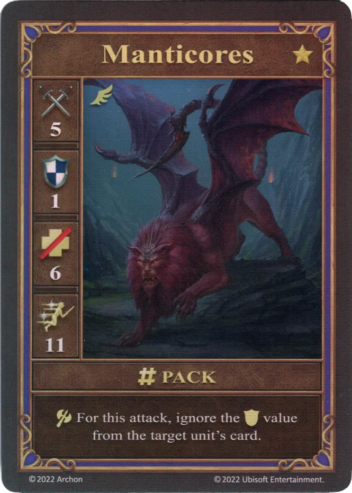
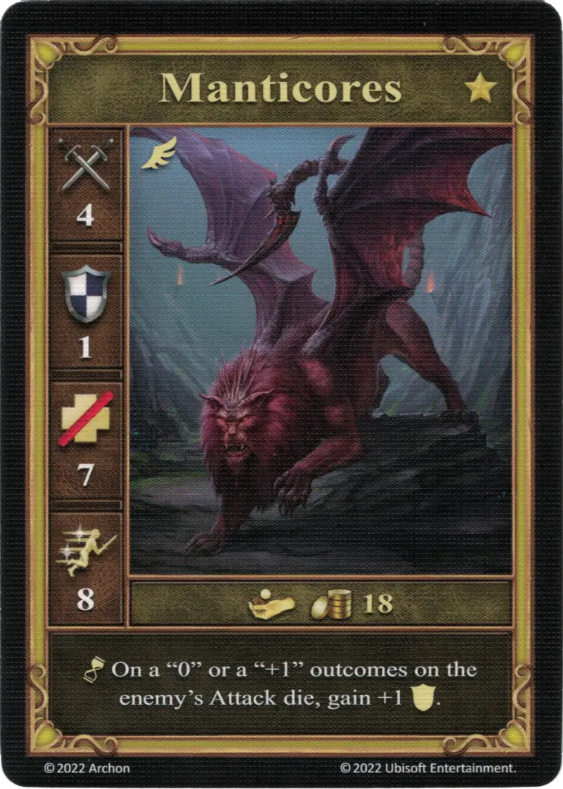

# Mantícoras

=== "Pocos"

    <figure markdown="span">
        { width="340" align=right }
    </figure>

=== "Manada"

    <figure markdown="span">
        { width="340" align=right }
    </figure>

=== "Manada (Alternativa)"

    <figure markdown="span">
        { width="340" align=right }
    </figure>

=== "Neutral"

    <figure markdown="span">
        { width="340" align=right }
    </figure>

| Statistics | Few | Pack | Pack (Alternate) | Neutral |
| :--- | :---: | :---: | :---: | :---: |
| Town | [Mazmorra](../towns/dungeon.md) | [Mazmorra](../towns/dungeon.md) | [Mazmorra](../towns/dungeon.md) | [Neutral](../towns/neutral.md) |
| Tier | :golden: | :golden: | :golden: | :golden: |
| Type | [:unit_flying:](../keywords/flying_unit.md) | [:unit_flying:](../keywords/flying_unit.md) | [:unit_flying:](../keywords/flying_unit.md) | [:unit_flying:](../keywords/flying_unit.md) |
| :attack: | 5 | 5 | 5 | 4 |
| :defense: | 1 | 1 | **2** | 1 |
| :health_points: | 6 | 6 | 6 | 7 |
| :initiative: | 7 | **11** | **11** | 8 |
| Cost | 10 :gold: | 18 :gold: 1 :valuables: | 18 :gold: 1 :valuables: | 18 :gold: |
| Abilities | - | :unit_attack: For this attack, ignore the :defense: value from the target unit's card. | :unit_attack: After the Attack, roll an [Attack die](../dice.md#attack-die), on a "0" or a "+1" the target is :paralysis:. | :unit_passive: On a "0" or a "+1" outcomes on the enemy's [Attack die](../dice.md#attack-die), gain +1 :defense:. |

## Notas

- **Manada** - Only the :defense: value printed on the target unit's card is ignored, bonuses provided by other cards are still valid.
- **Manada (Alternate)** - See [Paralysis](../keywords/paralysis.md)
- ** Neutral ** - Cuando está atacado por Neutral [Campeones](champions.md), las Mantícoras reciben +2: Defensa:, ya que ambos dados de ataque siempre terminarán como un 0 o un 1.

## Viene Con

- [Juego Principal](../content/core_game.md)

## Ver También

- [Lista de Unidades](index.md)
- [Lista de Ciudades](../towns/index.md)
