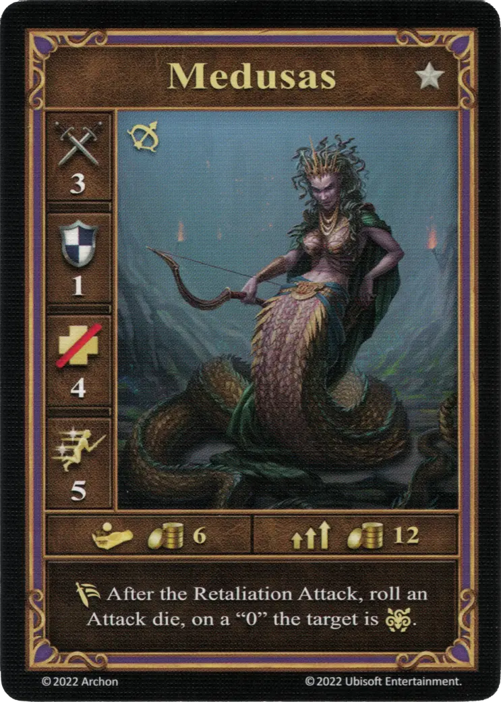
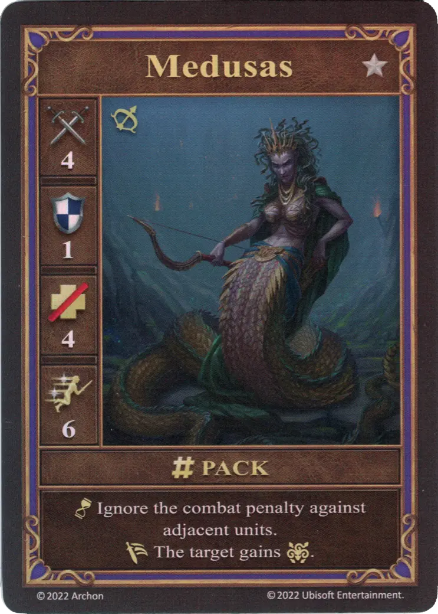
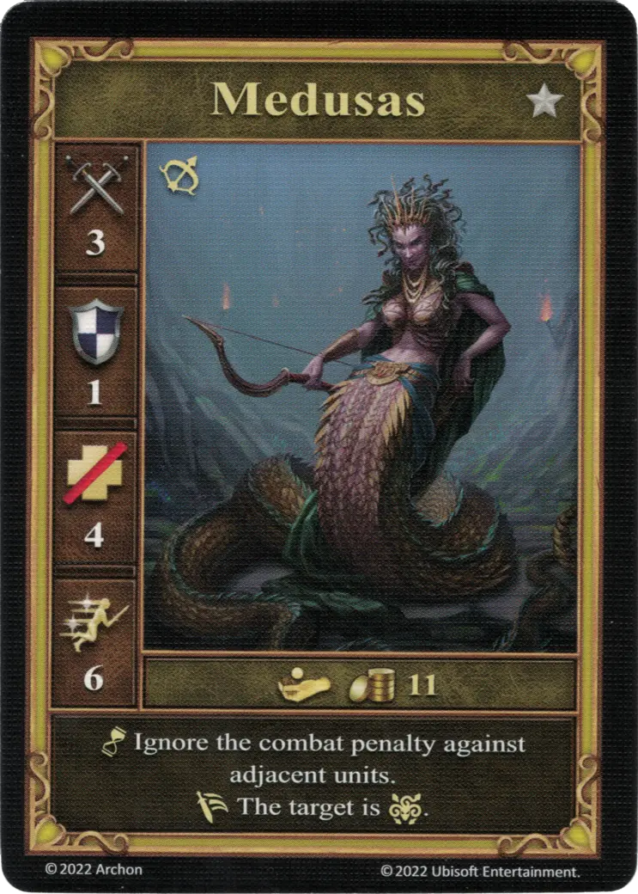

# Medusas

=== "Pocos"

    <figure markdown="span">
        { width="340" align=right }
    </figure>

=== "Manada"

    <figure markdown="span">
        { width="340" align=right }
    </figure>

=== "Neutral"

    <figure markdown="span">
        { width="340" align=right }
    </figure>

| Statistics | Few | Pack | Neutral |
| :--- | :---: | :---: | :---: |
| Town | [Mazmorra](../towns/dungeon.md) | [Mazmorra](../towns/dungeon.md) | [Neutral](../towns/neutral.md) |
| Tier | :silver: | :silver: | :silver: |
| Type | [:unit_ranged:](../keywords/ranged_unit.md) | [:unit_ranged:](../keywords/ranged_unit.md) | [:unit_ranged:](../keywords/ranged_unit.md) |
| :attack: | 3 | **4** | 3 |
| :defense: | 1 | 1 | 1 |
| :health_points: | 4 | 4 | 4 |
| :initiative: | 5 | **6** | 6 |
| Cost | 6 :gold: | 12 :gold: | 11 :gold: |
| Abilities | :unit_passive: After the Retaliation Attack, roll an [Attack die](../dice.md#attack-die), on a "0" the target is :paralysis:. | :unit_passive: Ignore the combat penalty against adjacent units. :unit_retaliate: The target gains :paralysis:. | :unit_passive: Ignore the combat penalty against adjacent units. :unit_retaliate: The target is :paralysis:. |

## Notas

- ** Pocos ** - Después del ataque de represalia, rode *otro* dado.El resultado del dado rodado como parte del ataque no se aplica a la capacidad.
- Ver [Parálisis](../keywords/paralysis.md)

## Viene Con

- [Juego Principal](../content/core_game.md)

## Ver También

- [Lista de Unidades](index.md)
- [Lista de Ciudades](../towns/index.md)
