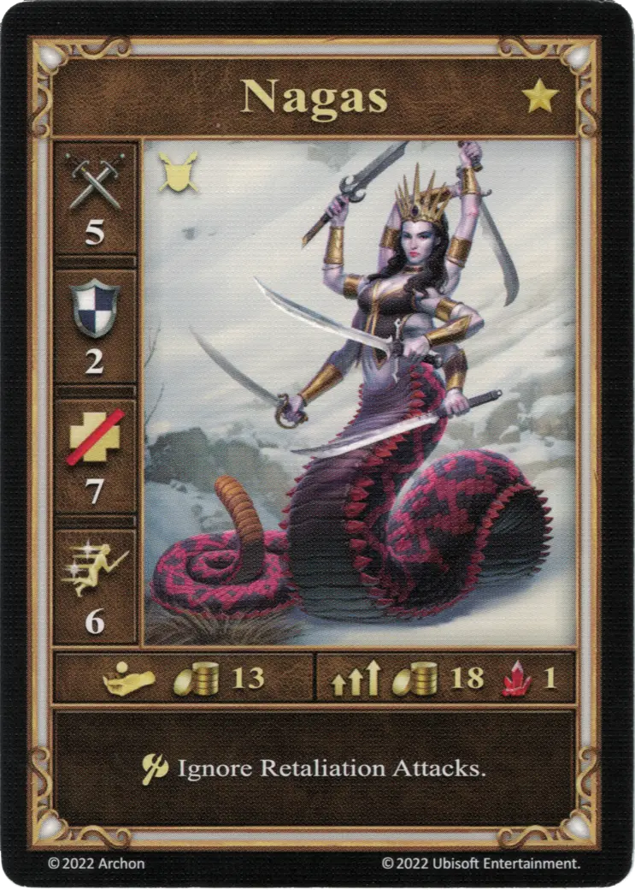
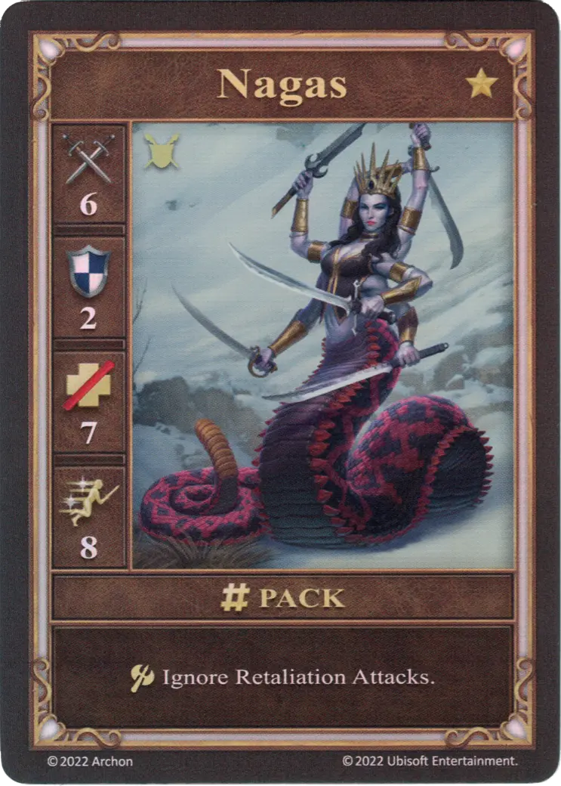
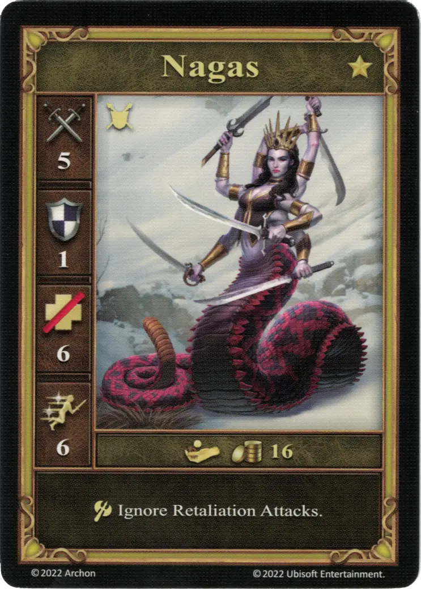

# Nagas

=== "Pocos"

    <figure markdown="span">
        { width="340" align=right }
    </figure>

=== "Manada"

    <figure markdown="span">
        { width="340" align=right }
    </figure>

=== "Neutral"

    <figure markdown="span">
        { width="340" align=right }
    </figure>

| Características | Pocos | Manada | Neutral |
| :--- | :---: | :---: | :---: |
| Town | [Tower](../towns/tower.md) | [Tower](../towns/tower.md) | [Neutral](../towns/neutral.md) |
| Tier | :golden: | :golden: | :golden: |
| Type | [:unit_ground:](../keywords/ground_unit.md) | [:unit_ground:](../keywords/ground_unit.md) |
| :attack: | 5 | **6** |
| :defense: | 2 | 2 |
| :health_points: | 7 | 7 |
| :initiative: | 6 | **8** |
| Cost | 13 :gold: | 18 :gold: 1 :valuables: |
| Abilities | :unit_attack: Ignore Retaliation Attacks. | :unit_attack: Ignore Retaliation Attacks. |

## Viene Con

- [Expansión de Torre](../content/tower_expansion.md)

## Ver También

- [Lista de Unidades](index.md)
- [Lista de Ciudades](../towns/index.md)
