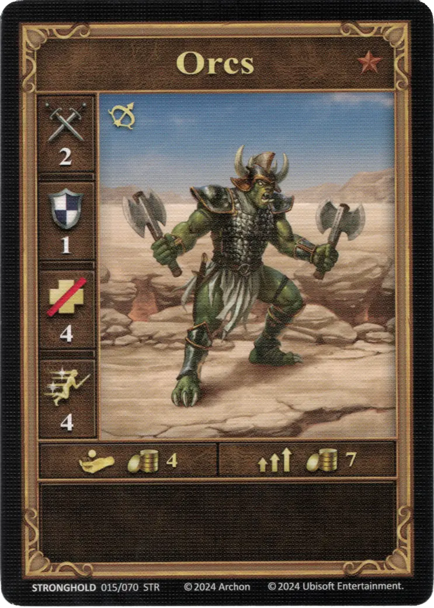
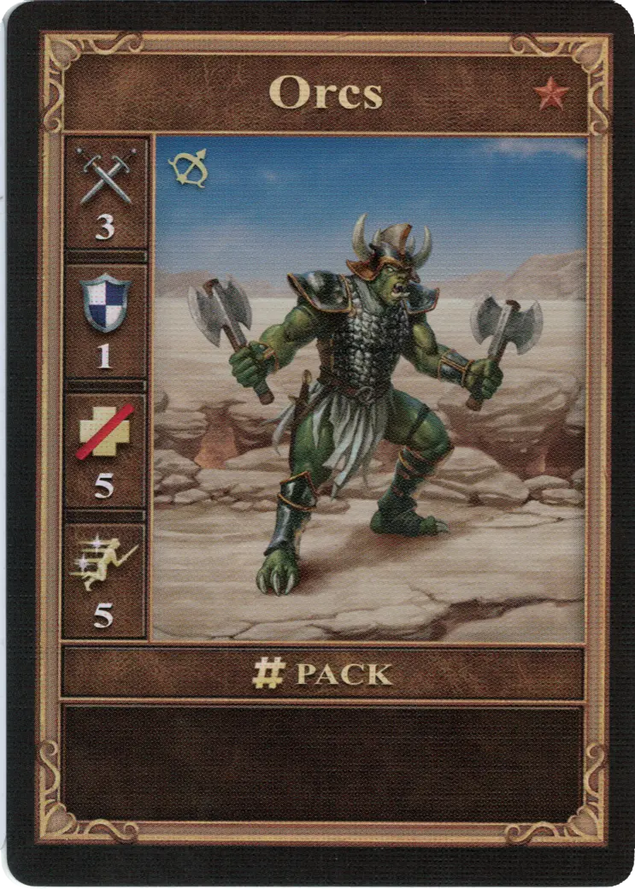
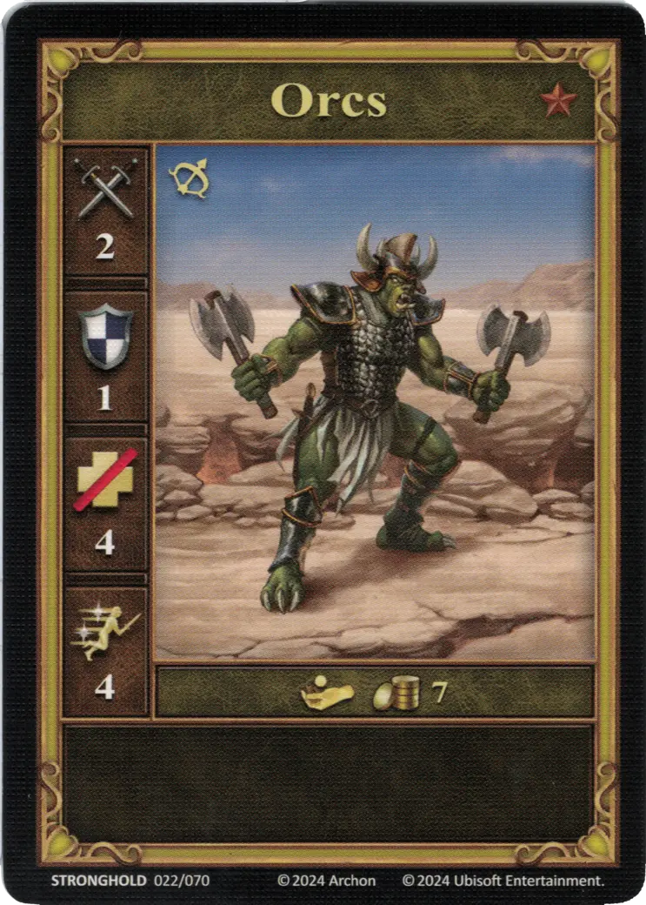

# Orcos

=== "Pocos"

    <figure markdown="span">
        { width="340" align=right }
    </figure>

=== "Manada"

    <figure markdown="span">
        { width="340" align=right }
    </figure>

=== "Neutral"

    <figure markdown="span">
        { width="340" align=right }
    </figure>

| Statistics | Few | Pack | Neutral |
| :--- | :---: | :---: | :---: |
| Town | [Stronghold](../towns/stronghold.md) | [Stronghold](../towns/stronghold.md) | [Neutral](../towns/neutral.md) |
| Tier | :bronze_tier: | :bronze_tier: | :bronze_tier: |
| Type | [:ranged_unit:](index.md#ranged-units) | [:ranged_unit:](index.md#ranged-units) | [:ranged_unit:](index.md#ranged-units) |
| :attack: | 2 | **3** | 2 |
| :defense: | 1 | 1 | 1 |
| :health_points: | 4 | **5** | 4 |
| :initiative: | 4 | **5** | 4 |
| Cost | 4 :gold: | 7 :gold: | 7 :gold: |
| Abilities | - | - | - |

## Viene Con

- [Expansión de Bastión](../content/stronghold_expansion.md)

## Ver También

- [Lista de Unidades](index.md)
- [Lista de Ciudades](../towns/index.md)
