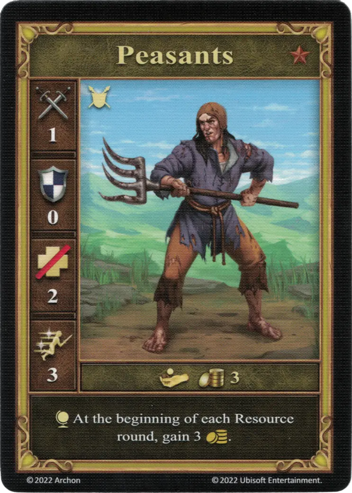

# Campesinos

<figure markdown="span">
    { width="340" align=right }
</figure>

| Statistics | Neutral |
| :--- | :---: |
| Town | [Neutral](../towns/neutral.md) |
| Tier | :bronze: |
| Type | [:unit_ground:](../keywords/ground_unit.md) |
| :attack: | 1 |
| :defense: | 0 |
| :health_points: | 2 |
| :initiative: | 3 |
| Cost | 3 :gold: |
| Abilities | :effect_map: At the beginning of each Resource round, gain 3 :gold:. |

## Notas

- The effect only triggers if the Peasants are in the player's unit deck, so they had to be recruited beforehand (e.g. by [Diplomacia](../abilities/diplomacy.md)).

## Viene Con

- [Juego Principal](../content/core_game.md)

## Ver También

- [Lista de Unidades](index.md)
- [Lista de Ciudades](../towns/index.md)
