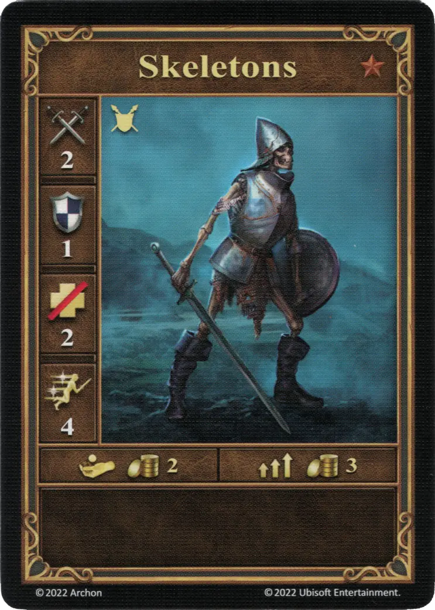
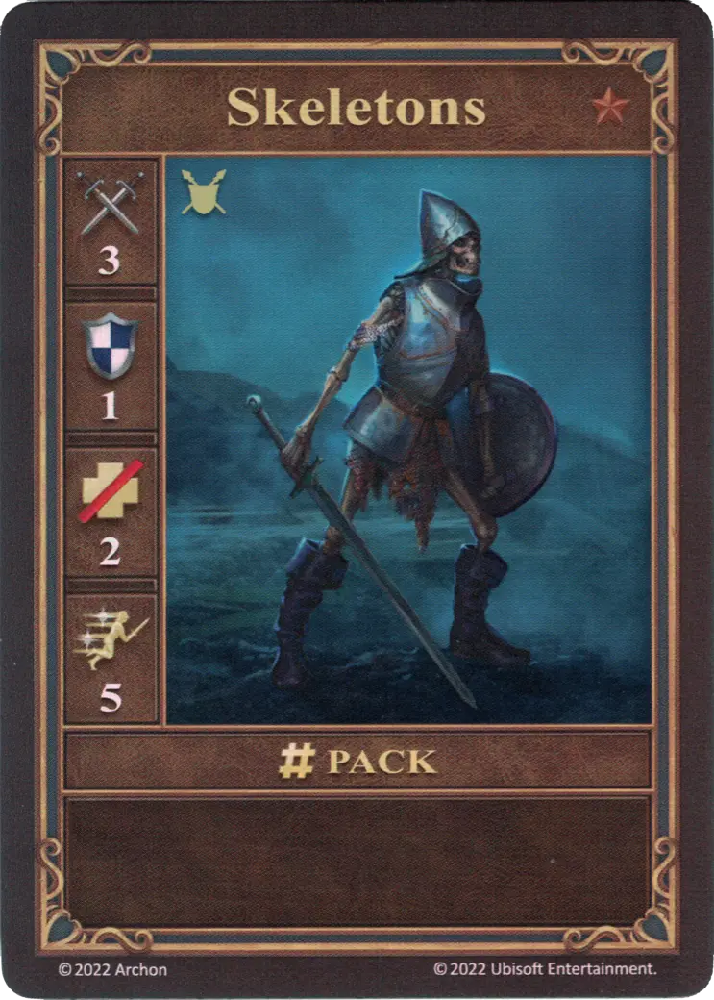
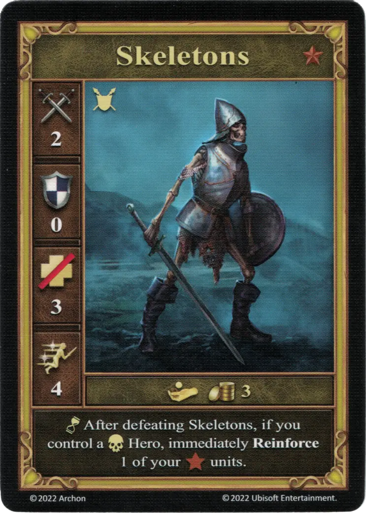
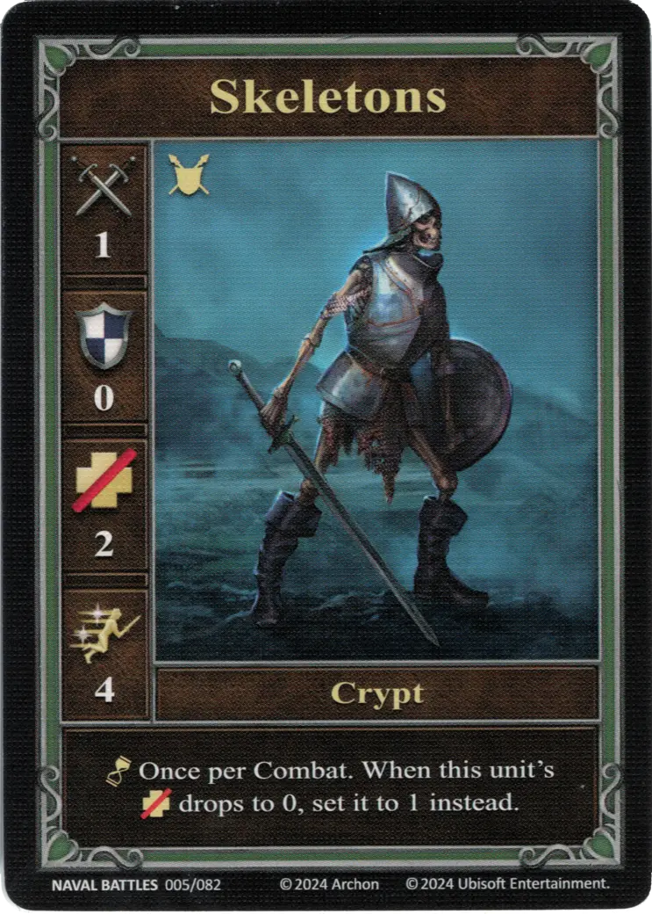

# Esqueletos

=== "Pocos"

    <figure markdown="span">
        { width="340" align=right }
    </figure>

=== "Manada"

    <figure markdown="span">
        { width="340" align=right }
    </figure>

=== "Neutral"

    <figure markdown="span">
        { width="340" align=right }
    </figure>

=== "Crypt"

    <figure markdown="span">
        { width="340" align=right }
    </figure>

| Statistics | Few | Pack | Neutral | Crypt |
| :--- | :---: | :---: | :---: | :---: |
| Town | [Necropolis](../towns/necropolis.md) | [Necropolis](../towns/necropolis.md) | [Neutral](../towns/neutral.md) | [Creature Bank](../towns/neutral.md#creature-bank-units) |
| Tier | :bronze_tier: | :bronze_tier: | :bronze_tier: | - |
| Type | [:ground_unit:](index.md#ground-units) | [:ground_unit:](index.md#ground-units) | [:ground_unit:](index.md#ground-units) | [:ground_unit:](index.md#ground-units) |
| :attack: | 2 | **3** | 2 | 1 |
| :defense: | 1 | 1 | 0 | 0 |
| :health_points: | 2 | 2 | 3 | 2 |
| :initiative: | 4 | **5** | 4 | 4 |
| Cost | 2 :gold: | 3 :gold: | 3 :gold: | - |
| Abilities | - | - | :unit_passive: After defeating Skeletons, if you control a [:necropolis: Hero](../towns/necropolis.md#heroes), immediately Reinforce 1 of your :bronze_tier: units. | :unit_passive: Once per Combat. When this unit's :health_points: drops to 0, set it to 1 instead. |

## Héroes Con Especialidad

- [:magic: Sandro](../heroes/sandro.md#specialty)
- [:magic: Vidomina](../heroes/vidomina.md#specialty)

## Notas

- **Neutral** - A [Necropolis](../towns/necropolis.md) player can reinforce their :bronze_tier: unit during ongoing Combat. Any damage present on the Few side of the unit is transferred to the Pack side.
- ** Neutral ** - El refuerzo es gratuito y no necesita ser pagado.

## Viene Con

- [Juego Principal](../content/core_game.md)
- [Naval Battles Expansion](../content/naval_battles_expansion.md) (Crypt)

## Ver También

- [Crypt (Creature Bank)](../fields/crypt_creature_bank.md)
- [Lista de Unidades](index.md)
- [Lista de Ciudades](../towns/index.md)
