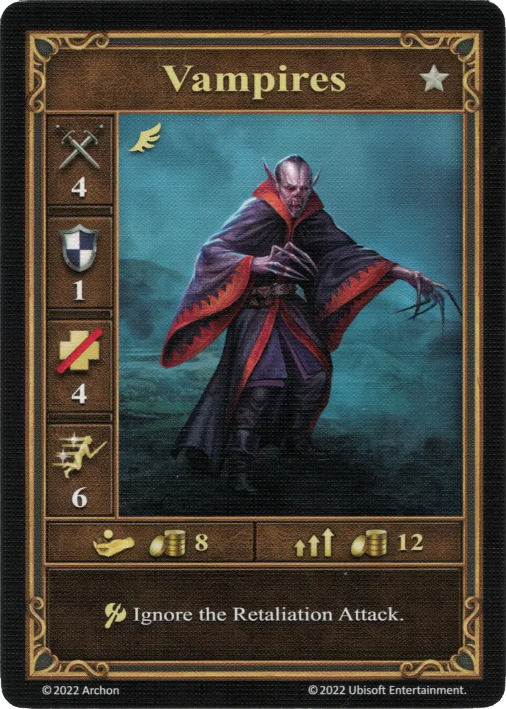
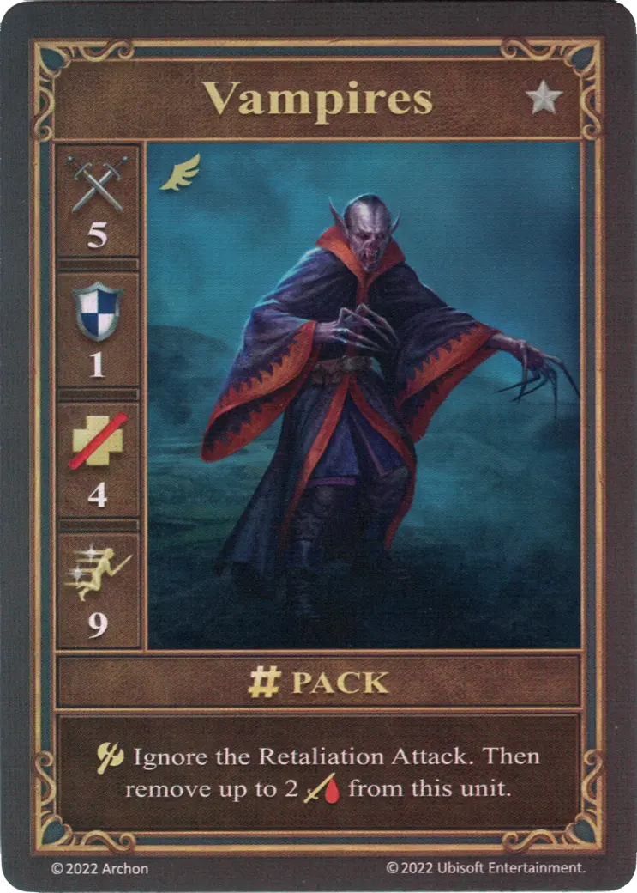
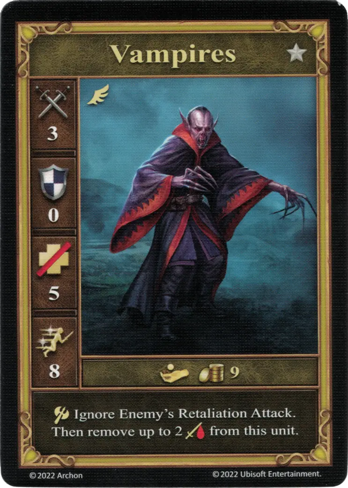

# Vampiros

=== "Pocos"

    <figure markdown="span">
        { width="340" align=right }
    </figure>

=== "Manada"

    <figure markdown="span">
        { width="340" align=right }
    </figure>

=== "Neutral"

    <figure markdown="span">
        { width="340" align=right }
    </figure>

| Características | Pocos | Manada | Neutral |
| :--- | :---: | :---: | :---: |
| Town | [Necropolis](../towns/necropolis.md) | [Necropolis](../towns/necropolis.md) | [Neutral](../towns/neutral.md) |
| Tier | :silver: | :silver: | :silver: |
| Type | [:unit_flying:](../keywords/flying_unit.md) | [:unit_flying:](../keywords/flying_unit.md) | [:unit_flying:](../keywords/flying_unit.md) |
| :attack: | 4 | **5** | 3 |
| :defense: | 1 | 1 | 0 |
| :health_points: | 4 | 4 | 5 |
| :initiative: | 6 | **9** | 8 |
| Cost | 8 :gold: | 12 :gold: | 9 :gold: |
| Abilities | :unit_attack: Ignore the Retaliation Attack. | :unit_attack: Ignore the Retaliation Attack. Then remove up to 2 :damage: from this unit. | :unit_attack: Ignore Enemy's Retaliation Attack. Then remove up to 2 :damage: from this unit. |

## Notas

- Los vampiros no sanan al atacar una pared.Destruir un muro se considera una acción y no un ataque real.

## Viene Con

- [Juego Principal](../content/core_game.md)

## Ver También

- [Lista de Unidades](index.md)
- [Lista de Ciudades](../towns/index.md)
