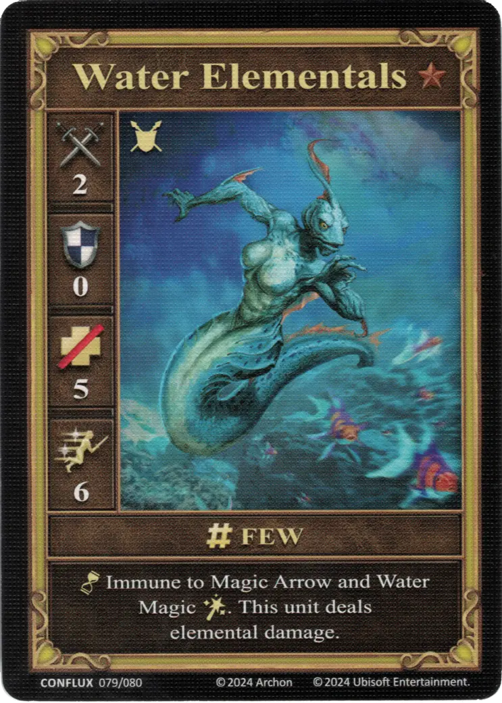
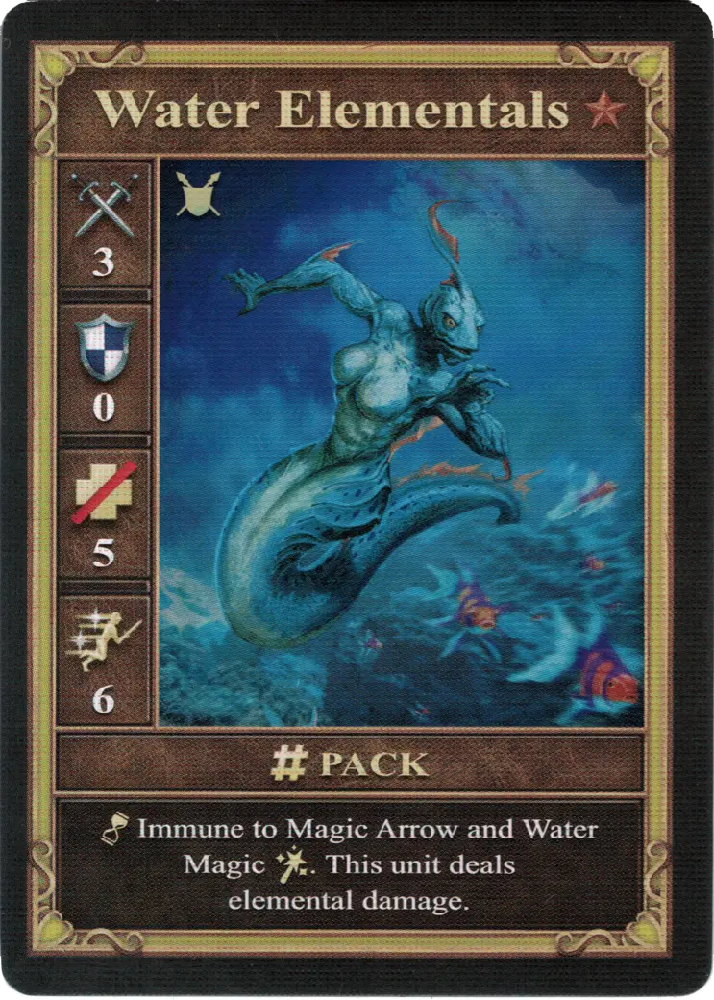
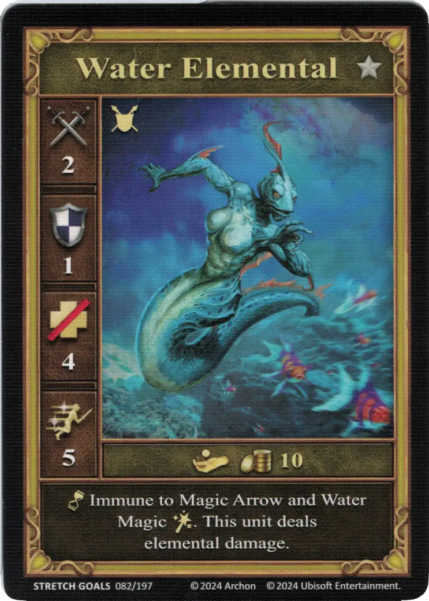
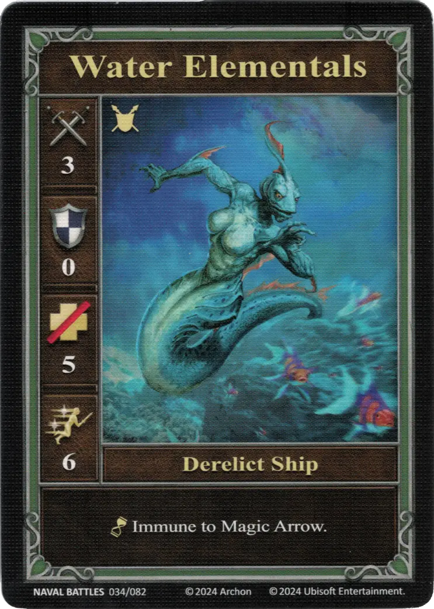

# Elementales de Agua

=== "Pocos"

    <figure markdown="span">
        { width="340" align=right }
    </figure>

=== "Manada"

    <figure markdown="span">
        { width="340" align=right }
    </figure>

=== "Neutral"

    <figure markdown="span">
        { width="340" align=right }
    </figure>

=== "Derelict Ship"

    <figure markdown="span">
        { width="340" align=right }
    </figure>

| Statistics | Few | Pack | Neutral | Derelict Ship |
| :--- | :---: | :---: | :---: | :---: |
| Town | [Summoned](../towns/neutral.md#summoned-units) | [Summoned](../towns/neutral.md#summoned-units) | [Neutral](../towns/neutral.md) | [Creature Bank](../towns/neutral.md#creature-bank-units) |
| Tier | :bronze_tier: | :bronze_tier: | :silver_tier: | - |
| Type | [:ground_unit:](index.md#ground-units) | [:ground_unit:](index.md#ground-units) | [:ground_unit:](index.md#ground-units) | [:ground_unit:](index.md#ground-units) |
| :attack: | 2 | **3** | 2 | 3 |
| :defense: | 0 | 0 | 1 | 0 |
| :health_points: | 5 | 5 | 4 | 5 |
| :initiative: | 6 | 6 | 5 | 6 |
| Cost | - | - | 10 :gold: | - |
| Abilities | :unit_passive: Immune to [Magic Arrow](../spells/magic_arrow.md) and [Water Magic :spell:](../spells/index.md#school-of-water-magic). This unit deals elemental damage. | :unit_passive: Immune to [Magic Arrow](../spells/magic_arrow.md) and [Water Magic :spell:](../spells/index.md#school-of-water-magic). This unit deals elemental damage. | :unit_passive: Immune to [Magic Arrow](../spells/magic_arrow.md) and [Water Magic :spell:](../spells/index.md#school-of-water-magic). This unit deals elemental damage. | :unit_passive: Immune to [Magic Arrow](../spells/magic_arrow.md). |

## Notas

- Summoned by [Summon Water Elemental](../spells/summon_water_elemental.md).

## Viene Con

- [Expansión de Conflujo](../content/conflux_expansion.md)
- [Regular Stretch Goals 2024](../content/regular_stretch_goals.md) (Neutral)
- [Naval Battles Expansion](../content/naval_battles_expansion.md) (Derelict Ship)

## Ver También

- [Derelict Ship (Creature Bank)](../fields/derelict_ship_creature_bank.md)
- [Lista de Unidades](index.md)
- [Lista de Hechizos](../spells/index.md)
- [Lista de Ciudades](../towns/index.md)
