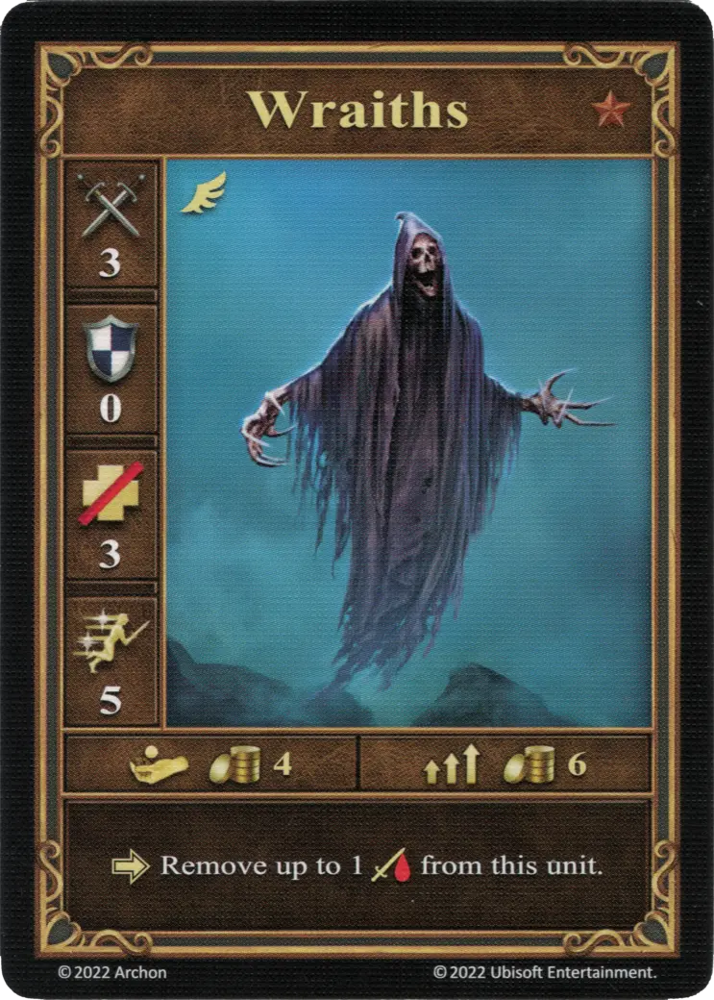
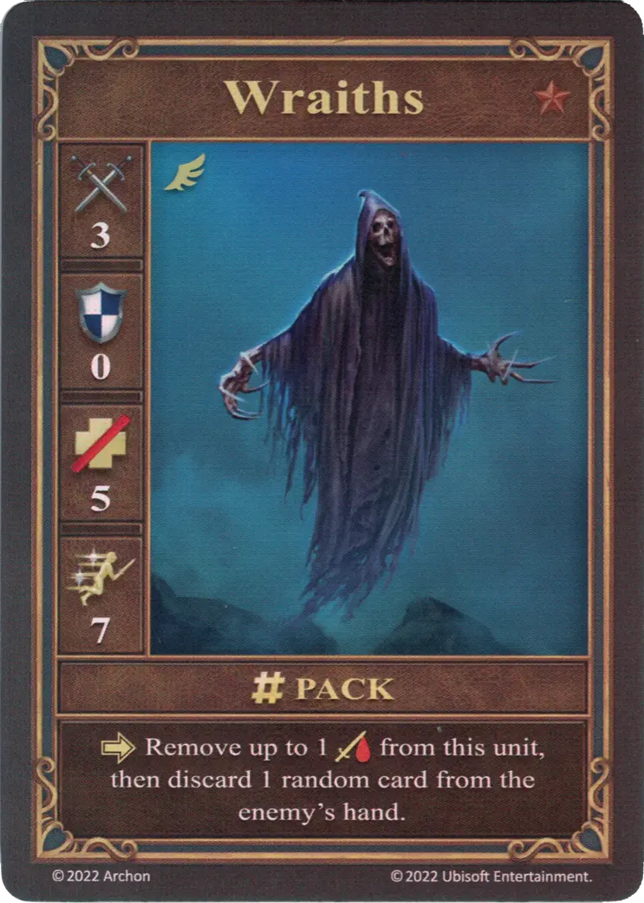
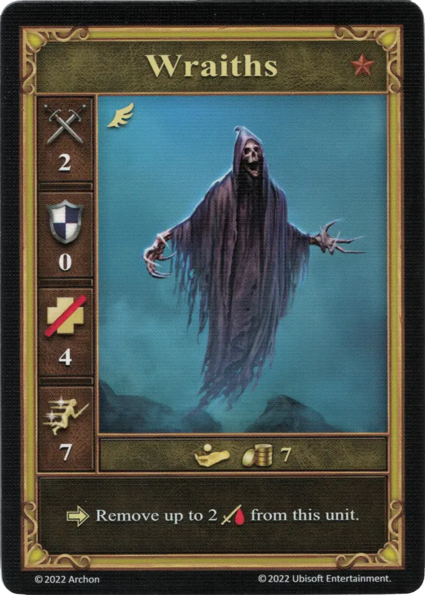

# Espectros

=== "Pocos"

    <figure markdown="span">
        { width="340" align=right }
    </figure>

=== "Manada"

    <figure markdown="span">
        { width="340" align=right }
    </figure>

=== "Neutral"

    <figure markdown="span">
        { width="340" align=right }
    </figure>

| Características | Pocos | Manada | Neutral |
| :--- | :---: | :---: | :---: |
| Town | [Necropolis](../towns/necropolis.md) | [Necropolis](../towns/necropolis.md) | [Neutral](../towns/neutral.md) |
| Tier | :bronze: | :bronze: | :bronze: |
| Type | [:unit_flying:](../keywords/flying_unit.md) | [:unit_flying:](../keywords/flying_unit.md) | [:unit_flying:](../keywords/flying_unit.md) |
| :attack: | 3 | 3 | 2 |
| :defense: | 0 | 0 | 0 |
| :health_points: | 3 | **5** | 4 |
| :initiative: | 5 | **7** | 7 |
| Cost | 4 :gold: | 6 :gold: | 7 :gold: |
| Abilities | :activation: Remove up to 1 :damage: from this unit. | :activation: Remove up to 1 :damage: from this unit, then discard 1 random card from the enemy's hand. | :activation: Remove up to 2 :damage: from this unit. |

## Notas

- La capacidad se aplica justo después de que se activan los Wraiths.
- If Wraiths were attacked by [Wyverns](wyverns.md), both the damage and the healing take place simultaneously. Nothing happens for faction (Pocos and Pack) Wraiths, and the Neutral variant removes up to 1 :damage:.

## Viene Con

- [Juego Principal](../content/core_game.md)

## Ver También

- [Lista de Unidades](index.md)
- [Lista de Ciudades](../towns/index.md)
