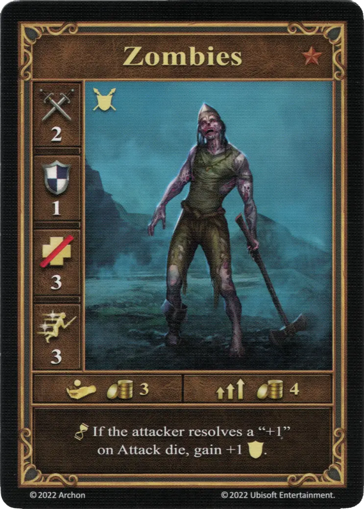
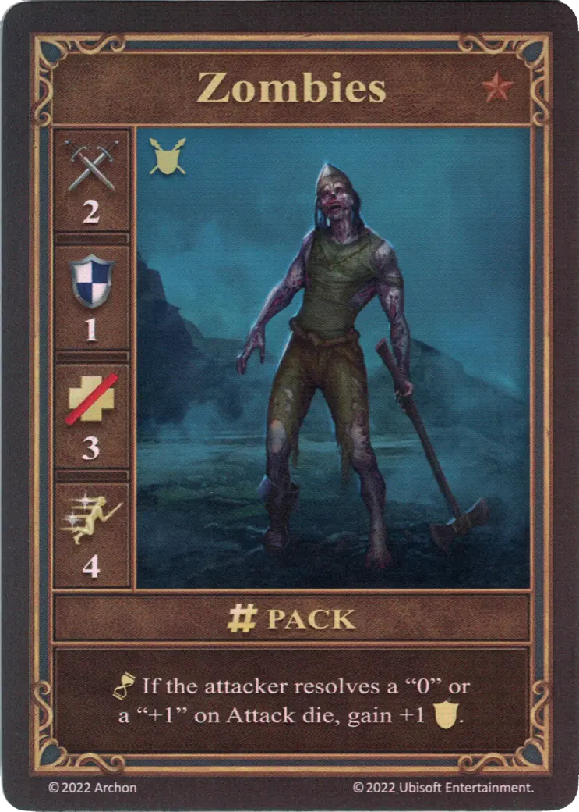
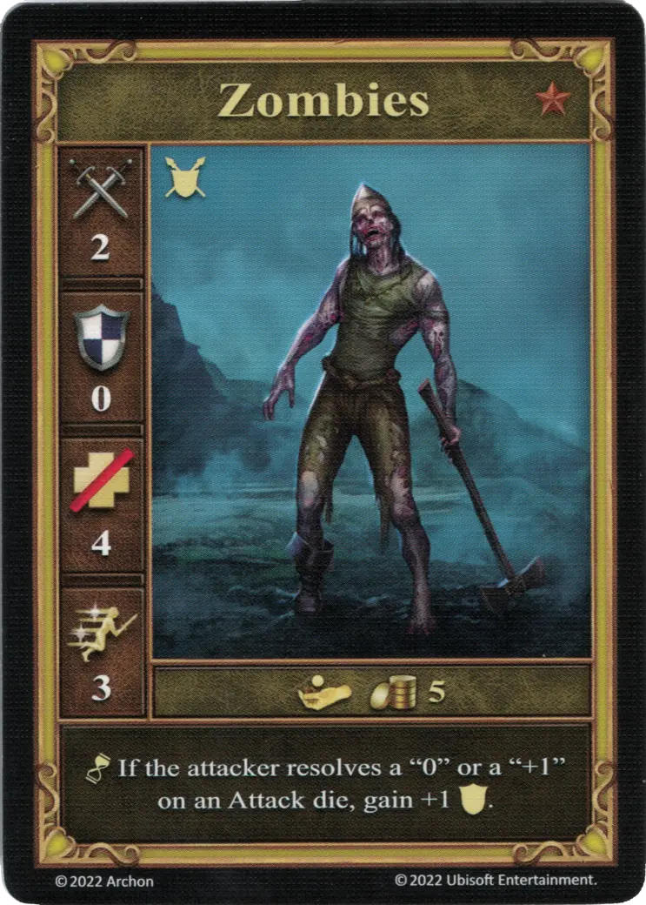

# Zombis

=== "Pocos"

    <figure markdown="span">
        { width="340" align=right }
    </figure>

=== "Manada"

    <figure markdown="span">
        { width="340" align=right }
    </figure>

=== "Neutral"

    <figure markdown="span">
        { width="340" align=right }
    </figure>

| Características | Pocos | Manada | Neutral |
| :--- | :---: | :---: | :---: |
| Town | [Necropolis](../towns/necropolis.md) | [Necropolis](../towns/necropolis.md) | [Neutral](../towns/neutral.md) |
| Tier | :bronze: | :bronze: | :bronze: |
| Type | [:unit_ground:](../keywords/ground_unit.md) | [:unit_ground:](../keywords/ground_unit.md) | [:unit_ground:](../keywords/ground_unit.md) |
| :attack: | 2 | 2 | 2 |
| :defense: | 1 | 1 | 0 |
| :health_points: | 3 | 3 | 4 |
| :initiative: | 3 | **4** | 3 |
| Cost | 3 :gold: | 4 :gold: | 5 :gold: |
| Abilities | :unit_passive: If the attacker resolves a "+1" on [Attack die](../dice.md#attack-die), gain +1 :defense:. | :unit_passive: If the attacker resolves a "0" or a +1" on [Attack die](../dice.md#attack-die), gain +1 :defense:. | :unit_passive: If the attacker resolves a "0" or a "+1" on an [Attack die](../dice.md#attack-die), gain +1 :defense: |

## Héroes Con Especialidad

- [:magic: Sandro](../heroes/sandro.md#specialty)

## Notas

- La capacidad se activa cuando se realiza un ataque regular contra los zombis, así como un ataque de represalia.

## Viene Con

- [Juego Principal](../content/core_game.md)

## Ver También

- [Lista de Unidades](index.md)
- [Lista de Ciudades](../towns/index.md)
